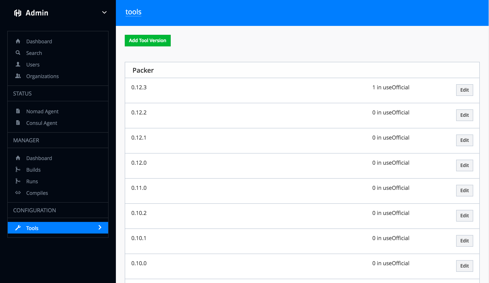

# Private Terraform Enterprise Frequently Asked Questions

This page provides answers to many common questions about Private Terraform Enterprise.

## General FAQ

1. [Support](#support-for-private-terraform-enterprise)
2. [Managing Tool Versions](#managing-tool-versions)
3. [Migration from the Terraform Cloud SaaS](#migrating-from-the-terraform-cloud-saas)
1. [Network Requirements](#network-requirements)

## AMI FAQ

!> **Deprecation warning**: The AMI will no longer be actively developed as of 201808-1 and will be fully decommissioned on November 30, 2018. Please see our [Migration Guide](./migrate.html) for instructions to migrate to the new Private Terraform Enterprise Installer.

1. [About the AMI](#about-the-private-terraform-enterprise-ami)
2. [AMI IDs](#ami-ids)
3. [Additional Configuration Info](#additional-configuration-info)
5. [Required Network Access](#network-access)
6. [Managing the Terraform State of the Install Process](#storing-terraform-enterprise-state)
7. [Private Terraform Enterprise Architecture](#private-terraform-enterprise-architecture)
8. [Advanced Terraform](#advanced-terraform)
9. [Rekeying the Vault instance used by Private Terraform Enterprise](#rekeying-vault)
10. [Minimum Viable IAM Access Policy](#minimum-viable-iam-access-policy)

---

## Support for Private Terraform Enterprise

If some aspect of Private Terraform Enterprise is not working as
expected, please reach out to support for help.

### Email

You can engage HashiCorp support via the web portal at https://support.hashicorp.com or
by email at <support@hashicorp.com>. Please make sure
to use your organization email (not your personal email) when contacting us so
we can associate the support request with your organization and expedite our
response.

### Diagnostics

For most technical issues, HashiCorp support will ask you to include diagnostic
information in your support request. To ensure the required information is included,
PTFE has the ability to automatically generate a support bundle including logs and configuration details.

* [AMI-based instance bundle generation](./diagnostics.html#ami-based-installs)
* [Installer-based instance bundle generation](./diagnostics.html#installer-based-instances)

## Managing Tool Versions

Terraform Enterprise has a control panel that allows admins to manage the versions of Terraform and Packer and their download locations.

In Terraform Enterprise installations 201807-1 or later, see [Managing Tool Versions](admin/resources.html#managing-terraform-versions).

In older Terraform Enterprise installations (prior to 201807-1) this control panel is available at the `/admin/tools` path or as a link in the sidebar from the general administrative interface at `/admin/manager`.



Here you'll find a list of Packer and Terraform versions as well as a link to add tool versions. If you click the `Edit` button on an individual tool version, you'll see that each version consists of:

* **Version Number** - will show up in dropdown lists for users to select
* **Download URL** - must point to a `linux-amd64` build of the tool
* **SHA256 Checksum Value** - must match the SHA256 checksum value of the download


## Migrating from the Terraform Cloud SaaS

If you are already a user of the Terraform Cloud SaaS (hereafter "the SaaS"), you may have workspaces that you want to migrate over to your new Private Terraform Enterprise installation.

These instructions assume Terraform 0.9 or greater. See [docs on legacy remote state](/docs/backends/legacy-0-8.html) for information on upgrading usage of remote state in prior versions of Terraform.

### Prerequisites

Have a Terraform Cloud user API token ("Atlas token") handy for both Private Terraform Enterprise and the SaaS. The following examples will assume you have these stored in `PTFE_ATLAS_TOKEN` and `SAAS_ATLAS_TOKEN`, respectively.

### Step 1: Connect local config to SaaS

Set up a local copy of your Terraform config that's connected to the SaaS via a `backend` block.

Assuming your environment is located at `my-organization/my-environment` in the SaaS, in a local copy of the Terraform config, ensure you have a backend configuration like this:

```tf
terraform {
  backend "atlas" {
    name = "my-organization/my-environment"
  }
}
```

Assign your SaaS API token to `ATLAS_TOKEN` and run `terraform init`:

```
export ATLAS_TOKEN=$SAAS_ATLAS_TOKEN
terraform init
```

### Step 2: Copy state locally

This step fetches the latest copy of the state locally so it can be pushed to Private Terraform Enterprise. First, comment out the `backend` section of the config:

```tf
# Temporarily commented out to copy state locally
# terraform {
#   backend "atlas" {
#     name = "my-organization/my-environment"
#   }
# }
```

Then, re-run `terraform init`:

```
terraform init
```

This will cause Terraform to detect the change in backend and ask you if you want to copy the state.

Type `yes` to allow the state to be copied locally. Your state should now be present on disk as `terraform.tfstate`, ready to be uploaded to Private Terraform Enterprise.

### Step 3: Update backend configuration for Private Terraform Enterprise

Change the backend config to point to the Private Terraform Enterprise installation:

```tf
terraform {
  backend "atlas" {
    address = "https://tfe.mycompany.example.com" # the address of your PTFE installation
    name    = "my-organization/my-environment"
  }
}
```

Assign your Private TFE API token to `ATLAS_TOKEN` and run `terraform init`:

```
export ATLAS_TOKEN=$PTFE_ATLAS_TOKEN
terraform init
```

You will again be asked if you want to copy the state file. Type `yes` and the state will be uploaded to your Private Terraform Enterprise installation.

---

## Network Requirements

The network requirements for Terraform Enterprise are located on the
[preflight requirements page](/docs/enterprise/private/preflight-installer.html#network-requirements).

---

## About the Private Terraform Enterprise AMI

This section contains information about the Terraform Enterprise AMI.

### Operating System

The Private Terraform Enterprise AMI is based on the latest release of Ubuntu 16.04 with all security
patches applied.

### Network Ports

The Private Terraform Enterprise AMI requires that port :8080 be accessible. This is where all traffic
from the ELB is routed. Many other internal Private Terraform Enterprise services listen on the host,
but they do not require external traffic. The AWS security group for the
instance as well as software firewall rules within the runtime enforce this.

### `ulimits`

The necessary limits on open file descriptors are raised within
`/etc/security/limits.d/nofile.conf` on the machine image.

### Critical Services

The Private Terraform Enterprise AMI contains dozens of services that are required for proper operation
of Terraform Enterprise. These services are all configured to launch on boot.
Application-level services are managed via Nomad and system-level automation is
managed via `systemd`.

## AMI IDs

For the most up-to-date list of AMI IDs, see the [list maintained on our GitHub repo](https://github.com/hashicorp/terraform-enterprise-modules/blob/master/docs/ami-ids.md).

## Additional Configuration Info

 * [`base-vpc`](https://github.com/hashicorp/terraform-enterprise-modules/blob/master/aws-extra/base-vpc) - Configuration for creating a basic VPC and subnets that meet [the documented requirements for Private Terraform Enterprise installation](/docs/enterprise/private/install-ami.html#preflight).
 * [`minimum-viable-iam`](https://github.com/hashicorp/terraform-enterprise-modules/blob/master/aws-extra/minimum-viable-iam) - Configuration for creating an AWS user with a minimum access policy required to perform a Terraform Enterprise installation. Please note using the `AdministratorAccess` policy is recommended. This access is only required for the initial deployment.

## Network Access

This section details the ingress and egress network access required by Terraform Enterprise to function properly.

### Ingress Traffic

Terraform Enterprise requires certain ports to be accessible for it to function. The Terraform configuration that ships with Terraform Enterprise will by default create Security Groups (SGs) that make the appropriate ports available, but you can also specify custom SGs to be used instead.

Here are the two SGs in the system relevant for user access and the ports they require to be open:

* **Load Balancer SG**: Applied to the Elastic Load Balancer (ELB), controls incoming HTTP traffic from users
  * **Port 443** must be accessible to users for basic functionality, must also be accessible from the VPC itself, as certain internal services reach over the ELB to access cross-service APIs
  * **Port 80** is recommended to leave open for convenience - the system is set up to force SSL by redirecting users who visit Private Terraform Enterprise over HTTP to the HTTPS equivalent URL. If this port is not available, users who mistakenly visit the site over HTTP will see hanging requests in their browser
* **Instance SG**: Applied to the EC2 Instance running the application
  * **Port 8080** must be accessible to the ELB to serve traffic
  * **Port 22** must be accessible to operators to perform diagnostics and troubleshooting over SSH

There are also two internal SGs that are not currently user-configurable:

* **Database SG**: Applied to the RDS instance - allows the application to talk to PostgreSQL
* **Redis SG**: Applied to the ElastiCache instance - allows the application to talk to Redis

### Egress Traffic

Terraform Enterprise makes several categories of outbound requests, detailed in the sections below.

#### Primary Data Stores

**S3** is used for object storage, so access to the AWS S3 API and endpoints is required for basic functionality

**RDS and ElastiCache** instances are provisioned for application data storage. These instances are within the same VPC as the application, so communication with them does not constitute outbound traffic.

#### Version Control System Integrations

Private Terraform Enterprise can be configured to connect to a number of [Version Control Systems (VCSs)](/docs/cloud/vcs/index.html), some supporting both SaaS and private-network installations.

In order to perform ingress of Terraform configuration from a configured VCS, Private Terraform Enterprise will need to be able to communicate with that provider's API, and webhooks from that provider will need to be able to reach Private Terraform Enterprise.

For example, an integration with GitHub.com will require Private Terraform Enterprise to have access to https://github.com and for GitHub's webhooks to be able to route back to Terraform. Similarly, an integration with GitHub Enterprise will require Terraform to have access to the local GitHub instance.

#### Terraform Execution

As a part of its primary mode of operation, Terraform makes API calls out to infrastructure provider APIs. Since Private Terraform Enterprise runs Terraform on behalf of users, Private Terraform Enterprise will therefore need access to any Provider APIs that your colleagues want to manage with Private Terraform Enterprise.

#### Terraform Release Downloading

By default, Private Terraform Enterprise downloads the versions of Terraform that it executes from https://releases.hashicorp.com/. This behavior can be customized by specifying different download locations. See [Managing Tool Versions](#managing-tool-versions).

#### Terraform Latest Version Notifications

When displaying Terraform Runs, Private Terraform Enterprise has JavaScript that reaches out to https://checkpoint-api.hashicorp.com to determine the latest released version of Terraform and notify users if there is a newer version available than the one they are running. This functionality is non-essential; new version notifications will not be displayed in the Web UI if checkpoint-api.hashicorp.com cannot be reached from a user's browser.

#### Communication Functions

* Private Terraform Enterprise uses the configured SMTP endpoint for sending emails
* Twilio can optionally be set up for for SMS-based 2FA. (Virtual TOTP support is available separately, which does not make external API calls.)

## Storing Terraform Enterprise State

The Private Terraform Enterprise AMI install process uses Terraform, and therefore must store Terraform state. This presents a bootstrapping problem, because while generally you can use Terraform Enterprise to securely store versioned Terraform state, in this case Terraform Enterprise is not ready yet.

Therefore, you must choose a separate mechanism for storing the Terraform State produced by the install process.

### Security Considerations for Terraform State

The Terraform state file for the Private Terraform Enterprise instance will contain the RDS Database password used by the application. While sensitive fields are separately encrypted-at-rest via Vault, this credential and network access to the database would yield access to all of the unencrypted metadata stored by Terraform Enterprise.

HashiCorp recommends storing the Terraform state for the install in an encrypted data store.

### Recommended State Storage Setup

Terraform supports various [remote state](/docs/state/remote.html) backends that can be used to securely store the Terraform state produced by the install.

HashiCorp recommends a versioned, encrypted-at-rest S3 bucket as a good default choice.

Here are steps for setting up and using an S3 bucket for remote state storage:

```bash
# From the root dir of your Private Terraform Enterprise installation config
BUCKETNAME="mycompany-terraform-enterprise-state"

# Create bucket
aws s3 mb "s3://${BUCKETNAME}"

# Turn on versioning for the bucket
aws s3api put-bucket-versioning --bucket "${BUCKETNAME}" --versioning-configuration status=Enabled

# Configure terraform backend to point to the S3 bucket
cat <<EOF >backend.tf
terraform {
  backend "s3" {
    bucket  = "${BUCKETNAME}"
    key     = "terraform-enterprise.tfstate"
    encrypt = true
  }
}
EOF

# Initialize Terraform with the Remote Backend
terraform init
```

Now, if you keep the `backend.tf` file in scope when you run `terraform` operations, all state will be stored in the configured bucket.

## Private Terraform Enterprise Architecture

This document describes aspects of the architecture of Private Terraform Enterprise as deployed via the AMI.

### Services

These are the services used to run Private Terraform Enterprise. Each service contains a description of what actions it performs, a policy for restarts, impact of failing or degraded performance, and the service's dependencies.

- [`atlas-frontend` and `atlas-worker`](https://github.com/hashicorp/terraform-enterprise-modules/blob/master/docs/services/atlas.md)
- [`archivist`, `binstore`, `storagelocker`, and `logstream`](https://github.com/hashicorp/terraform-enterprise-modules/blob/master/docs/services/archivist.md)
- [`terraform-build-manager`, and `terraform-build-worker`](https://github.com/hashicorp/terraform-enterprise-modules/blob/master/docs/services/build-pipeline.md)
- [`slug-extract`, `slug-ingress`, `slug-merge`](https://github.com/hashicorp/terraform-enterprise-modules/blob/master/docs/services/slugs.md)

### Data Flow Diagram

The following diagram shows the way data flows through the various services and data stores in Terraform Enterprise.


(Note: The services in double square brackets are soon to be replaced by the service that precedes them.)

## Advanced Terraform

The `aws-standard` Terraform module can be used as a true Terraform module
to enable some additional features to configure the cluster.


### Additional IAM Role policies

The module outputs the role name used by the instance, allowing you
to attach additional policies to configure access:

```hcl
provider "aws" {
  region = "us-west-2"
}

module "standard" {
  source = "../../terraform/aws-standard"
  # Variables that would be in terraform.tfvars go here
}

data "aws_iam_policy_document" "extra-s3-perms" {
  statement {
    sid    = "AllowS3Access"
    effect = "Allow"

    resources = [
      "arn:aws:s3:::my-private-artifacts/*",
      "arn:aws:s3:::my-private-artifacts",
    ]

    actions = [
      "s3:*",
    ]
  }
}

resource "aws_iam_role_policy" "extra-s3-perms" {
  role   = "${module.standard.iam_role}"
  policy = "${data.aws_iam_policy_document.extra-s3-perms.json}"
}

```

## Rekeying Vault

(Requires an AMI version `201709-1` or later)

The Vault instance used by Private Terraform Enterprise self-manages its unseal key by
default. This unseal key is stored in a KMS-encrypted file on S3 and is
downloaded by the instance on boot to automatically unseal Vault.

If the above configuration is insufficient for your security needs, you can
choose to rekey the Vault instance after bootstrapping is completed. This
allows you to change the key shares and key threshold settings, places the
Vault unseal keys under your control, and deactivates the auto-unseal behavior
of the Private Terraform Enterprise instance.

The Vault documentation has a
[guide](https://www.vaultproject.io/guides/rekeying-and-rotating.html#rekeying-vault)
on how to perform a rekey operation and `vault rekey -help` output provides
full docs on the various options available.

### Walkthrough of Rekey Operation

Here is an example of rekeying the Private Terraform Enterprise vault to use 5 key shares with a key
threshold of 2. These commands are executed from an SSH session on the Private Terraform Enterprise
instance as the `tfe-admin` user.

```
vault rekey -init -key-shares=5 -key-threshold=2

WARNING: If you lose the keys after they are returned to you, there is no
recovery. Consider using the '-pgp-keys' option to protect the returned unseal
keys along with '-backup=true' to allow recovery of the encrypted keys in case
of emergency. They can easily be deleted at a later time with
'vault rekey -delete'.

Nonce: acdd8a46-3b...
Started: true
Key Shares: 5
Key Threshold: 2
Rekey Progress: 0
Required Keys: 1
```

The rekey operation has now been started. The printed nonce and the current
unseal key are required to complete it.

The current unseal key can be found under `/data/vault-unseal-key`

```
VAULT_UNSEAL_KEY=$(sudo cat /data/vault-unseal-key)
vault rekey -nonce=acdd8a46-3b... $VAULT_UNSEAL_KEY

Key 1: jcLit6uk...
Key 2: qi/AfO30...
Key 3: t3TezCbE...
Key 4: 5O6E8WFU...
Key 5: +bWaQapk...

Operation nonce: acdd8a46-3b2a-840e-0db8-e53e84fa7e64

Vault rekeyed with 5 keys and a key threshold of 2. Please
securely distribute the above keys. When the Vault is re-sealed,
restarted, or stopped, you must provide at least 2 of these keys
to unseal it again.

Vault does not store the master key. Without at least 2 keys,
your Vault will remain permanently sealed.
```

### IMPORTANT: After Rekeying

**Note**: After performing a rekey it's important to remove the old unseal key
and trigger a backup before rebooting the machine. This will ensure that Private Terraform Enterprise
knows to prompt for Vault unseal keys.

```
sudo rm /data/vault-unseal-key
sudo atlas-backup
```

## Minimum Viable IAM Access Policy

HashiCorp does not recommend using the minimum viable IAM access policy. You will need to edit this policy to account for any and all actions you wish Terraform to be able to perform against your AWS account. We do, however, provide a [git repo](https://github.com/hashicorp/terraform-enterprise-modules/tree/master/aws-extra/minimum-viable-iam) you can use as a base example to start from.

