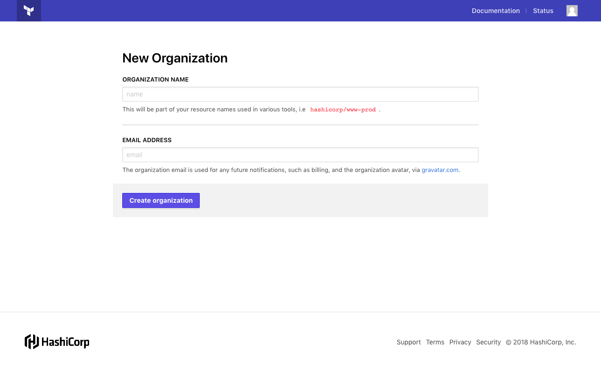

# Getting Started with the Terraform Cloud Free Tier

Welcome to the Terraform Cloud Free Tier! This service enhances your team's CLI-based Terraform workflow with easy access to shared Terraform state.

Your free account allows you to share unlimited workspaces with an unlimited number of teammates.

## Summary

To begin using Terraform Cloud for state storage, do the following steps:

1. Upgrade Terraform to 0.11.13 or later.
1. Create (or join) an organization, and optionally add other users to it.
1. Configure credentials for Terraform to use.
1. Update your Terraform configurations to use remote workspaces.
1. Re-run `terraform init`, then Terraform as normal.


## Upgrade to Terraform 0.11.13 or later

The Terraform Cloud Free Tier requires Terraform 0.11.13 or later. [Upgrade Terraform](https://releases.hashicorp.com/terraform/) on any systems where you or your collaborators plan to run Terraform.

The newest 0.12 preview releases (as of alpha 4) also support the Terraform Cloud Free Tier.

## Create an Organization

You can skip this step if you've already joined a free organization.

Log into [https://app.terraform.io](https://app.terraform.io), and go to the new organization page:

- New users are automatically taken to the new organization page.
- If your user account is already a member of an organization, open the organization switcher menu in the top navigation bar and click the "Create new organization" button.

Enter a unique organization name and an email address for notifications, then click the "Create organization" button.



## Add Organization Members

~> **Important:** Members of your organization have the same permissions as you, including the ability to add and remove members. Only invite trusted teammates to your organization.

To add or remove organization members, click the "Settings" link in the top navigation bar, then click "Teams" in the left sidebar.


To add a new member, enter their username and click the "Add member" button. You must know someone's exact username on `app.terraform.io` to add them to your organization; users cannot be added by email address.

If the person you want to add doesn't have an account, ask them to sign up at `https://app.terraform.io/account/new` and send you their username.

You can add any `app.terraform.io` user to your organization. 

## Configure Access for the Terraform CLI

Terraform's CLI needs credentials before it can access Terraform Cloud. Follow these steps to allow Terraform to access your organization.

1. Open your [Terraform CLI config file](/docs/commands/cli-config.html) in a text editor; create the file if it doesn't already exist. This file is located at `%APPDATA%\terraform.rc` on Windows systems, and `~/.terraformrc` on other systems.
2. Add the following `credentials` block to the config file:

    ```hcl
    credentials "app.terraform.io" {
      token = "REPLACE_ME"
    }
    ```

    Leave your editor open.
3. In your web browser, go to the tokens section of your user settings. Open [`https://app.terraform.io/app/settings/tokens`](https://app.terraform.io/app/settings/tokens), or click the user icon in the upper right corner, click "User Settings", then click "Tokens" in the left sidebar.
4. Generate a new token by entering a description and clicking the "Generate token" button. The new token will appear in a text area below the description field.
5. Copy the token to the clipboard.
6. In your text editor, paste the real token into the `token` argument, replacing the `REPLACE_ME` placeholder. Save the CLI config file and close your editor.

    At this point, Terraform can use Terraform Cloud with any Terraform configuration that has enabled the `remote` backend.
7. Check the CLI config file's permissions and ensure it can only be viewed by your local user account (`0600` in traditional Unix permissions notation). Update its permissions if necessary.

~> **Important:** Anyone with your API token can access Terraform Cloud with your identity and permissions. Protect it accordingly.

-> **Note:** If you have automated systems that need to run Terraform, they can use the owners team token instead of a human user's token. To generate this token, go to the "Teams" page of the organization settings and use the token controls at the bottom of the page.

## Enable Remote State in Terraform Configurations

Once Terraform has its credentials, you can update your configurations to use remote state storage. To use remote state, add a `terraform { backend "remote" { ... } }` block to your configuration and specify which organization and workspace(s) to use.

For full information about configuring the remote backend, see [Backend Type: Remote](/docs/backends/types/remote.html).

### One Workspace Per Configuration

For configurations that manage a unique collection of resources, choose one remote workspace to use. Add a block like the following:

```hcl
terraform {
  backend "remote" {
    organization = "<ORGANIZATION NAME>"

    workspaces {
      name = "<WORKSPACE NAME>"
    }
  }
}
```

The workspace name is arbitrary, since Terraform Free State Storage creates workspaces on demand; if a workspace with this name doesn't yet exist, it will be automatically created the next time you run `terraform init` for that configuration.

### Multiple Workspaces Per Configuration

If you use [the `terraform workspace` command](/docs/commands/workspace/index.html) to manage multiple sets of resources with this configuration, choose a prefix for its remote workspace names. Add a block like the following:

```hcl
terraform {
  backend "remote" {
    organization = "<ORGANIZATION NAME>"

    workspaces {
      prefix = "<PREFIX STRING>" # like "app-frontend-"
    }
  }
}
```

On the CLI you'll use local names like `dev` and `prod`, but the Terraform Cloud UI will use prefixed names like `app-frontend-dev` and `app-frontend-prod`.

## Re-init and Run Terraform

After you've configured the remote backend, run `terraform init` to reconfigure Terraform and migrate any existing state. Depending on what's in your working directory, you might need to take additional actions:

- If there is already Terraform state for this working directory, Terraform will ask whether to copy it to the new backend. Answer yes.
- If you are migrating multiple workspaces and have an un-named `default` workspace, Terraform will request a new name for it.
- If there is no state in the working directory and you configured a prefix for remote workspaces, Terraform will ask you to create a workspace with `terraform workspace new <NAME>` after the init has finished. (Future users can skip this, since there will be at least one remote workspace already.)

Once `terraform init` has finished, you can run `terraform plan` and `terraform apply` as needed; Terraform will use the remote state to identify resources.

Be sure to commit your configuration changes, push to your shared version control system, and inform your teammates; they will need to configure credentials before they can run Terraform with the updated configuration. Add your teammates to your Terraform Cloud organization if you haven't already.

## Collaborate

Once a configuration is updated to use remote state, you can use several new collaboration features.

### View Workspaces

The home page of the Terraform Cloud UI is a list of all of your organization's workspaces. Select a workspace for more details and settings.


To return to the workspaces list from another page, use the "Workspaces" link in the top navigation.

### Locking

Whenever one organization member is running a Terraform plan or apply, Terraform will prevent other organization members from doing so. Anyone trying to start a new plan or apply will see a message like the following:

```
Acquiring state lock. This may take a few moments...

Error: Error locking state: Error acquiring the state lock: workspace already locked

Terraform acquires a state lock to protect the state from being written
by multiple users at the same time. Please resolve the issue above and try
again. For most commands, you can disable locking with the "-lock=false"
flag, but this is not recommended.
```

This makes it easy to avoid conflicting changes and state corruption. You can apply your own changes after the current run ends.

You can also use the Terraform Cloud UI to lock a workspace for an indefinite period. Select the workspace from the main workspace list, open its "Settings" menu, and choose "Locking." Use the lock/unlock button to change the workspace's lock status.

### View State History

Terraform Cloud workspaces preserve their state history, and you can view a list of previous states in the UI.


The list indicates which user in your organization created each state, and you can get more information by clicking a state. A state detail page includes both a basic view and a diff against the previous state.


### Delete Workspaces

When a workspace is no longer needed, you can delete it from the workspace's settings menu. To avoid orphaned resources, be sure to [destroy any managed infrastructure](/docs/commands/destroy.html) before deleting a workspace.

