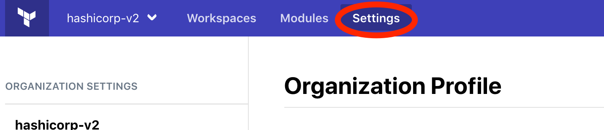
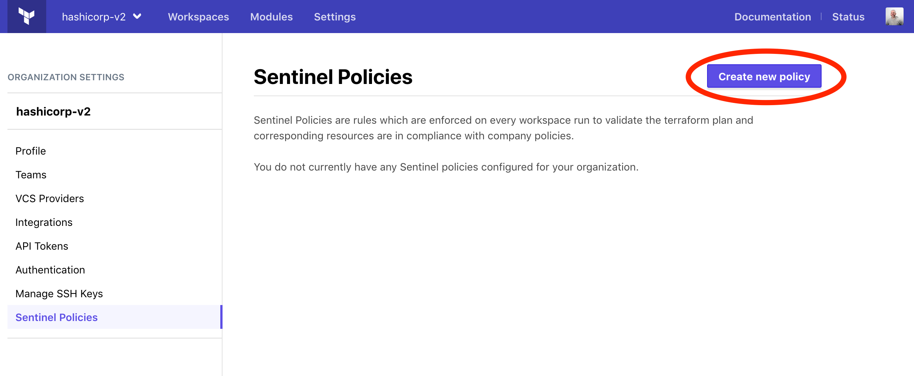
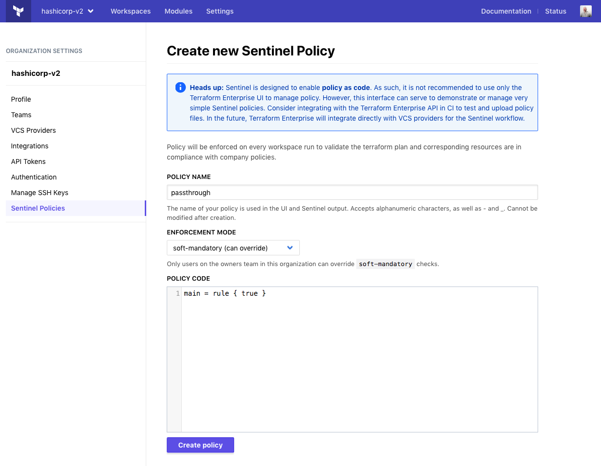
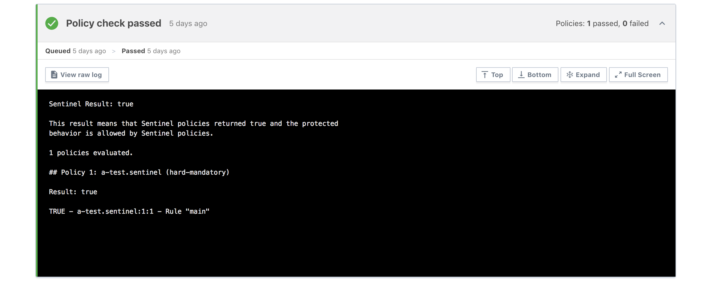

# Creating and Managing Terraform Policies

**Prerequisites:** Before starting this guide, make sure you've [sucessfully completed a run](./runs.html).

## About Sentinel Policies

_Policies_ in TFE are composed of [Sentinel policies](../sentinel/index.html) with some extra features. [Sentinel](https://www.hashicorp.com/sentinel) is an embedded policy-as-code framework integrated with the HashiCorp Enterprise products. It enables fine-grained, logic-based policy decisions, and can be extended to use information from external sources. Within TFE, you can use Sentinel to apply checks to your runs.

A policy consists of:

- The Sentinel policy code
- An enforcement mode that changes how a policy affects the run lifecycle

Currently, policies in an organization apply to **all** workspaces. You'll want to consider that when writing your policies so they won't fail unrelated workspace runs or configurations. In the future, TFE will provide a way to manage policies so you can apply them per-workspace.

## Creating a Policy

First, make sure you're viewing the organization settings. If you're still on a run page (or any other page), click the "Settings" button in the top navigation bar.



The policy list shows all of the policies you have access to; if you haven't created any, it's empty.

To create your first policy, click the "Create new policy" button in the upper right.



On the "Create a new Policy" page, you need to enter at least two items: a policy name, and the policy code. When you've finished, click the "Create Policy" button.



### Policy Name

A policy name should tell your colleagues what the policy is for. Most policies are _a particular environment_ of _a particular Terraform configuration,_ so the name should include both the name of the configuration and the name of the environment.

For this example, we'll just create a sample passthrough policy that will allow all runs to "PASS" our policy check. 

In this example, we're using a configuration named "minimum" and we're deploying it in a production environment, so we named it `passthrough`.

### Enforcement Mode

Enforcement Mode alters how a policy result affects your run; "hard-mandatory" will always stop a run if a policy fails, "soft-mandatory" will pause a run and allow a failure to be overridden, and "advisory" will log failures but always allow a run to continue. Use "soft-mandatory" for now so we can see

### Policy Code

You can paste the following code into the code input box. It always resolves to `true` and will allow all runs to pass. This is a good way to see policy checks applied to your run without having a policy "FAIL".

```python
main = rule { true }
```

Later, you can switch `true` to `false` to see how a "FAIL" during a policy check can affect your run. You can find many more examples in our [Example policies doc](../sentinel/examples.html).

## What Happens in a New Policy

When you create a new policy, it will be applied to all future runs. Runs that are currently queued or in progress will not be affected.

## See a Policy Check in a Run

Once your policy is created, you can view its effect on the run page. Start a new run to watch it play out. Again, you can start a run with the "Queue Plan" at the upper right of the workspace page, or using the "Save & Plan" button when editing the workspace's variables.

Your policy code will be applied to this run and you'll see a new section in the run's timeline called "POLICY CHECK". Click "View Check" and you should see that our new "passthrough" policy has been run with a "true" result, allowing the run to continue.



If you change your policy code to `true` false, the "soft-mandatory" option will allow you to override at this stage and continue to the apply stage of the run.

## Finished

You've now configured TFE and experienced its core workflows — you know how to create new workspaces, automatically and manually trigger runs on a workspace, review and monitor runs, approve plans, and add policy checks to your runs.
