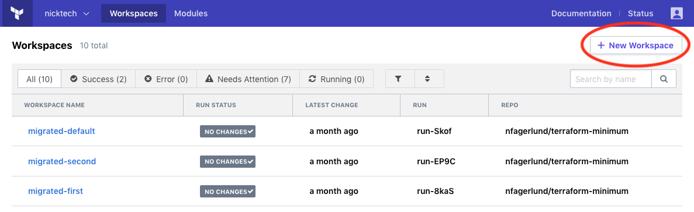
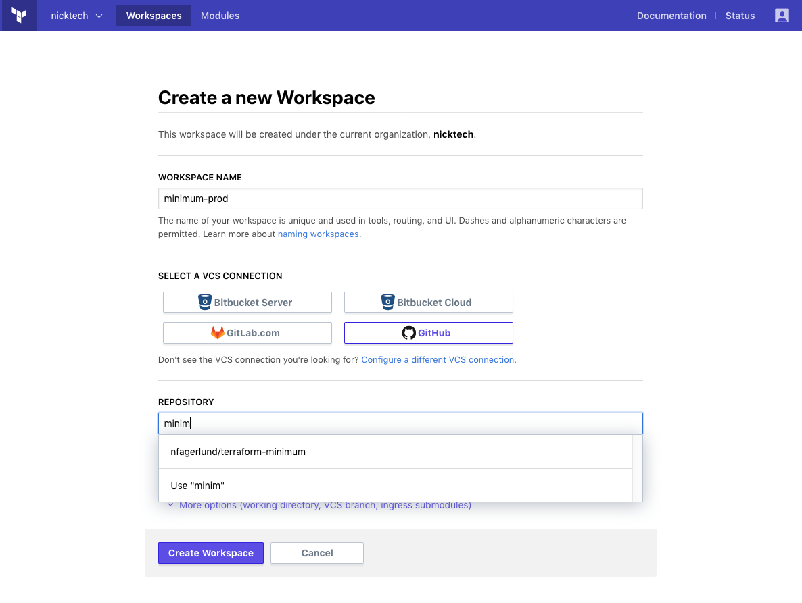
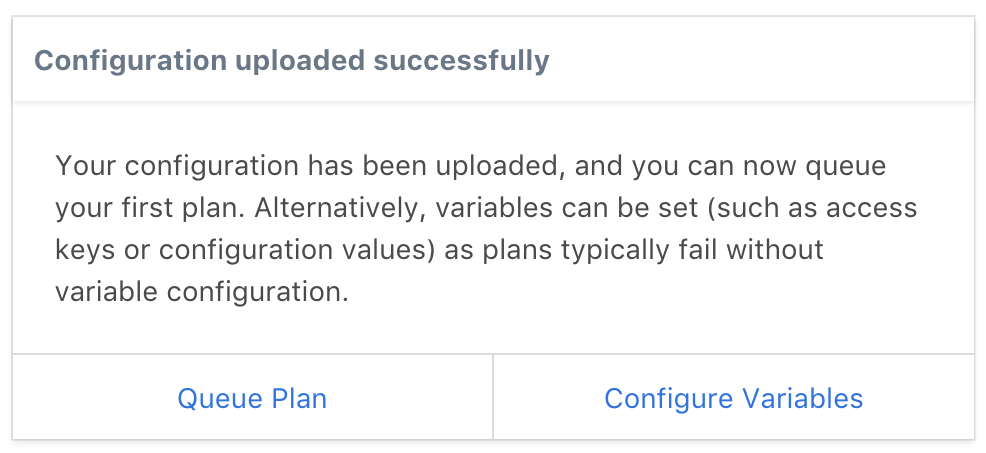
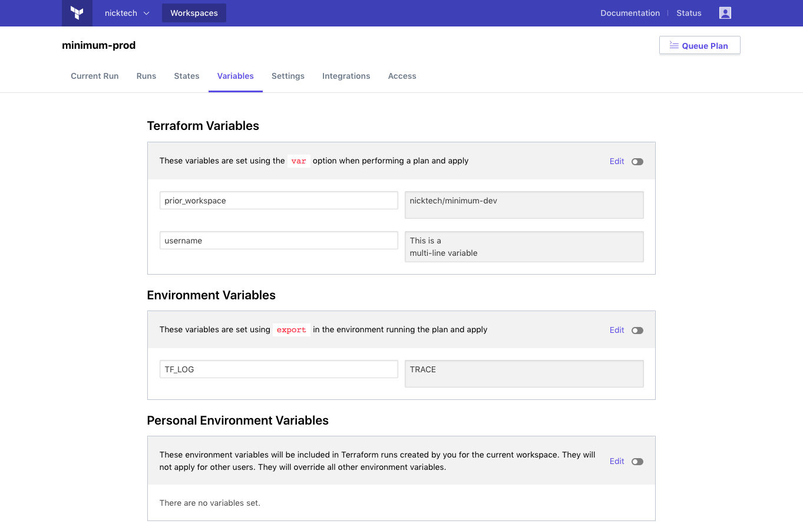
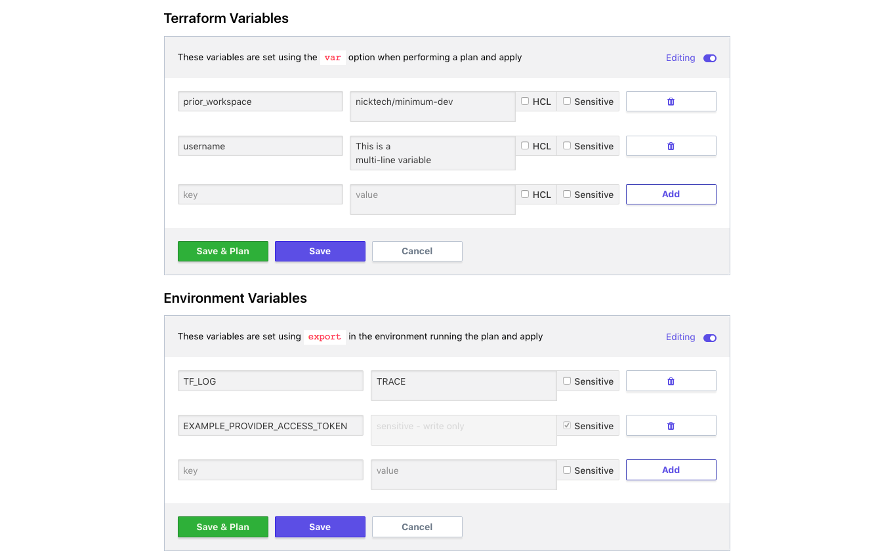
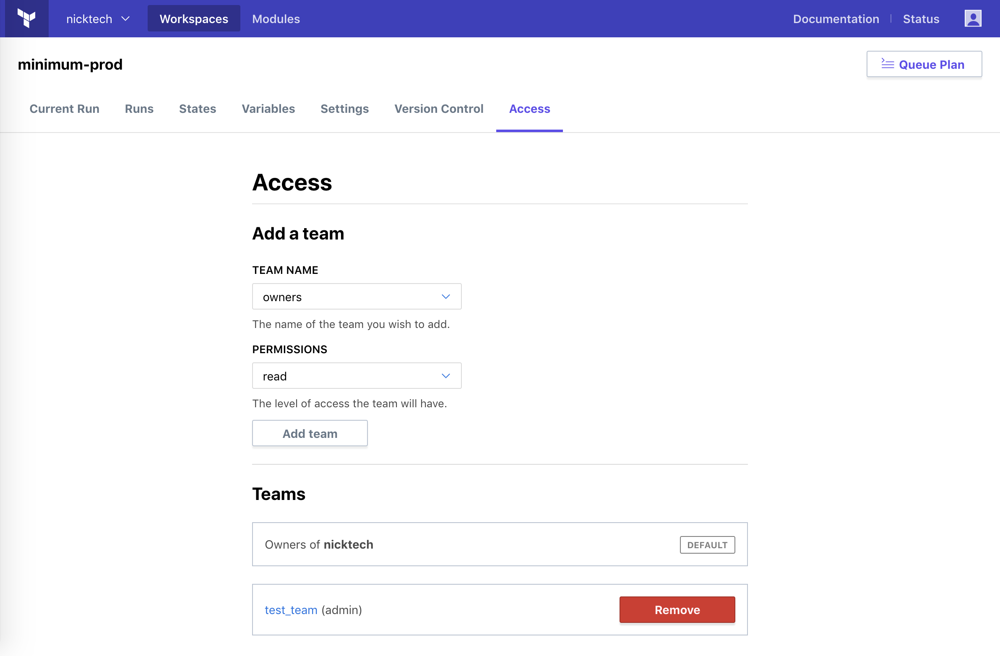
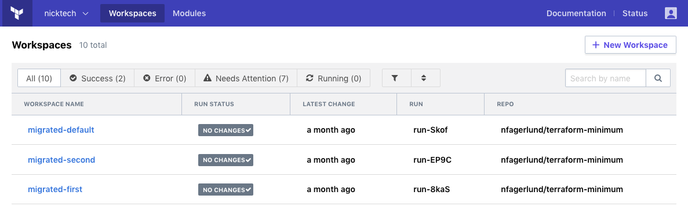

# Creating and Managing Terraform Workspaces

**Prerequisites:** Before starting this guide, you should [get access to Terraform Enterprise](./access.html) and [configure VCS access](./vcs.html).

At this point, you've done all the setup TFE needs, and can start using it for real work. Your first task should be to set up some workspaces.

## About Workspaces

_Workspaces_ are how TFE organizes infrastructure. If you've used the legacy version of TFE, workspaces used to be called environments.

A workspace consists of:

- A collection of Terraform configurations (retrieved from a VCS repo).
- Values for any variables those configurations require.
- Persistent stored state for the resources it manages.
- Historical state and run logs.

A well-designed Terraform workflow uses multiple configurations, so you can manage each logical grouping of infrastructure with its own code. Additionally, it's common to use the same configuration multiple times (with different values for variables) to manage different environments.

## Creating a Workspace

~> **Note:** Only members of the "owners" team can create new workspaces.

First, make sure you're viewing the workspace list. If you're still on the VCS settings (or any other page), click the "Workspaces" button in the top navigation bar.

The workspace list shows all of the workspaces you have access to; if you haven't created any, it's empty.

To create your first workspace, click the "+ New Workspace" button in the upper right.

On the "Create a new Workspace" page, you need to enter at least two items: a workspace name, and a VCS repository. (You can search for a repo by typing part of its name.) When you've finished, click the "Create Workspace" button.

### Workspace Name

A workspace name should tell your colleagues what the workspace is for. Most workspaces are _a particular environment_ of _a particular Terraform configuration,_ so the name should include both the name of the configuration and the name of the environment.

In this example, we're using a configuration named "minimum" and we're deploying it in a production environment, so we named it `minimum-prod`.

### Repository

The "repository" field is linked to data from your VCS service. You can start typing the name of a repo, then select the correct repo from the resulting list.

In this example, we're using the `nfagerlund/terraform-minimum` repo.

### Other Settings

Optionally, you can set three other settings for a new workspace:

- **Terraform Working Directory:** The directory in this repo where TFE will execute Terraform commands. If the Terraform configuration files you want aren't in the root of the repository, use this to specify where they are.
- **VCS Branch:** Which branch to use. Defaults to the repo's default branch, which is usually `master`.

## What Happens in a New Workspace

When you create a new workspace, a few things happen:

- TFE _doesn't_ immediately queue a plan for the workspace. Instead, it presents you with a dialog, with shortcut links to either queue a plan or edit variables.

    
- TFE automatically registers a webhook with your VCS service. The next time new commits appear in the selected branch of that repo, TFE will automatically queue a Terraform plan for the workspace.

## Editing Variables

For almost any workspace, you'll want to edit the Terraform variables and environment variables used by the code.

You can edit variables as soon as you've created a workspace, by clicking the workspace's "Variables" tab.

The variables page has two sections: Terraform variables (as declared in your Terraform configurations) and environment variables.

Click the "+ Add Variable" button to create a new variable, or click an existing variable's text fields or pencil icon to change its values and settings. After editing a variable, be sure to click its "Save Variable" button.

Terraform variables start as basic string values, but you can also enter array or map values if you click the "HCL" checkbox for that variable. You can write these values with the same syntax you'd use in a Terraform configuration.

For more information, see [Variables](../workspaces/variables.html).

## Granting Access

The user account that created your organization is part of the "owners" team, which can do any action on any workspace. Most of your colleagues don't need that level of access; instead, an administrator can give them access to the specific workspaces they need to use.

TFE manages access with _teams._ In your organization's settings, you can create any number of teams and add users to them — earlier in this getting started guide, you might have [already created a team](./access.html#adding-other-users-to-an-organization) to bring other users into your organization. If you haven't done that yet, do it now.

Once you have some teams, you can add them to a workspace by clicking the "Access" tab:

A newly created workspace can't be used by anyone but the "owners" team; other teams can't even see it. To enable collaboration on a workspace, you must add other teams to it.

To add a team to a workspace, select it from the dropdown menu and choose which permissions the team should have. There are three levels of permissions available:

- **Read** access lets team members view the workspace's variables and settings, view its run history, and view its StateVersions and ConfigurationVersions. They can't queue run plans, apply existing run plans, or change any variables or settings.
- **Write** access lets team members create and approve runs, and lock or unlock the workspace. It doesn't let them change variables or settings.
- **Admin** access lets team members change variables and settings, add other teams to the workspace, remove other teams from the workspace, and delete the workspace.

To change a team's permissions on a workspace, you must first delete their existing permissions, then add their new permissions.

~> **Note:** These permissions only affect actions via TFE's UI and API. If a person can push commits to a workspace's VCS repo and the workspace is set to automatically apply changes, that person can still make infrastructure changes. Take this into account when planning your teams and workspace permissions.

## Configuring a Workspace

Each workspace has a "Settings" page (available from the top links when viewing that workspace), where you can change the behavior of the workspace. Currently, this page has the following settings:

- **Auto apply vs. manual apply:** By default, TFE only performs a Terraform plan when you start a run (either manually or by adding new commits to the repo). You can then view the outcome of the plan and decide whether to go forward with applying it.

    This is called "manual apply." If you'd rather have TFE automatically apply successful plans, you can switch to "auto apply."
- **Terraform version:** TFE can use any released version of Terraform to manage a workspace. Different workspaces can use different versions, and TFE won't automatically upgrade a workspace.

    To stay up to date, you should visit workspace settings periodically and update the Terraform version.
- **Workspace lock:** A user with write privileges on a workspace can _lock_ the workspace, which prevents plans and applies from running. Use this when recovering from a bad commit or performing other maintenance.
- **Workspace delete:** When deleting a workspace, you usually also want to de-provision any infrastructure it's managing. This section of the settings has a button for queueing a destroy plan (to de-provision), and a button for deleting the workspace data. Note that destroy plans require an extra environment variable for confirmation; see the settings page for more details.

## Navigating Workspaces

Most of your time in TFE is spent in two views:

* The workspace list. Use this to get an overview of the workspaces you're responsible for, and to navigate between workspaces.

    

    To get back to the workspace list at any time, click the "Workspaces" button in the top navigation bar.
* The individual workspace pages, which provide more detail about a workspace's status, and let you manage runs, variables, and settings.

    To reach a workspace page, click that workspace's entry on the workspace list.

    

## Next Steps

Now that you've created and configured at least one workspace, you're ready to [start performing Terraform runs](./runs.html).
