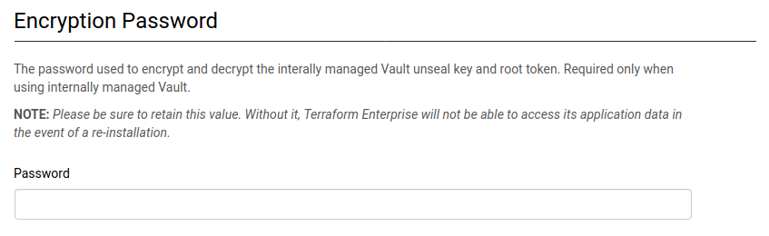

# Terraform Enterprise Encryption Password

When using internally-managed Vault, Terraform Enterprise requires that the operator specify a password that will be
used to to encrypt and decrypt the internally-managed Vault unseal key and root token. This password is called the
"encryption password". Please be sure to retain this value as it will be needed in the event of a re-installation.

The encryption password is used to protect the internally-managed Vault unseal key and root token with a password
provided by the operator. It allows Terraform Enterprise to securely store the Vault unseal key and root token in
PostgreSQL, which means that Vault is only dependent on the encryption password itself and the data in PostgreSQL.

## Specifying the Encryption Password

### Manual Installation

For manual installations, the encryption password can be specified via the "Encryption Password" field:



### Automated Installation

For automated installations, the encryption password can be specified via the `enc_password` setting in the
[application settings JSON file](./automating-the-installer.html#available-settings):

```json
{
    "hostname": {
        "value": "terraform.example.com"
    },
    "installation_type": {
        "value": "poc"
    },
    "enc_password": {
        "value": "CHANGEME"
    }
}
```

## Retrieving the Encryption Password

To retrieve the encryption password that Terraform Enterprise is currently configured to use, connect to your Terraform
Enterprise instance and execute the following: 

```
replicatedctl app-config export --template '{{.enc_password.Value}}'
```
