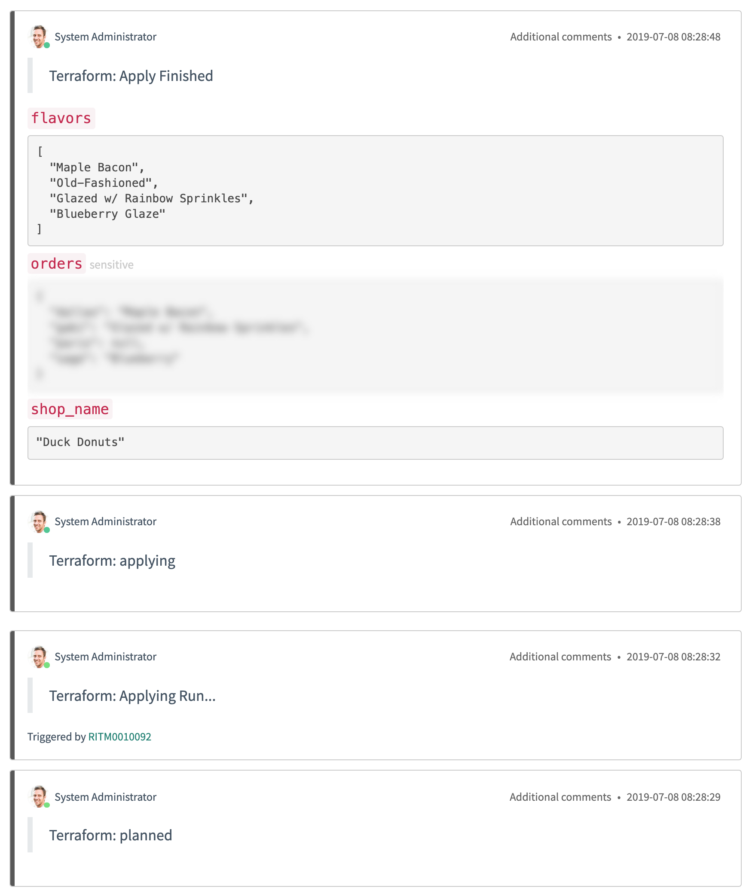

# Terraform ServiceNow Service Catalog Integration Setup Guide

-> **Version:**  v1.0.0

The Terraform ServiceNow Service Catalog integration enables your end-users to self-serve infrastructure via ServiceNow. The integration is a building block for administrators to connect ServiceNow with Terraform Enterprise to deliver infrastructure. With this integration, users can create, plan, and apply workspaces from prepared Terraform configurations hosted in VCS repositories.

Integrating ServiceNow with Terraform Enterprise involves:

|Terraform ServiceNow Service Catalog | Terraform Enterprise |
--|--
| | Prepare an organization for the ServiceNow Catalog and a team to manage workspaces created by the integration. |
| Import the integration from source control. |
| Connect the integration with Terraform Enterprise. | Team API token to manage workspaces for an organization from the integration client. |
| Add VCS repositories with Terraform configurations as catalog items. |
| Self-serve infrastructure available through the ServiceNow Catalog. | Provisioned infrastructure are served and managed in Terraform Enterprise. |

## Prerequisites

To start using Terraform with ServiceNow Catalog Integration, you must already have:

- A [Terraform Enterprise](https://www.hashicorp.com/products/terraform/) account, either on app.terraform.io or on a Terraform Enterprise installation.
- A ServiceNow instance or developer instance. You can request a ServiceNow developer instance at [developer.servicenow.com](https://developer.servicenow.com/).
- A [supported version control system](../../vcs/index.html#supported-vcs-providers) (VCS) with read access to repositories with Terraform configuration.
- A git repository to host the ServiceNow integration.

## Terraform Enterprise Setup

In order to prepare for installing the ServiceNow integration, you'll need to create and copy a few things from the Terraform side.

1. [Create an organization](../../users-teams-organizations/organizations.html) (or choose an existing organization) where ServiceNow will create new workspaces.
1. [Create a team](../../users-teams-organizations/teams.html) for that organization called ServiceNow, and ensure that it has "Manage Workspaces" enabled.
    - Generate a Team Token and save it for later.
1. If not yet done for this Terraform organization, [connect a VCS Provider](../../vcs/index.html).
    - Save the OAuth Token ID for later.

## Installing the ServiceNow Integration

### ServiceNow Server Studio

Import the integration using the [ServiceNow Studio](https://docs.servicenow.com/bundle/madrid-application-development/page/build/applications/concept/c_ServiceNowStudio.html).

1. Launch the ServiceNow Studio by typing "studio" in the search on the left-hand side.
1. Click "Import from Source Control" and
    - If this is not your first time opening the Studio, you can also access this from File > Import from Source Control.
1. Fill in the information required to import the integration:
    - URL: https://github.com/YOUR_ORG/terraform-servicenow-integration
    - Username: [your VCS username]
    - Password: [a VCS Personal Access Token or your password]
1. Select the Terraform application.
    - Application > Terraform
1. You can now close the ServiceNow Studio or continue customizing the application.

#### Enable Polling Workers [Recommended]

The integration includes 2 ServiceNow Workflow Schedules to poll Terraform Enterprise API using ServiceNow Outbound HTTP REST requests. By default, all workflow schedules are set to On-Demand. These can be customized inside the ServiceNow Server Studio:

1. Select the Worker Poll Run State (Workflow > Workflow Schedule)
1. Change the value for the Run field from On-Demand to Periodically
1. Repeat Intervals 1-5 minutes
1. Click “Update”

##### Worker Poll Apply Run

The worker executes Terraform Run Apply to workspaces that have been planned and are ready to be applied. The worker adds a comment on the request item for those workspaces notifying a run has been triggered.

##### Worker Poll Run State

The worker synchronizes ServiceNow with the current run state of Terraform workspaces by polling the Terraform Enterprise API. On state changes, the worker adds a comment to the ServiceNow request item with the updated run state and other metadata.

### Connecting to Terraform Enterprise

-> **Roles Required:** `admin` or `x_terraform.config_user`

1. Using the left-hand navigation, open the configuration table for the integration to manage the Terraform Enterprise connection.
    - Terraform > Configs
1. Click on "New" to create a new Terraform Enterprise connection:
    - Set API Team Token to the Terraform Enterprise [Team Token](../../users-teams-organizations/teams.html) you created earlier.
    - If you're using Terraform Enterprise instead of the SaaS version of Terraform Cloud, change Hostname to the hostname of your Terraform Enterprise instance.
    - Set Org Name to the name of the Terraform Enterprise organization you wish to use for new workspaces created by ServiceNow.

## Adding the Terraform Service Catalog

1. In ServiceNow, open the Service Catalog > Catalogs view by searching for "catalogs" in the left-hand navigation.
1. Click the plus sign in the top right.
1. Select Terraform and choose a place to add it.

## Configuring VCS Repositories

-> **Roles Required:** `admin` or `x_terraform.vcs_repositories_user`

1. In ServiceNow, open the Terraform > VCS Repositories table by searching for "terraform" in the left-hand navigation.
1. Click "New" to add a VCS Repository for to be available for fulfillment through the Terraform Service Catalog.
    - Name: The name for this workspace template that you want users to see.
    - OAuth Token ID: The OAuth Token ID that you copied from your Terraform Enterprise organization in Settings > VCS Providers.
    - Identifier: The name you want your user to choose when ordering infrastructure. This can be the repository name, it can include organization or user(mycompany/foo), or it can be a description of what infrastructure the configuration in the repo will create (Full Azure stack)
    - The remaining fields are all optional.

-> **Note:** Currently, the implementation uses the [auto-apply](../../api/workspaces.html#request-body) attribute by default when creating workspaces. When creating a new workspace from a VCS repository, Terraform Enterprise inherits webhooks that are used to notify it of changes. Changes to the original repository may cause changes to the Terraform workspaces created from it.

## Terraform Variables and ServiceNow Variable Sets

ServiceNow has the concept of a Variable Set which is a collection of ServiceNow Variables that can be referenced in a workflow from a Service Catalog item. The Terraform Integration codebase can create [Terraform Variables and Terraform Environment Variables](../../workspaces/variables.html) via the API using the `tf_variable.createVariablesFromSet()` function.

This function looks for variables following these conventions:

ServiceNow Variable Name | Terraform Enterprise Variable
--|--
`tf_var_VARIABLE_NAME` | Terraform Variable: `VARIABLE_NAME`
`tf_env_ENV_NAME` | Environment Variable: `ENV_NAME`

This function takes the ServiceNow Variable Set and Terraform Workspace ID. It will loop through the given variable set collection and create any Terraform variables or Terraform environment variables.

## Customizing with ServiceNow "Script Includes" Libraries

The Terraform/ServiceNow Integration codebase includes [ServiceNow Script Includes Classes](https://docs.servicenow.com/bundle/madrid-application-development/page/script/server-scripting/concept/c_ScriptIncludes.html) that are used to interface with Terraform Enterprise. The codebase also includes example catalog items and workflows that implement the interface to Terraform API.

These classes and examples can be used to help create ServiceNow Catalog Items customized to your specific ServiceNow instance and requirements.

### Script Include Classes

The ServiceNow Script Include Classes can be found in the ServiceNow Studio > Server Development > Script Include.

Class Name | Description
--|--
`tf_config` | Helper to pull values from the SN Terraform Configs Table
`tf_http` | SN HTTP REST Wrapper for requests to Terraform API
`tf_run` | Resources for Terraform Run API Requests
`tf_terraform_record` | Manage ServiceNow Terraform Table Records
`tf_util` | Miscellaneous helper functions
`tf_variable` | Resources for Terraform Variable API Requests
`tf_vcs_record` | Manage ServiceNow Terraform VCS Repositories Table Records
`tf_workspace` | Resources for Terraform Workspace API Requests

### Example Service Catalog Workflows

The ServiceNow Example Workflows can be found in the ServiceNow Studio > Workflow > Workflow. By default, the workflows execute upon submitting an order request for the various catalog items. Admins can modify the workflows to wait on an approval action, include approval rules, and specify approver groups.

Workflow Name | Description
--|--
Create Workspace | Creates a new Terraform Enterprise workspace from VCS repository.
Create Workspace with Variables | Creates a new Terraform Enterprise workspace from VCS repository and creates any variables provided.
Create Run | Creates/Queues a new run on the Terraform Enterprise workspace.
Apply Run | Applies a run on the Terraform Enterprise workspace.
Provision Resources | Creates a Terraform Enterprise workspace (with auto-apply), creates/queues a run, applies the run when ready.
Provision Resources with Variables | Creates a Terraform Enterprise workspace (with auto-apply), creates any variables, creates/queues a run, applies the run when ready.
Poll Run State | Polls the Terraform Enterprise API for the current run state of a workspace.
Poll Apply Run | Polls the Terraform Enterprise API and applies any pending Terraform runs.

## ServiceNow ACLs

Access control lists (ACLs) restrict user access to objects and operations based on permissions granted. This integration includes the following roles that can be used to manage various components.

Access Control Roles | Description
:--|--
`x_terraform.config_user` | Can manage the connection from the ServiceNow application to your Terraform Enterprise organization.
`x_terraform.terraform_user` | Can manage all of the Terraform resources created in ServiceNow.
`x_terraform.vcs_repositories_user` | Can manage the VCS repositories available for catalog items to be ordered by end-users.

For users who only need to order from the Terraform Catalog, we recommend creating another role with read-only permissions for `x_terraform_vcs_repositories` to view the available repositories for ordering infrastructure.

