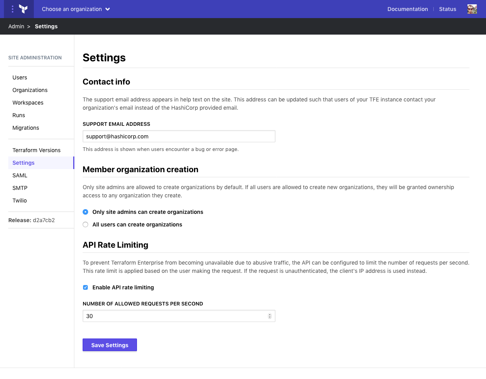

# Administration: General Settings

General settings control global behavior in Private Terraform Enterprise. To access general settings, visit the site admin area and click **Settings** in the left menu. To save the settings, click **Save Settings** at the bottom of the page.

-> **API:** See the [Admin Settings API](../../api/admin/settings.html).

## Contact Info

The support email address is used in system emails and other contact details. It defaults to support@hashicorp.com. If you'd like  users of your instance to reach out to a specific person or team when they have issues, it can be changed to a local email address.

## Organization Creation

Organization creation can be limited to site administrators or allowed for all users. Limiting organization creation to administrators means that the need for new organizations can be audited and their creation easily monitored.

When new user accounts are created, if they cannot create their own organizations, they will be unable to access any Terraform Enterprise resources until they are added to a team.

## API Rate Limiting

By default, requests to the Terraform Enterprise API from a single user or IP address are [limited to 30 requests per second](../../api/index.html#rate-limiting) to prevent abuse or hogging of resources. Since usage patterns may vary for a given instance, this can be updated to match local needs.
