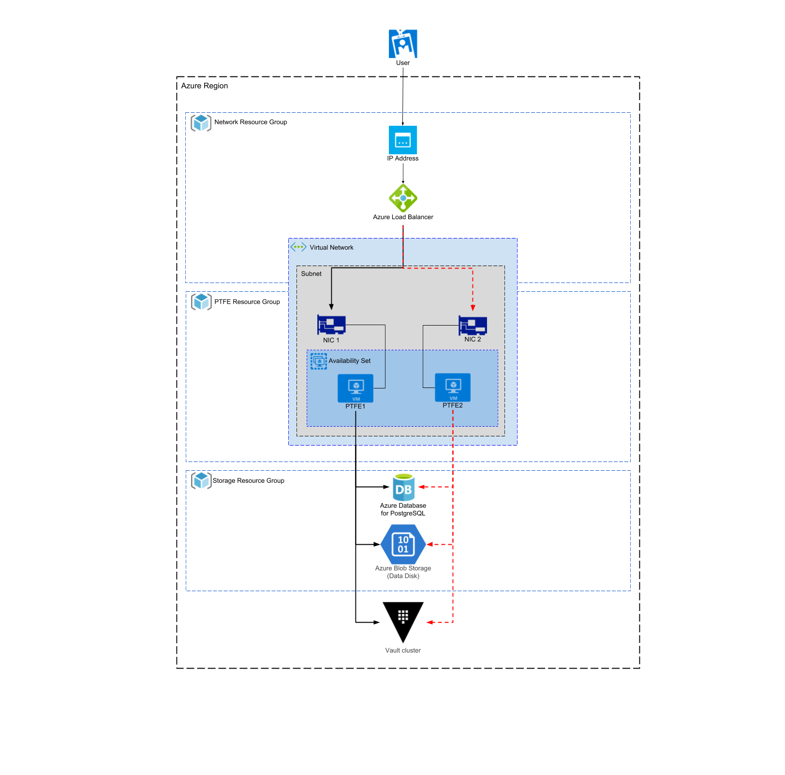

## Introduction

This document provides recommended practices and a reference
architecture for HashiCorp Private Terraform Enterprise (PTFE)
implementations on Azure.

## Required Reading

Prior to making hardware sizing and architectural decisions, read through the
[installation information available for
PTFE](https://www.terraform.io/docs/enterprise/private/install-installer.html)
to familiarise yourself with the application components and architecture.
Further, read the [reliability and availability
guidance](https://www.terraform.io/docs/enterprise/private/reliability-availability.html)
as a primer to understanding the recommendations in this reference
architecture.

## Infrastructure Requirements

Depending on the chosen [operational
mode](https://www.terraform.io/docs/enterprise/private/install-installer.html#operational-mode-decision),
the infrastructure requirements for PTFE range from a single [Azure VM
instance](https://azure.microsoft.com/en-us/services/virtual-machines/) for
demo or proof of concept installations, to multiple instances connected to
Azure DB, Azure Blob Storage and an external Vault cluster for a stateless
production installation.

This reference architecture focuses on the “Production - External Services”
operational mode.

The following table provides high level server recommendations, and is meant as
a guideline. Of particular note is the strong recommendation to avoid non-fixed
performance CPUs, or “Burstable CPU” in Azure terms, such as B-series
instances.

### PTFE Servers (Azure VMs)

| Type        | CPU      | Memory       | Disk | Azure VM Sizes                     |
| ----------- | -------- | ------------ | ---- | ---------------------------------- |
| Minimum     | 2 core   | 8 GB RAM     | 50GB | Standard\_D2\_v3                   |
| Recommended | 4-8 core | 16-32 GB RAM | 50GB | Standard\_D4\_v3, Standard\_D8\_v3 |

#### Hardware Sizing Considerations

- The minimum size would be appropriate for most initial production
	deployments, or for development/testing environments.

- The recommended size is for production environments where there is
	a consistent high workload in the form of concurrent terraform
	runs.

### PostgreSQL Database (Azure DB for PostgreSQL)

| Type        | CPU      | Memory      | Storage | Azure DB Sizes                                     |
| ----------- | -------- | ----------- | ------- | -------------------------------------------------- |
| Minimum     | 2 core   | 4 GB RAM    | 50GB    | General Purpose 2 vCores                           |
| Recommended | 4-8 core | 8-16 GB RAM | 50GB    | General Purpose 4 vCores, General Purpose 8 vCores |

#### Hardware Sizing Considerations

  - The minimum size would be appropriate for most initial production
    deployments, or for development/testing environments.

  - The recommended size is for production environments where there is
    a consistent high workload in the form of concurrent terraform
    runs.

### Object Storage (Azure Blob Storage)

An Azure Blob Storage
[container](https://docs.microsoft.com/en-us/azure/storage/blobs/storage-blobs-introduction#container)
must be specified during the PTFE installation for application data to
be stored securely and redundantly away from the Azure VMs running the
PTFE application. This Azure Blob Storage container must be in the same
region as the VMs and Azure DB instances. It is recommended the Virtual
Network containing the PTFE servers be configured with a
[Virtual Network (VNet) service
endpoint](https://docs.microsoft.com/en-us/azure/virtual-network/virtual-network-service-endpoints-overview)
for Azure Storage. Vault is used to encrypt all application data stored
in the Azure Blob Storage container. This allows for further
[server-side
encryption](https://docs.microsoft.com/en-us/azure/storage/common/storage-service-encryption)
by Azure Blob Storage if required by your security policy.

### Vault Cluster

In order to provide a fully stateless application instance, PTFE must be
configured to speak with an [external Vault
cluster](https://www.terraform.io/docs/enterprise/private/vault.html).
This reference architecture assumes that a highly available Vault
cluster is accessible at an endpoint the PTFE servers can reach.

### Other Considerations

#### Additional Azure Resources

In order to successfully provision this reference architecture you must
also be permitted to create the following Azure resources:

  - Resource Group

  - Load Balancer

  - Virtual Network

  - Subnet

  - Public IP

  - Managed Disk

  - Network Interface

#### Network

To deploy PTFE in Azure you will need to create new or use existing
networking infrastructure. The infrastructure diagram highlights some of
the key components. These elements are likely to be very unique to your
environment and not something this Reference Architecture can specify in
detail.

#### DNS

DNS can be configured outside of Azure or using
[Azure
DNS](https://azure.microsoft.com/en-gb/services/dns/). The fully
qualified domain name should resolve to the Load Balancer. Creating the
required DNS entry is outside the scope of this guide.

#### SSL/TLS

An SSL/TLS certificate is required for secure communication between
clients and the PTFE application server. The certificate can be
specified during the UI-based installation or the path to the
certificate codified during an unattended installation.

## Infrastructure Diagram

The above diagram show the infrastructure components at a high-level.

### Application Layer

The Application Layer is composed of two PTFE servers (Azure VMs)
running in different subnets and operating in a main/standby
configuration. Traffic is routed only to PTFE-main via a Load Balancer.
Routing changes are typical managed by a human triggering a change in
the Load Balancer configuration.

### Storage Layer

The Storage Layer is composed of multiple service endpoints (AzureDB,
Azure Blob Storage, Vault) all configured with or benefitting from
inherent resiliency provided by Azure (in the case of AzureDB and Azure
Blob Storage) or assumed resiliency provided by a well-architected
deployment (in the case of Vault).

  - [More information about AzureDB for
    PostgreSQL
    deployments](https://docs.microsoft.com/en-us/azure/postgresql/concepts-business-continuity)

  - [More information about Azure Blob
    Storage](https://docs.microsoft.com/en-us/azure/storage/blobs/storage-blobs-introduction)

  - [More information about highly available
    Vault
    deployments](https://www.vaultproject.io/guides/operations/vault-ha-consul.html)

## Infrastructure Provisioning

The recommended way to deploy PTFE is through use of a Terraform
configuration that defines the required resources, their references to
other resources and dependencies.

## Normal Operation

### Component Interaction

The Load Balancer routes all traffic to the *PTFE-main* instance which
in turn handles all requests to the PTFE application.

The PTFE application is connected to the PostgreSQL database via the
Azure provided database server name endpoint. All database requests are
routed to the *AzureDB-main* server.

The PTFE application is connected to object storage via the Azure Blob
Storage endpoint for the defined container and all object storage
requests are routed to the highly available infrastructure supporting
Azure Storage.

The PTFE application is connected to the Vault cluster via the Vault
cluster endpoint URL.

### Monitoring

While there is not currently a monitoring guide for PTFE, information around
[logging](https://www.terraform.io/docs/enterprise/private/logging.html),
[diagnostics](https://www.terraform.io/docs/enterprise/private/diagnostics.html)
as well as [reliability and
availability](https://www.terraform.io/docs/enterprise/private/reliability-availability.html)
can be found on our website.

### Upgrades

See [the upgrading
section](https://www.terraform.io/docs/enterprise/private/install-installer.html#upgrading)
of the installation guide.

## High Availability

### Failure Scenarios

The PTFE Reference Architecture is designed to handle different failure
scenarios that have different probabilities. As the architecture evolves
the ability to provide better service continuity may improve.

#### Component Failure

##### Single VM Failure

In the event of the *PTFE-main* instance failing, the Load Balancer
should be re-configured (manually or automatically) to route all traffic
to the *PTFE-standby* instance. It is important to note this
configuration of routing all traffic to a single instance and not in an
active-active configuration is by design due to a serialisation
requirement in the core components of PTFE.

With external services (PostgreSQL Database, Object Storage, Vault) in
use, there is still some application configuration data present on the
PTFE server such as installation type, database connection settings,
hostname. This data rarely changes. If the application configuration has
not changed since installation, both PTFE-main and PTFE-standby will be
using the same configuration and no action is required. If the
configuration on PTFE-main changes you should create a snapshot via the
UI or CLI and recover this to PTFE-standby so both instances use the
same configuration.

##### PostgreSQL Database

The Azure Database for PostgreSQL service provides a guaranteed high
level of availability. The financially backed service level agreement
(SLA) is 99.99% upon general availability. There is virtually no
application down time when using this service. More information on Azure
Database for PostgreSQL service redundancy is available in the
[Azure
documentation](https://docs.microsoft.com/en-us/azure/postgresql/concepts-high-availability).

##### Object Storage

Using Azure Blob Storage as an external object store leverages the
highly available infrastructure provided by Azure. More information on
Azure Storage redundancy is available in the
[Azure
documentation](https://docs.microsoft.com/en-us/azure/storage/common/storage-redundancy).

##### Vault Servers

For the purposes of this guide, the external Vault cluster is expected
to be deployed and configured in line with the
[HashiCorp Vault Enterprise Reference
Architecture](https://www.vaultproject.io/guides/operations/reference-architecture.html).
This would provide high availability and disaster recovery support,
minimising downtime in the event of an outage.

## Disaster Recovery

### Failure Scenarios

The PTFE Reference Architecture is designed to handle different failure
scenarios that have different probabilities. As the architecture evolves
it may provide a higher level of service continuity.

#### Region Failure

PTFE is currently architected to provide high availability within a
single Azure Region. Using multiple Azure Regions will give you greater
control over your recovery time in the event of a hard dependency
failure on a regional Azure service. In this section, we’ll discuss
various implementation patterns and their typical availability.

An identical infrastructure should be provisioned in a secondary Azure
Region. In the event of the primary Azure Region hosting the PTFE
application failing, the secondary Azure Region will require some
configuration before traffic is directed to it along with some global
services such as DNS.

  - [Azure Database for PostgreSQL's
    geo-restore
    feature](https://docs.microsoft.com/en-us/azure/postgresql/concepts-business-continuity)
    provides the ability to recover the database backup to the
    secondary Azure Region

  - [Geo-redundant storage (GRS) for Azure
    Storage](https://docs.microsoft.com/en-us/azure/storage/common/storage-redundancy-grs)
    must be configured so the object storage component of the Storage
    Layer is available in the secondary Azure Region.

  - [Vault Disaster Recovery (DR)
    Replication](https://www.vaultproject.io/docs/enterprise/replication/index.html#performance-replication-and-disaster-recovery-dr-replication)
    must be configured for a Vault cluster in the secondary Azure
    Region.

  - DNS must be redirected to the Load Balancer acting as the entry
    point for the infrastructure deployed in the secondary Azure
    Region.

#### Data Corruption

The PTFE application architecture relies on multiple service endpoints
(Azure DB, Azure Storage, Vault) all providing their own backup and
recovery functionality to support a low MTTR in the event of data
corruption.

##### PTFE Servers

With external services (PostgreSQL Database, Object Storage, Vault) in
use, there is still some application configuration data present on the
PTFE server such as installation type, database connection settings,
hostname. This data rarely changes. We recommend
[configuring automated
snapshots](https://www.terraform.io/docs/enterprise/private/automated-recovery.html#1-configure-snapshots)
for this installation data so it can be recovered in the event of data
corruption.

##### PostgreSQL Database

Backup and recovery of PostgreSQL is managed by Azure and configured
through the Azure portal or CLI. More details of Azure DB for PostgreSQL
features are available
[here](https://docs.microsoft.com/en-us/azure/postgresql/concepts-backup)
and summarised below:

> ***Automated Backups** – Azure Database for PostgreSQL automatically
> creates server backups and stores them in user configured locally
> redundant or geo-redundant storage.*
> 
> ***Backup redundancy** – Azure Database for PostgreSQL provides the
> flexibility to choose between locally redundant or geo-redundant
> backup storage.*

##### Object Storage

There is no automatic backup/snapshot of Azure Storage by Azure, so it
is recommended to script a container copy process from the container
used by the PTFE application to a “backup container” in Azure Storage
that runs at regular intervals. It is important the copy process is not
so frequent that data corruption in the source content is copied to the
backup before it is identified.

##### Vault Cluster

The recommended Vault Reference Architecture uses Consul for storage.
Consul provides the underlying [snapshot
functionality](https://www.consul.io/docs/commands/snapshot.html)
to support Vault backup and recovery. [Vault
Backup/Restore
doc](https://docs.google.com/document/d/1_RzV5xqgjDG-krFht0T3Deehw37HIMdU24uc2tqRwRk/edit).
