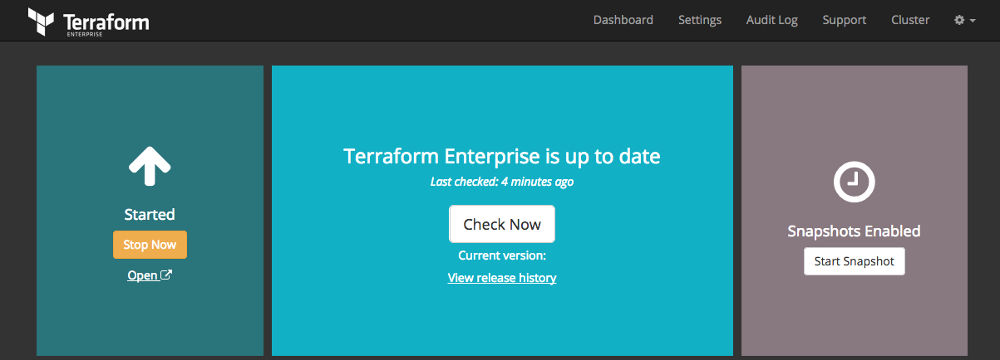

# Private Terraform Enterprise Configuration

After you have completed the installation process you will need to create an
administrator account. When the admin user creation has been completed you will
be able to create your first organizations and users and enable the enterprise
features for those accounts.

~> **Note:** If you are performing an upgrade or restore for an existing
installation you _do not_ need to follow these steps. If your upgraded or
restored installation does not function without the steps below then it was not
correctly restored from backup. Please contact HashiCorp for help.

## System Configuration

In all examples below, be sure to replace "`<TFE HOSTNAME>`" with the hostname
of your Private Terraform Enterprise instance.

Navigate to `https://<TFE HOSTNAME>:8800/` in your browser. You will
be presented with the installer's dashboard that looks like this:

### Creating an Administrator

After clicking on the "Open", right below the "Stop Now" button, you will
be brought to a page asking you to create the first PTFE administrator account.
You will be able to create additional administrators once you login.

### Creating an Organization

The next step will create the first Organization.

After this is done, you can either continue with the creation of a new workspace,
choose to configure other aspects of PTFE, or add more users.

## Success!

You have successfully configured the installation and configuration steps that
are specific to Private Terraform Enterprise! You can now head to the [Getting
Started](/docs/enterprise/getting-started/index.html) section to continue.
