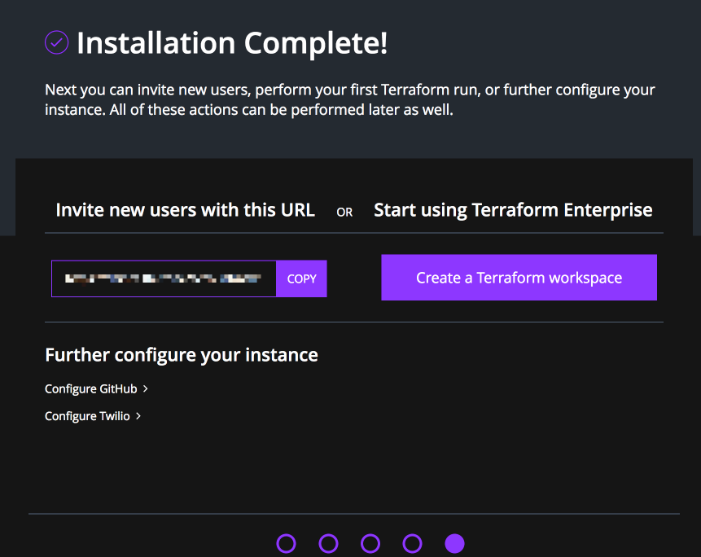

# Private Terraform Enterprise Configuration

After you have completed the installation process you will need to create an
administrator account, configure your Private Terraform Enterprise installation so
it can send emails and SMS, and connect to your VCS provider.

When the system configuration has been completed, create your first organizations and users and enable the
enterprise features for those accounts.

~> **Note:** If you are performing an upgrade or restore for an existing
installation you _do not_ need to follow these steps. If your upgraded or
restored installation does not function without the steps below then it was not
correctly restored from backup. Please contact HashiCorp for help.

## System Configuration

In all examples below, be sure to replace "`<TFE HOSTNAME>`" with the hostname
of your Private Terraform Enterprise instance.

Navigate to `https://<TFE HOSTNAME>/admin/bootstrap` in your browser. You will
be presented with a status page that looks like this:

### Creating an Administrator

After clicking on "Begin Installation" you will be brought to a page called
"Create Administrator". Enter the requested information to create the first
Administrator account. You will be able to create additional administrators
later.

### Creating an Organization

The next step will create the first Organization.

If you skip this step, you will be prompted the create the first organization
when you first log in.

After this is done, and showing the `Create a new Workspace` page, click back to the previous tab/browser window and continue.

### Configure SMTP (optional)

Terraform Enterprise sends emails occasionally for features like password reset
and to alert you when a new administrator is added. Fill out the details for
your SMTP server.  You may use an external provider such as Amazon SES or
Mailgun.

When you have added your configuration press "Save and Continue," or skip to
the next step.

### Installation Completion

At this point the installation is complete! You will be presented with this
page:

There are two tertiary links on the bottom of the page:

 * **Configure GitHub** - [**DO NOT USE**] This configuration mechanism is
   deprecated and will be removed in a future version of Private Terraform
   Enterprise.
 * **Configure Twilio** - This will set up Twilio for SMS-based multi-factor
   authentication see the next section for details.

Click **Create a Terraform workspace** when you are ready to continue.

### Configure Twilio (optional)

Terraform Enterprise uses Twilio to send SMS if a user selects SMS as their multi-factor
authentication option. If Twilio is not configured they must use the Google
Authenticator app on their smartphone instead.

When you have added your configuration press "Save and Continue," or skip to the
next step.

## Success!

You have successfully configured the installation and configuration steps that
are specific to Private Terraform Enterprise! You can now head to the [Getting
Started](/docs/enterprise/getting-started/index.html) section to continue.
