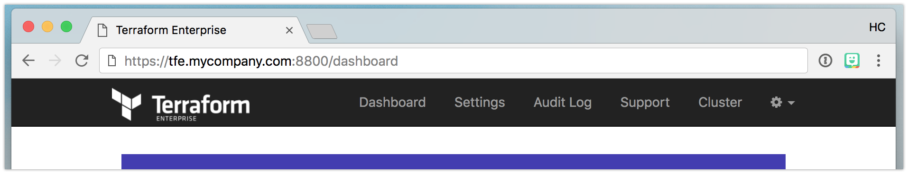
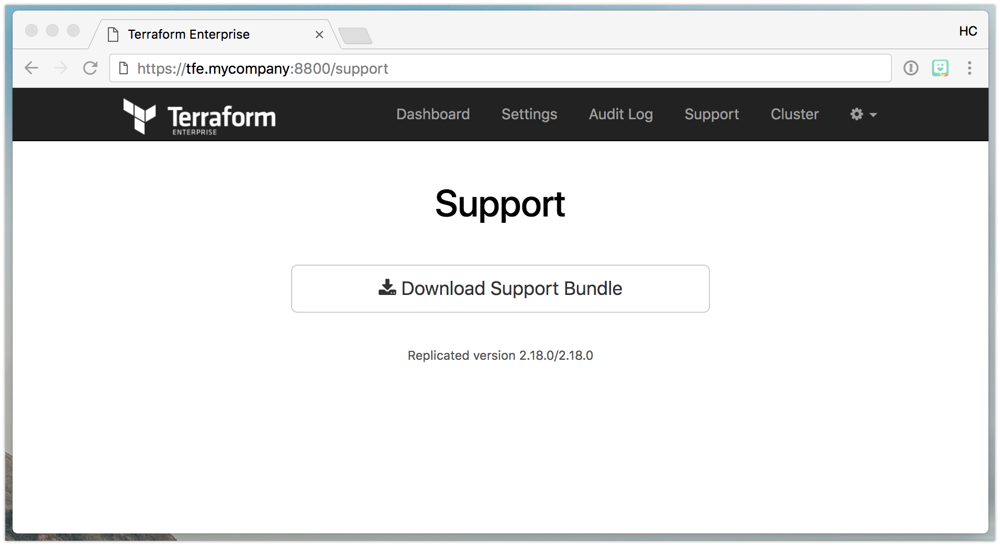

# Private Terraform Enterprise Diagnostics

This document contains information on how to provide HashiCorp with diagnostic information about a Private Terraform Enterprise (PTFE)
installation that requires assistance from HashiCorp support.

## AMI-based installs

To generate a support bundle, connect to the instance via ssh and run `sudo hashicorp-support`. Below is a sample session:

```
local$ ssh -i ~/.ssh/hc-eng-emp.pem tfe-admin@1.2.3.4
Last login: Thu Mar 29 14:39:14 2018 from 5.6.7.8

             H        H
          HHHH        HHH
      HHHHHHHH        HHHHH
   HHHHHHHHHH         HHHHH   H
 HHHHHHHHH            HHHHH   HHH
 HHHHHH      H        HHHHH   HHHHH   _  _         _    _  ___
 HHHHH     HHH        HHHHH   HHHHH  | || |__ _ __| |_ (_)/ __|___ _ _ _ __
 HHHHH   HHHHH        HHHHH   HHHHH  | __ / _` (_-< ' \| | (__/ _ \ '_| '_ \
 HHHHH   HHHHH        HHHHH   HHHHH  |_||_\__,_/__/_||_|_|\___\___/_| | .__/
 HHHHH   HHHHHHHHHHHHHHHHHH   HHHHH                                   |_|
 HHHHH   HHHHHHHHHHHHHHHHHH   HHHHH
 HHHHH   HHHHHHHHHHHHHHHHHH   HHHHH      TFE Hostname: tfe.mycompany.com
 HHHHH   HHHHH        HHHHH   HHHHH            Region: us-west-2
 HHHHH   HHHHH        HHH     HHHHH        IP Address: 4.3.2.1
 HHHHH   HHHHH        H      HHHHHH              User: tfe-admin
   HHH   HHHHH            HHHHHHHHH
     H   HHHHH          HHHHHHHHH        Distribution: Ubuntu 16.04
         HHHHH        HHHHHHHH                 Kernel: 4.4.0-98-generic
           HHH        HHHH
             H        H

      Memory Usage:     11.5%           System Uptime:  62 days
        Usage On /:     6%                 Swap Usage:  1.3%
       Local Users:     2                   Processes:  762
       System Load:     0.14, 0.26, 0.30

tfe.mycompany.com:~$ sudo hashicorp-support
==> Creating HashiCorp Support Bundle in /var/lib/hashicorp-support
==> Wrote support tarball to /var/lib/hashicorp-support/hashicorp-support.tar.gz
gpg: checking the trustdb
gpg: marginals needed: 3  completes needed: 1  trust model: PGP
gpg: depth: 0  valid:   1  signed:   0  trust: 0-, 0q, 0n, 0m, 0f, 1u
gpg: next trustdb check due at 2019-04-14
==> Wrote encrypted support tarball to /var/lib/hashicorp-support/hashicorp-support.tar.gz.enc
Please send your support bundle to HashiCorp support.

tfe.mycompany.com:~$ ls -F /var/lib/hashicorp-support/
gnupg/  hashicorp-support.tar.gz  hashicorp-support.tar.gz.enc
```

Next, copy the `hashicorp-support.tar.gz.enc` file listed above off the instance. This
can be done via scp or another tool that can interface with the system over SSH/SFTP. For example, on Linux and Mac OS X:

```
local$ scp -i ~/.ssh/hc-eng-emp.pem tfe-admin@1.2.3.4:/var/lib/hashicorp-support/hashicorp-support.tar.gz.enc .
hashicorp-support.tar.gz.enc                                                      100%  111MB  20.9MB/s   00:05
```

Then, attach the bundle to your support ticket. If possible, use the SendSafely integration (as it allows for large file uploads).

### Windows

On Microsoft Windows, tools such as [PSCP](https://www.ssh.com/ssh/putty/putty-manuals/0.68/Chapter5.html) and [WinSCP](https://winscp.net/eng/index.php) can be used to transfer the file.

## Installer-based Instances

Diagnostic information is available via in the Installer dashboard on port 8800 of your installation.

On the dashboard, click on the Support tab:



On the next page, click the _Download Support Bundle_ button which will download the support bundle directly to your web browser.



Then, attach the bundle to your support ticket. If possible, use the SendSafely integration (as it allows for large file uploads).

## Pre-Sales uploads

Customers in the pre-sales phase can upload support bundle files directly at https://hashicorp.sendsafely.com/dropzone/private-tfe.
