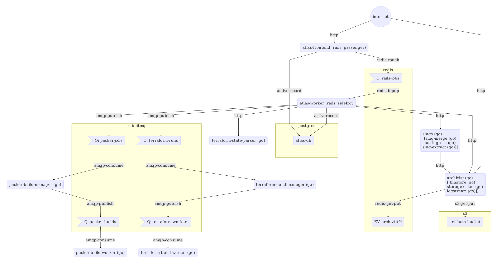

# Private Terraform Enterprise Frequently Asked Questions

This page will provide answers to many common questions around Private Terraform Enterprise

1. [About the AMI](#about-the-private-terraform-enterprise-ami)
2. [AMI IDs](#ami-ids)
3. [Additional Configuration Info](#additional-configuration-info)
4. [Upgrade Information](#migrating-from-a-legacy-terraform-enterprise-installation)
5. [Logs](#terraform-enterprise-logs)
6. [Migration from SaaS-based Terraform Enterprise](#migrating-from-terraform-enterprise-saas)
7. [Required Network Access](#network-access)
8. [Managing the Terraform State of the Install Process](#storing-terraform-enterprise-state)
9. [Support](#support-for-private-terraform-enterprise)
10. [Private Terraform Enterprise Architecture](#private-terraform-enterprise-architecture)
11. [Advanced Terraform](#advanced-terraform)
12. [Rekeying the Vault instance used by Private Terraform Enterprise](#rekeying-vault)

---

## About the Private Terraform Enterprise AMI

This document contains information about the Terraform Enterprise AMI.

### Operating System

The Private Terraform Enterprise AMI is based on the latest release of Ubuntu 16.04 with all security
patches applied.

### Network Ports

The Private Terraform Enterprise AMI requires that port :8080 be accessible. This is where all traffic
from the ELB is routed. Many other internal Private Terraform Enterprise services listen on the host,
but they do not require external traffic. The AWS security group for the
instance as well as software firewall rules within the runtime enforce this.

### `ulimits`

The necessary limits on open file descriptors are raised within
`/etc/security/limits.d/nofile.conf` on the machine image.

### Critical Services

The Private Terraform Enterprise AMI contains dozens of services that are required for proper operation
of Terraform Enterprise. These services are all configured to launch on boot.
Application-level services are managed via Nomad and system-level automation is
managed via `systemd`.

---

## AMI IDs

For the most up-to-date list of AMI IDs please view the [list maintained on our GitHub repo](https://github.com/hashicorp/terraform-enterprise-modules/blob/master/docs/ami-ids.md).

---

## Additional Configuration Info

 * [`base-vpc`](https://github.com/hashicorp/terraform-enterprise-modules/blob/master/aws-extra/base-vpc) - Configuration for creating a basic VPC and subnets that meet [the documented requirements for Private Terraform Enterprise installation](/docs/enterprise/private/install.html#preflight).
 * [`minimum-viable-iam`](https://github.com/hashicorp/terraform-enterprise-modules/blob/master/aws-extra/minimum-viable-iam) - Configuration for creating an AWS user with a minimum access policy required to perform a Terraform Enterprise installation. Please note using the `AdministratorAccess` policy is recommended. This access is only required for the initial deployment.

---

*NOTE:* This document only applies to customers who are running the Legacy Terraform Enterprise
architecture (mid-late 2016). If you're unsure if that's you, it likely is not.

## Migrating from a Legacy Terraform Enterprise Installation

The legacy Terraform Enterprise platform shipped as a complex multi-VM deployment. The
current generation ships as a single VM with supporting AWS services,
including S3 and RDS. This vastly simplifies deployment considerations and
reduces estimated operating costs by almost 90%.

Additionally, the legacy version shipped with a proprietary orchestration tool that was critical
for installation and maintenance. In the current version, these functions are either performed
by Terraform configuration, with full source provided to you, or by simple
scripts self-contained inside the VM.

We hope that the improvements reduce the time you spend managing your Private Terraform Enterprise
installation and increase your confidence in delivering Terraform Enterprise to the rest of your
organization.

### Data

To upgrade your version of Private Terraform Enterprise, you will need to access your existing
installation to create backups and copy some configuration. Afterwards, the new version
will be ready to resume work where you left off.

- Both versions store most of their data in RDS. The current version is designed to use RDS
  encryption by default. When migrating from we _strongly_ recommend
  enabling RDS encryption. To do this, you will need to create an encrypted RDS
  snapshot and specify the encrypted snapshot and KMS key in the v3 terraform
  config.

- Vault and Consul data will be migrated using a supplemental backup script
  provided by HashiCorp. This must be run from a bastion instance created by the
  legacy installer tool. The script will create a compatible backup from your
  legacy consul and vault clusters.

- The primary S3 bucket in the legacy installation is the one with the
  `-storagelocker` suffix. This S3 bucket may be left as-is, and you will have
  the option to configure your existing S3 bucket in the current Terraform
  configuration by adding `manage_bucket = false` to your `tfvars` file. Please
  note that the current version expects the bucket to be versioned to facilitate cross-region
  disaster recovery. If your bucket is not versioned please use this opportunity
  to enable versioning. The remainder of the buckets in the legacy installation are
  administrative and can be cleaned up after a successful upgrade.

### Installation Steps

#### Step 1. Configuration

Begin by configuring the `tfvars` file found in the `aws-standard`
directory. Please reference [the Installation page](./install.html) for
full descriptions of all the variables. You will provide your existing S3 bucket
as `bucket_name`, and `tfe-legacy-upgrade` as the `db_snapshot_identifier`.

 * Set existing `-storagelocker` S3 bucket as `bucket_name`
 * Set `manage_bucket` to `false` to indicate that this Terraform config will
   not create and manage a new bucket
 * Set `tfe-legacy-upgrade` as the `db_snapshot_identifier` - this will be the
   name of the encrypted snapshot copy below.

Specify `fqdn` as the DNS name used to access your installation, for example
`tfe.mycompany.io`. This value is used internally for redirects and CSRF.
Externally, you will need to direct your DNS server to the CNAME output from
`terraform apply`. **NOTE:** This value does not have to be the same as the the
value used for the legacy Private Terraform Enterprise installation. You're free to pick whatever you'd
like, but the `fqdn` must match your installation's external DNS or you will
be unable to login.

#### Step 2. KMS key creation

Private Terraform Enterprise now uses KMS to encrypt sensitive data stored in S3 and RDS. Because you will
be migrating data, you will need to create a KMS key in advance. We will use
this key to create an encrypted RDS snapshot and to encrypt the backup
in S3.

First, plan the change: `$ terraform plan --target=aws_kms_key.key`

This should only be creating the kms key, nothing else. Once this is approved:

`$ terraform apply --target=aws_kms_key.key`

This will output a KMS key ARN as `aws_kms_key.key`. You will use this value in
subsequent steps.

**Note:** The Terraform configuration provided by HashiCorp assumes that the new
install is taking place in the same account and region where your legacy
installation is located. If you are migrating to a new account or region you
will need to make minor adjustments, such as creating a new KMS key in the
target region or sharing a KMS key between accounts. Please refer to the AWS
documentation for details.

#### Step 3. Shutting down Legacy Application

Terminate the Atlas job inside your legacy installation. This will allow you
to perform a clean data migration without losing in-flight work.

To do this, bring up a bastion in the legacy installation and run the following
commands:

```
# Back up Atlas job contents
nomad inspect atlas > atlas.job.json
# Stop atlas
nomad stop atlas
```

Leave the bastion host running as you will also use it to migrate Consul and
Vault data in a subsequent step.

**Note:** Make sure the Atlas jobs have completely terminated before you
proceed. This ensures you will produce a consistent snapshot of work in Private Terraform Enterprise.

#### Step 4. RDS snapshot creation

Create an RDS snapshot from your legacy database. You can create a snapshot via the
AWS api or via the AWS console. We suggest naming the snapshot `tfe-legacy-1`.

Once the snapshot is complete, perform a copy of the snapshot with encryption
enabled. This procedure is documented here:
[Amazon RDS Update - Share Encrypted Snapshots, Encrypt Existing Instances](https://aws.amazon.com/blogs/aws/amazon-rds-update-share-encrypted-snapshots-encrypt-existing-instances/).

Be sure to select `Yes` to `Enable Encryption` and then select the KMS
key we created in Step 2 as the `Master Key`. We suggest naming the snapshot
`tfe-legacy-upgrade`, which is the value we indicated earlier for
`db_snapshot_identifier` in your `tfvars` file.

Once the snapshot has completed, move on to the next step.

#### Step 5. Consul/Vault data

The legacy Consul and Vault clusters contain the encryption keys needed to access
encrypted data stored in RDS (note that this application-level encryption is
different from the system-wide RDS encryption we just talked about). To restore
these keys into the new version we will create a special backup from the legacy data that is
compatible with the new version's automatic restore feature.

The tools to perform this step can be found at
[`hashicorp/tfe-v2-to-v3`](https://github.com/hashicorp/tfe-v2-to-v3). You can
request access from HashiCorp if you are not able to see this repository.
Running `make` in that repository will produce `tfe-v2-to-v3.tar.gz`.

Upload `tfe-v2-to-v3.tar.gz` to the legacy bastion host you created earlier (or
create a new bastion host now).

Extract the `tfe-v2-to-v3.tar.gz` into a folder like `~/backup` or
`/tmp/backup`. It should contain the following files:

    consul (binary)
    consul.json
    legacy-backup.sh
    vault.hcl

Make sure the `consul` binary is marked executable, and then invoke
`bash legacy-backup.sh`. This will connect to consul inside your legacy cluster and
produce a file called `atlas-backup-[timestamp].tar.gz`, which the new version can restore.
For additional details please refer to the script itself.

After you have the atlas-backup file, you will need to put it in S3 and encrypt
it with KMS. It should be placed under the `tfe-backup` folder in your Private Terraform Enterprise S3
bucket, like `s3://my-tfe-data/tfe-backup/atlas-backup-[timestamp].tar.gz`.

You must encrypt the archive when copying it to S3. Either ensure that the
bastion host's IAM role can use the KMS key, or pass in a set of credentials
that can access the required resources in KMS and S3. For example:

    aws configure set s3.signature_version s3v4
    aws s3 cp --sse=aws:kms --sse-kms-key-id=$KMS_KEY_ID $BACKUP_FILE $BACKUP_BUCKET/tfe-backup/$BACKUP_FILE

#### Step 6. Full Terraform Run

Now that all data have been migrated it's time to run a terraform plan for the
remainder of the installation:

`$ terraform plan`

Take a moment and look over the resources that will be created. It should be
considerably smaller than the existing legacy install. Once you're satisfied:

`$ terraform apply`

The apply will take around 30 minutes to create and restore the RDS database,
though the other resources should finish sooner. If there are any problems at
this stage, simply run `terraform apply` again.

When Terraform apply completes it will output a `dns_name` field. Use this to
configure DNS for your installation by configuring a CNAME record to point to
`dns_name`. **NOTE:** The CNAME you configure must match the one specified
earlier in `tfvars`!

Once the CNAME has propagated, you can view your installation in your browser.

#### Step 7. Verification

Open your selected DNS name in your browser using `https://<hostname>` (HTTPS is
required). You will see a page indicating that Terraform Enterprise is booting.
This page automatically refreshes and will redirect you to the login screen once
the database migrations and boot process have completed. Depending on the
size of your database this may take some time, possibly up to 1 hour. If you are
unsure whether your installation is making progress at this point, please reach
out to HashiCorp for help.

Once your instance boots you are ready to login with your existing admin or user
credentials. To verify that the installation is complete, browse to a previous
Terraform run and inspect the state or secrets (environment variables). If
everything loads correctly, then data and encryption keys have been successfully
restored your upgrade was successful. If you cannot login, cannot find previous
Terraform runs, or secrets are missing, please reach out to HashiCorp for help.

### Known Issues

#### GitHub Web Hooks and Callbacks

If you opt to change the hostname during your migration, existing GitHub web
hooks and callbacks will still be pointing to the prior installation. You will
need to update these in two places:

- You will need to update the GitHub OAuth Application for Terraform Enterprise
  so its Authorization callback URL references the new hostname. This enables
  users to link their Terraform Environments to GitHub.

- Each Terraform Environment that is already
  linked to a GitHub Repo will need to be relinked with GitHub by clicking
  "Update VCS Settings" on the "Integrations" page. This will update GitHub
  webhooks to point to the new hostname.

  ---

## Terraform Enterprise Logs

This document contains information about interacting with Private Terraform Enterprise logs.

### Application-level Logs

Private Terraform Enterprise's applcation-level services all log to CloudWatch logs, with one stream per service. The stream names take the format:

```
{hostname}-{servicename}
```

Where `hostname` is the fqdn you provided when setting up Private Terraform Enterprise, and `servicename` is the name of the service whose logs can be found in the stream. More information about each service can be found in [`tfe-architecture`](#private-terraform-enterprise-architecture).

For example, if your Private Terraform Enterprise installation is available at `tfe.mycompany.io`, you'll find CloudWatch Log streams like the following:

```
tfe.mycompany.io-atlas-frontend
tfe.mycompany.io-atlas-worker
tfe.mycompany.io-binstore
tfe.mycompany.io-logstream
tfe.mycompany.io-packer-build-manager
tfe.mycompany.io-packer-build-worker
tfe.mycompany.io-slug-extract
tfe.mycompany.io-slug-ingress
tfe.mycompany.io-slug-merge
tfe.mycompany.io-storagelocker
tfe.mycompany.io-terraform-build-manager
tfe.mycompany.io-terraform-build-worker
tfe.mycompany.io-terraform-state-parser
```

CloudWatch logs can be searched, filtered, and read from either from the AWS Web Console or (recommended) the command line [`awslogs`](https://github.com/jorgebastida/awslogs) tool.

### System-level Logs

All other system-level logs can be found in the standard locations for an Ubuntu 16.04 system.

---

## Migrating from Terraform Enterprise SaaS

If you are already a user of the Terraform Enterprise SaaS (hereafter "the SaaS"), you may have Environments that you want to migrate over to your new Private Terraform Enterprise installation.

These instructions assume Terraform 0.9 or greater. See [docs on legacy remote state](https://www.terraform.io/docs/backends/legacy-0-8.html) for information on upgrading usage of remote state in prior versions of Terraform.

### Prerequisites

Have an Atlas Token handy for both Private Terraform Enterprise and the SaaS. The following examples will assume you have these stored in `PTFE_ATLAS_TOKEN` and `SAAS_ATLAS_TOKEN`, respectively.

### Step 1: Connect local config to SaaS

Set up a local copy of your Terraform config that's wired in to the SaaS via a `backend` block.

Assuming your environment is located at `my-organization/my-environment` in the SaaS - make your way to a local copy of the Terraform config, and ensure you have a backend configuration like this:

```tf
terraform {
  backend "atlas" {
    name = "my-organization/my-environment"
  }
}
```

Place your SaaS token in scope and initialize:

```
export ATLAS_TOKEN=$SAAS_ATLAS_TOKEN
terraform init
```

### Step 2: Copy state locally

Now we'll want to get the latest copy of the state locally so we can push it to Private Terraform Enterprise - you can do this by commenting out the `backend` section of your config:

```tf
# Temporarily commented out to copy state locally
# terraform {
#   backend "atlas" {
#     name = "my-organization/my-environment"
#   }
# }
```

Now, rerunning initialization:

```
terraform init
```

This will cause Terraform to detect the change in backend and ask you if you want to copy the state.

Type `yes` to allow the state to be copied locally. Your state should now be present on disk as `terraform.tfstate`, ready to be uploaded to the Private Terraform Enterprise backend.

### Step 3: Update backend configuration for Private Terraform Enterprise

Change the backend config to point to your Private Terraform Enterprise installation:

```tf
terraform {
  backend "atlas" {
    address = "https://tfe.mycompany.example.com" # the address of your PTFE installation
    name    = "my-organization/my-environment"
  }
}
```

Now, place your Private Terraform Enterprise token in scope and re-initialize:

```
export ATLAS_TOKEN=$PTFE_ATLAS_TOKEN
terraform init
```

You will again be asked if you want to copy the state file. Type `yes` and the state will be uploaded to your Private Terraform Enterprise installation.

---

## Network Access

This section details the ingress and egress network access required by Terraform Enterprise to function properly.

### Ingress Traffic

Terraform Enterprise requires certain ports to be accessible for it to function. The Terraform configuration that ships with Terraform Enterprise will by default create Security Groups (SGs) that make the appropriate ports available, but you can also specify custom SGs to be used instead.

Here are the two SGs in the system relevant for user access and the ports they require to be open:

* **Load Balancer SG**: Applied to the Elastic Load Balancer (ELB), controls incoming HTTP traffic from users
  * **Port 443** must be accessible to users for basic functionality, must also be accessible from the VPC itself, as certain internal services reach over the ELB to access cross-service APIs
  * **Port 80** is recommended to leave open for convenience - the system is set up to force SSL by redirecting users who visit Private Terraform Enterprise over HTTP to the HTTPS equivalent URL. If this port is not available, users who mistakenly visit the site over HTTP will see hanging requests in their browser
* **Instance SG**: Applied to the EC2 Instance running the application
  * **Port 8080** must be accessible to the ELB to serve traffic
  * **Port 22** must be accessible to operators to perform diagnostics and troubleshooting over SSH

There are also two internal SGs that are not currently user configurable:

* **Database SG**: Applied to the RDS instance - allows the application to talk to PostgreSQL
* **Redis SG**: Applied to the ElastiCache instance - allows the application to talk to Redis

### Egress Traffic

Terraform Enterprise makes several categories of outbound requests, detailed in the sections below.

#### Primary Data Stores

**S3** is used for object storage, so access to the AWS S3 API and endpoints is required for basic functionality

**RDS and ElastiCache** instances are provisioned for application data storage. These instances are within the same VPC as the application, and so communication with them does not constitute outbound traffic

#### Version Control System Integrations

Private Terraform Enterprise workspaces can be configured to a number of **[Version Control Systems (VCSs)](https://www.terraform.io/docs/enterprise/vcs/index.html)**, some supporting both SaaS and private-network installations.

In order to perform ingress of Terraform configuration from a configured VCS, Private Terraform Enterprise will need to be able to communciate with that provider's API, and webhooks from that provider will need to be able to reach Private Terraform Enterprise.

For example, an integration with GitHub will require Private Terraform Enterprise to have access to https://github.com and for GitHub's webhooks to be able to route back to Terraform. Similarly, an integration with GitHub Enterprise will require Terraform to have access to the local GitHub instance.

#### Terraform Execution

As a part of their primary mode of operation, Terraform makes API calls out to infrastructure provider APIs. Since Private Terraform Enterprise runs Terraform on behalf of users, Private Terraform Enterprise will therefore need access to any Provider APIs that your colleagues want to manage with Private Terraform Enterprise.

#### Terraform Release Downloading

By default, Private Terraform Enterprise downloads the versions of Terraform that it executes from https://releases.hashicorp.com/ - though this behavior can be customized by specifying different download locations. See [`managing-tool-versions`](https://github.com/hashicorp/terraform-enterprise-modules/blob/master/docs/managing-tool-versions.md).

#### Terraform Latest Version Notifications

When displaying Terraform Runs, Private Terraform Enterprise has JavaScript that reaches out to https://checkpoint.hashicorp.com to determine the latest released version of Terraform and notify users if there is a newer version available than the one they are running. This functionality non-essential - new version notifications will not be displayed in the Web UI if checkpoint.hashicorp.com cannot be reached from a user's browser.

#### Communication Functions

* Private Terraform Enterprise uses the configured SMTP endpoint for sending emails
* Twilio can optionally be set up for for SMS-based 2FA (virtual TOTP support is available separately which does not make external API calls)

---

## Storing Terraform Enterprise State

The Private Terraform Enterprise install process uses Terraform, and therefore must store Terraform State. This presents a bootstrapping problem, because while generally you can use Terraform Enterprise to securely store versioned Terraform State, in this case Terraform Enterprise is not ready yet.

So therefore, you must choose a mechanism for storing the Terraform State produced by the install process.

### Security Considerations for Terraform State

The Terraform State file for the Private Terraform Enterprise instance will contain the RDS Database password used by the application. While sensitive fields are separately encrypted-at-rest via Vault, this credential and network access to the database would yield access to all of the unencrypted metadata stored by Terraform Enterprise.

HashiCorp recommends storing the Terraform State for the install in an encrypted data store.

### Recommended State Storage Setup

Terraform supports various [Remote State](https://www.terraform.io/docs/state/remote.html) backends that can be used to securely store the Terraform State produced by the install.

HashiCorp recommends a versioned, encrypted-at-rest S3 bucket as a good default choice.

Here are steps for setting up and using an S3 bucket for Remote State Storage:

```bash
# From the root dir of your Private Terraform Enterprise installation config
BUCKETNAME="mycompany-terraform-enterprise-state"

# Create bucket
aws s3 mb "s3://${BUCKETNAME}"

# Turn on versioning for the bucket
aws s3api put-bucket-versioning --bucket "${BUCKETNAME}" --versioning-configuration status=Enabled

# Configure terraform backend to point to the S3 bucket
cat <<EOF >backend.tf
terraform {
  backend "s3" {
    bucket  = "${BUCKETNAME}"
    key     = "terraform-enterprise.tfstate"
    encrypt = true
  }
}
EOF

# Initialize Terraform with the Remote Backend
terraform init 
```

Now, if you keep the `backend.tf` file in scope when you run `terraform` operations, all state will be stored in the configured bucket.

---

## Support for Private Terraform Enterprise

If some aspect of Private Terraform Enterprise is not working as
expected, please reach out to support for help.

### Email

You can engage HashiCorp support via <support@hashicorp.com>. Please make sure
to use your organization email (not your personal email) when contacting us so
we can associate the support request with your organization and expedite our
response.

### Diagnostics

For most technical issues HashiCorp support will ask you to include diagnostic
information in your support request. You can create a support bundle by
connecting to your Private Terraform Enterprise instance via SSH and running

    sudo hashicorp-support

You will see output similar to:

    ==> Creating HashiCorp Support Bundle in /var/lib/hashicorp-support
    ==> Wrote support tarball to /var/lib/hashicorp-support/hashicorp-support.tar.gz
    gpg: checking the trustdb
    gpg: marginals needed: 3  completes needed: 1  trust model: PGP
    gpg: depth: 0  valid:   1  signed:   0  trust: 0-, 0q, 0n, 0m, 0f, 1u
    gpg: next trustdb check due at 2019-04-14
    ==> Wrote encrypted support tarball to /var/lib/hashicorp-support/hashicorp-support.tar.gz.enc
    Please send your support bundle to HashiCorp support.

Attach the `hashicorp-support.tar.gz.enc` file to your support request. If it is
too large to attach you can send this to us via S3, FTP, or another data store
you control.

**Warning:** Make sure to attach the file ending in `.tar.gz.enc` as the
contents of `.tar.gz` are not encrypted!

**Note:** The GPG key used to encrypt the bundle is imported for the `root` user
only. If you use `sudo -sH`, change `$HOME`, or take a similar action, the
encryption step will fail. To assume `root` use `sudo -s` instead.

#### About the Bundle

The support bundle contains logging and telemetry data from various components
in Private Terraform Enterprise. It may also include log data from Terraform builds you have executed on your Private Terraform Enterprise installation. For your privacy and
security, the entire contents of the support bundle are encrypted with a 2048
bit RSA key.

#### Scrubbing Secrets

If you have extremely sensitive data in your Terraform build logs you
may opt to omit these logs from your bundle. However, this may impede our
efforts to diagnose any problems you are encountering. To create a custom
support bundle, run the following commands:

    sudo -s
    hashicorp-support
    cd /var/lib/hashicorp-support
    tar -xzf hashicorp-support.tar.gz
    rm hashicorp-support.tar.gz*
    rm nomad/*build-worker*
    tar -czf hashicorp-support.tar.gz *
    gpg2 -e -r "Terraform Enterprise Support" \
        --cipher-algo AES256 \
        --compress-algo ZLIB \
        -o hashicorp-support.tar.gz.enc \
        hashicorp-support.tar.gz

You will note that we first create a support bundle using the normal procedure,
extract it, remove the files we want to omit, and then create a new one.

---

## Private Terraform Enterprise Architecture

This document describes aspects of the architecture of Private Terraform Enterprise Enterprise.

### Services

These are the services used to run Private Terraform Enterprise. Each service contains a description of what actions it performs, a policy for restarts, impact of failing or degraded performance, and the service's dependencies.

- [`atlas-frontend` and `atlas-worker`](https://github.com/hashicorp/terraform-enterprise-modules/blob/master/docs/services/atlas.md)
- [`archivist`, `binstore`, `storagelocker`, and `logstream`](https://github.com/hashicorp/terraform-enterprise-modules/blob/master/docs/services/archivist.md)
- [`terraform-build-manager`, and `terraform-build-worker`](https://github.com/hashicorp/terraform-enterprise-modules/blob/master/docs/services/build-pipeline.md)
- [`slug-extract`, `slug-ingress`, `slug-merge`](https://github.com/hashicorp/terraform-enterprise-modules/blob/master/docs/services/slugs.md)

### Data Flow Diagram

The following diagram shows the way data flows through the various services and data stores in Terraform Enterprise.



(Note: The services in double square brackets are soon to be replaced by the service that precedes them.)

---

## Advanced Terraform

The `aws-standard` terraform module can be used as a true terraform module
to enable some additional features to configure the cluster.


### Additional IAM Role policies

The module outputs the role name used by the instance, allowing you
to attach additional policies to configure access:

```hcl
provider "aws" {
  region = "us-west-2"
}

module "standard" {
  source = "../../terraform/aws-standard"
  # Variables that would be in terraform.tfvars go here
}

data "aws_iam_policy_document" "extra-s3-perms" {
  statement {
    sid    = "AllowS3Access"
    effect = "Allow"

    resources = [
      "arn:aws:s3:::my-private-artifacts/*",
      "arn:aws:s3:::my-private-artifacts",
    ]

    actions = [
      "s3:*",
    ]
  }
}

resource "aws_iam_role_policy" "extra-s3-perms" {
  role   = "${module.standard.iam_role}"
  policy = "${data.aws_iam_policy_document.extra-s3-perms.json}"
}

```

---

## Rekeying Vault

(Requires a machine image `v201709-1` or later)

The Vault instance used by Private Terraform Enterprise self-manages its unseal key by
default. This unseal key is stored in a KMS-encrypted file on S3 and is
downloaded by the instance on boot to automatically unseal Vault.

If the above configuration is insufficient for your security needs, you can
choose to rekey the Vault instance after bootstrapping is completed. This
allows you to change the key shares and key threshold settings, places the
Vault unseal keys under your control, and deactivates the auto-unseal behavior
of the Private Terraform Enterprise instance.

The Vault documentation has a
[guide](https://www.vaultproject.io/guides/rekeying-and-rotating.html#rekeying-vault)
on how to perform a rekey operation and `vault rekey -help` output provides
full docs on the various options available.

### Walkthrough of Rekey Operation

Here is an example of rekeying the Private Terraform Enterprise vault to use 5 key shares with a key
threshold of 2. These commands are executed from an SSH session on the Private Terraform Enterprise
instance as the `tfe-admin` user.

```
vault rekey -init -key-shares=5 -key-threshold=2

WARNING: If you lose the keys after they are returned to you, there is no
recovery. Consider using the '-pgp-keys' option to protect the returned unseal
keys along with '-backup=true' to allow recovery of the encrypted keys in case
of emergency. They can easily be deleted at a later time with
'vault rekey -delete'.

Nonce: acdd8a46-3b...
Started: true
Key Shares: 5
Key Threshold: 2
Rekey Progress: 0
Required Keys: 1
```

The rekey operation has now been started. The printed nonce and the current
unseal key are required to complete it.

The current unseal key can be found under `/data/vault-unseal-key`

```
VAULT_UNSEAL_KEY=$(sudo cat /data/vault-unseal-key)
vault rekey -nonce=acdd8a46-3b... $VAULT_UNSEAL_KEY

Key 1: jcLit6uk...
Key 2: qi/AfO30...
Key 3: t3TezCbE...
Key 4: 5O6E8WFU...
Key 5: +bWaQapk...

Operation nonce: acdd8a46-3b2a-840e-0db8-e53e84fa7e64

Vault rekeyed with 5 keys and a key threshold of 2. Please
securely distribute the above keys. When the Vault is re-sealed,
restarted, or stopped, you must provide at least 2 of these keys
to unseal it again.

Vault does not store the master key. Without at least 2 keys,
your Vault will remain permanently sealed.
```

### IMPORTANT: After Rekeying

**Note**: After performing a rekey it's important to remove the old unseal key
and trigger a backup before rebooting the machine. This will ensure that Private Terraform Enterprise
knows to prompt for Vault unseal keys.

```
sudo rm /data/vault-unseal-key
sudo atlas-backup
```


