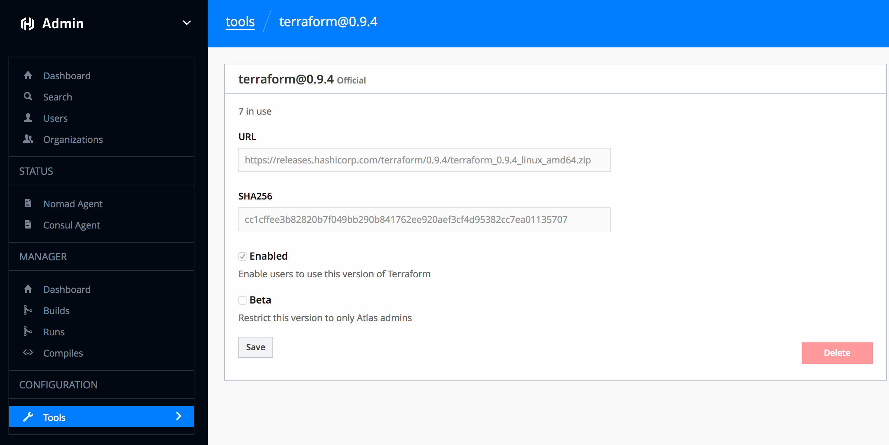

# Private Terraform Enterprise Frequently Asked Questions

This page provides answers to many common questions about Private Terraform Enterprise.

1. [Support](#support-for-private-terraform-enterprise)
2. [Managing Tool Versions](#managing-tool-versions)
3. [Migration from SaaS-based Terraform Enterprise](#migrating-from-terraform-enterprise-saas)
4. [Outbound Access](#outbound-access)
5. [Private Terraform Enterprise Architecture](#private-terraform-enterprise-architecture)

---

## Support for Private Terraform Enterprise

If some aspect of Private Terraform Enterprise is not working as
expected, please reach out to support for help.

### Email

You can engage HashiCorp support via the web portal at https://support.hashicorp.com or
by email at <support@hashicorp.com>. Please make sure
to use your organization email (not your personal email) when contacting us so
we can associate the support request with your organization and expedite our
response.

### Diagnostics

For most technical issues, HashiCorp support will ask you to include diagnostic
information in your support request. To ensure the required information is included,
PTFE has the ability to [generate a support bundle](./diagnostics.html#support-bundle) including logs and configuration details.

## Managing Tool Versions

Terraform Enterprise has a control panel that allows admins to manage the versions of Terraform and Packer and their download locations.

In older Terraform Enterprise installations (prior to 201807-1) this control panel is available at the `/admin/tools` path or as a link in the sidebar from the general administrative interface at `/admin/manager`.


Here you'll find a list of Packer and Terraform versions as well as a link to add tool versions. If you click the `Edit` button on an individual tool version, you'll see that each version consists of:

* **Version Number** - will show up in dropdown lists for users to select
* **Download URL** - must point to a `linux-amd64` build of the tool
* **SHA256 Checksum Value** - must match the SHA256 checksum value of the download



In Terraform Enterprise installations 201807-1 or later, see [Managing Tool Versions](admin/resources.html#managing-terraform-versions).

## Migrating from Terraform Enterprise SaaS

If you are already a user of the Terraform Enterprise SaaS (hereafter "the SaaS"), you may have Environments that you want to migrate over to your new Private Terraform Enterprise installation.

These instructions assume Terraform 0.9 or greater. See [docs on legacy remote state](/docs/backends/legacy-0-8.html) for information on upgrading usage of remote state in prior versions of Terraform.

### Prerequisites

Have a Terraform Enterprise user API token ("Atlas token") handy for both Private Terraform Enterprise and the SaaS. The following examples will assume you have these stored in `PTFE_ATLAS_TOKEN` and `SAAS_ATLAS_TOKEN`, respectively.

### Step 1: Connect local config to SaaS

Set up a local copy of your Terraform config that's connected to the SaaS via a `backend` block.

Assuming your environment is located at `my-organization/my-environment` in the SaaS, in a local copy of the Terraform config, ensure you have a backend configuration like this:

```tf
terraform {
  backend "atlas" {
    name = "my-organization/my-environment"
  }
}
```

Assign your SaaS API token to `ATLAS_TOKEN` and run `terraform init`:

```
export ATLAS_TOKEN=$SAAS_ATLAS_TOKEN
terraform init
```

### Step 2: Copy state locally

This step fetches the latest copy of the state locally so it can be pushed to Private Terraform Enterprise. First, comment out the `backend` section of the config:

```tf
# Temporarily commented out to copy state locally
# terraform {
#   backend "atlas" {
#     name = "my-organization/my-environment"
#   }
# }
```

Then, re-run `terraform init`:

```
terraform init
```

This will cause Terraform to detect the change in backend and ask you if you want to copy the state.

Type `yes` to allow the state to be copied locally. Your state should now be present on disk as `terraform.tfstate`, ready to be uploaded to Private Terraform Enterprise.

### Step 3: Update backend configuration for Private Terraform Enterprise

Change the backend config to point to the Private Terraform Enterprise installation:

```tf
terraform {
  backend "atlas" {
    address = "https://tfe.mycompany.example.com" # the address of your PTFE installation
    name    = "my-organization/my-environment"
  }
}
```

Assign your Private TFE API token to `ATLAS_TOKEN` and run `terraform init`:

```
export ATLAS_TOKEN=$PTFE_ATLAS_TOKEN
terraform init
```

You will again be asked if you want to copy the state file. Type `yes` and the state will be uploaded to your Private Terraform Enterprise installation.

---

## Outbound Access

This is a list of hostnames that the product connects to and should be available for egress:

* releases.hashicorp.com
  * This egress is not required if a [custom Terraform bundle](/docs/enterprise/run/index.html#custom-and-community-providers) is supplied.

Additionally these hostnames are accessed in online mode:

* get.replicated.com
* api.replicated.com
* registry.replicated.com
* registry-data.replicated.com
* quay.io

---


### Security Considerations for Terraform State

The Terraform state file for the Private Terraform Enterprise instance will contain the RDS Database password used by the application. While sensitive fields are separately encrypted-at-rest via Vault, this credential and network access to the database would yield access to all of the unencrypted metadata stored by Terraform Enterprise.

HashiCorp recommends storing the Terraform state for the install in an encrypted data store.

### Recommended State Storage Setup

Terraform supports various [remote state](https://www.terraform.io/docs/state/remote.html) backends that can be used to securely store the Terraform state produced by the install.

HashiCorp recommends a versioned, encrypted-at-rest S3 bucket as a good default choice.

Here are steps for setting up and using an S3 bucket for remote state storage:

```bash
# From the root dir of your Private Terraform Enterprise installation config
BUCKETNAME="mycompany-terraform-enterprise-state"

# Create bucket
aws s3 mb "s3://${BUCKETNAME}"

# Turn on versioning for the bucket
aws s3api put-bucket-versioning --bucket "${BUCKETNAME}" --versioning-configuration status=Enabled

# Configure terraform backend to point to the S3 bucket
cat <<EOF >backend.tf
terraform {
  backend "s3" {
    bucket  = "${BUCKETNAME}"
    key     = "terraform-enterprise.tfstate"
    encrypt = true
  }
}
EOF

# Initialize Terraform with the Remote Backend
terraform init 
```

Now, if you keep the `backend.tf` file in scope when you run `terraform` operations, all state will be stored in the configured bucket.

## Private Terraform Enterprise Architecture

This document describes aspects of the architecture of Private Terraform Enterprise.

### Services

These are the services used to run Private Terraform Enterprise. Each service contains a description of what actions it performs, a policy for restarts, impact of failing or degraded performance, and the service's dependencies.

- [`atlas-frontend` and `atlas-worker`](https://github.com/hashicorp/terraform-enterprise-modules/blob/master/docs/services/atlas.md)
- [`archivist`, `binstore`, `storagelocker`, and `logstream`](https://github.com/hashicorp/terraform-enterprise-modules/blob/master/docs/services/archivist.md)
- [`terraform-build-manager`, and `terraform-build-worker`](https://github.com/hashicorp/terraform-enterprise-modules/blob/master/docs/services/build-pipeline.md)
- [`slug-extract`, `slug-ingress`, `slug-merge`](https://github.com/hashicorp/terraform-enterprise-modules/blob/master/docs/services/slugs.md)

### Data Flow Diagram

The following diagram shows the way data flows through the various services and data stores in Terraform Enterprise.


(Note: The services in double square brackets are soon to be replaced by the service that precedes them.)


