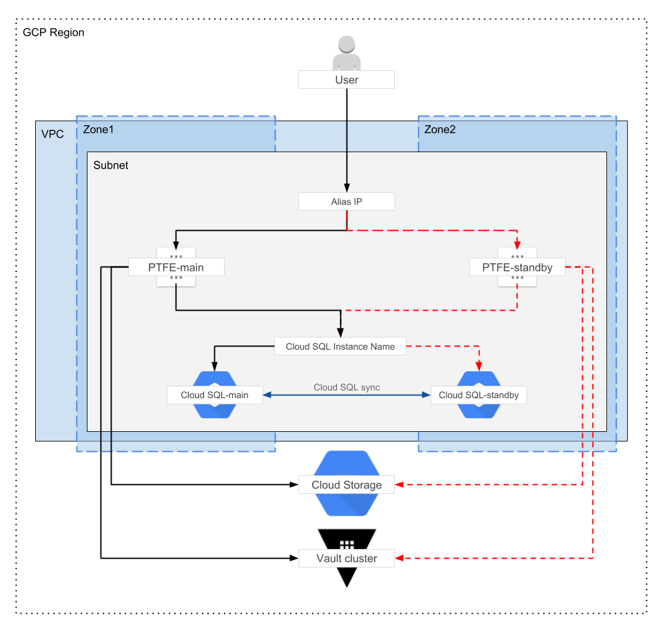

# Private Terraform Enterprise GCP Reference Architecture

This document provides recommended practices and a reference architecture for
HashiCorp Private Terraform Enterprise (PTFE) implementations on GCP.

## Required Reading

Prior to making hardware sizing and architectural decisions, read through the
[installation information available for
PTFE](https://www.terraform.io/docs/enterprise/private/install-installer.html)
to familiarise yourself with the application components and architecture.
Further, read the [reliability and availability
guidance](https://www.terraform.io/docs/enterprise/private/reliability-availability.html)
as a primer to understanding the recommendations in this reference
architecture.

## Infrastructure Requirements

-> **Note:** This reference architecture focuses on the _Production - External
Services_ operational mode.

Depending on the chosen [operational
mode](https://www.terraform.io/docs/enterprise/private/preflight-installer.html#operational-mode-decision),
the infrastructure requirements for PTFE range from a single Cloud Compute VM instance
for demo installations to multiple instances connected to Cloud SQL and Cloud Storage for a
stateless production installation.

The following table provides high-level server guidelines. Of particular
note is the strong recommendation to avoid non-fixed performance CPUs,
or “Shared-core machine types” in GCP terms, such as f1-series and g1-series instances.

### PTFE Server (Compute Engine VM via Regional Managed Instance Group)

| Type        | CPU      | Memory       | Disk        | GCP Machine Types              |
|-------------|----------|--------------|-------------|--------------------------------|
| Minimum     | 2-4 core | 8-16 GB RAM  | 50GB/200GB* | n1-standard-2, n1-standard-4   |
| Recommended | 4-8 core | 16-32 GB RAM | 50GB/200GB* | n1-standard-4, n1-standard-8   |

#### Hardware Sizing Considerations

- \*PTFE requires 50GB for installation, but 
  [GCP documentation for storage performance](https://cloud.google.com/compute/docs/disks/#performance)
  recommends "to ensure consistent performance for more general use of the boot device,
  use either an SSD persistent disk as your boot disk or use a standard persistent disk
  that is at least 200 GB in size."

- The minimum size would be appropriate for most initial production
  deployments, or for development/testing environments.

- The recommended size is for production environments where there is a
  consistent high workload in the form of concurrent terraform runs.

### PostgreSQL Database (Cloud SQL PostgreSQL Production)

| Type        | CPU      | Memory       | Storage | GCP Machine Types            |
|-------------|----------|--------------|---------|------------------------------|
| Minimum     | 2 core   | 8 GB RAM     | 50GB    | Custom PostgreSQL Production |
| Recommended | 4-8 core | 16-32 GB RAM | 50GB    | Custom PostgreSQL Production |

#### Hardware Sizing Considerations

- The minimum size would be appropriate for most initial production
  deployments, or for development/testing environments.

- The recommended size is for production environments where there is a
  consistent high workload in the form of concurrent terraform runs.

### Object Storage (Cloud Storage)

A [Regional Cloud Storage](https://cloud.google.com/storage/docs/storage-classes#regional) bucket must be
specified during the PTFE installation for application data to be stored
securely and redundantly away from the Compute Engine VMs running the PTFE
application. This Cloud Storage bucket must be in the same region as the Compute Engine and Cloud SQL
instances.
Vault is used to encrypt all application data stored in the Cloud Storage bucket.  This
allows for further [server-side
encryption](https://cloud.google.com/storage/docs/encryption/).
by Cloud Storage.

### Other Considerations

#### Additional GCP Resources

In order to successfully provision this reference architecture you must
also be permitted to create the following GCP resources:

- [Project](https://cloud.google.com/resource-manager/docs/creating-managing-projects)
- [VPC Network](https://cloud.google.com/vpc/docs/vpc)
- [Subnet](https://cloud.google.com/vpc/docs/using-vpc)
- [Firewall](https://cloud.google.com/vpc/docs/firewalls)
- [Target Pool](https://cloud.google.com/load-balancing/docs/target-pools)
- [Forwarding Rule](https://cloud.google.com/load-balancing/docs/forwarding-rules)
- [Compute Instance Template](https://cloud.google.com/compute/docs/instance-templates/)
- [Regional Managed Instance Group](https://cloud.google.com/compute/docs/instance-groups/distributing-instances-with-regional-instance-groups)
- [Cloud DNS (optional)](https://cloud.google.com/dns/)

#### Network

To deploy PTFE in GCP you will need to create new or use existing
networking infrastructure. The below infrastructure diagram highlights
some of the key components (network, subnets) and you will
also have firewall and gateway requirements. These
elements are likely to be very unique to your environment and not
something this Reference Architecture can specify in detail.

#### DNS

DNS can be configured external to GCP or using [Cloud DNS](https://cloud.google.com/dns/). The
fully qualified domain name should resolve to the Forwarding Rules associated with the PTFE deployment.
Creating the required DNS entry is outside the scope
of this guide.

#### SSL/TLS Certificates and Load Balancers

An SSL/TLS certificate signed by a public or private CA is required for secure communication between
clients, VCS systems, and the PTFE application server. The certificate can be specified during the
UI-based installation or in a configuration file used for an unattended installation.

## Infrastructure Diagram

The above diagram shows the infrastructure components at a high-level.

### Application Layer

The Application Layer is composed of a Regional Managed Instance Group and an Instance Template
providing an auto-recovery mechanism in the event of an instance or Zone failure.

### Storage Layer

The Storage Layer is composed of multiple service endpoints (Cloud SQL, Cloud Storage) all
configured with or benefiting from inherent resiliency
provided by GCP.

#### Additional Information

- [Cloud SQL high-availability](https://cloud.google.com/sql/docs/postgres/high-availability).

- [Regional Cloud Storage](https://cloud.google.com/storage/docs/storage-classes).

## Infrastructure Provisioning

The recommended way to deploy PTFE is through use of a Terraform configuration
that defines the required resources, their references to other resources, and
dependencies.

## Normal Operation

### Component Interaction

The Forwarding Rule routes all traffic to the *PTFE* instance, which is managed by
a Regional Managed Instance Group with maximum and minimum instance counts set to one.

The PTFE application is connected to the PostgreSQL database via the Cloud SQL
endpoint and all database requests are routed via the Cloud SQL endpoint to the database instance.

The PTFE application is connected to object storage via the Cloud Storage endpoint
for the defined bucket and all object storage requests are routed to the
highly available infrastructure supporting Cloud Storage.

### Upgrades

See [the Upgrades section](./upgrades.html) of the documentation.

## High Availability

### Failure Scenarios

GCP provides guidance on [designing robust systems](https://cloud.google.com/compute/docs/tutorials/robustsystems).
Working in accordance with those recommendations the PTFE Reference
Architecture is designed to handle different failure scenarios with
different probabilities. As the architecture evolves it may provide a
higher level of service continuity.

#### Single Compute Engine Instance Failure

In the event of the *PTFE* instance failing in a way that GCP can
observe, [Live Migration](https://cloud.google.com/compute/docs/instances/live-migration)
is used to move the instance to new physical hardware automatically.
In the event that Live Migration is not possible the instance will crash and be restarted
on new physical hardware automatically. During instance startup the PTFE services will
be started and service will resume.

#### Zone Failure

In the event of the Zone hosting the main instances (Compute Engine and Cloud SQL) failing,
the Regional Managed Instance Group for the Compute VMs will automatically
begin booting a new one in an operational Zone.

- Cloud SQL automatically and transparently fails over to the standby zone.
  The [GCP documentation provides more
  detail](https://cloud.google.com/sql/docs/postgres/high-availability)
  on the exact behaviour and expected impact.

- Cloud Storage is resilient to Zone failure based on its architecture.

See below for more detail on how each component handles Zone failure.

##### PTFE Server

By utilizing a Regional Managed Instance Group, the PTFE instance automatically recovers
in the event of any outage except for the loss of an entire region.

With external services (PostgreSQL Database, Object Storage) in use,
there is still some application configuration data present on the PTFE server
such as installation type, database connection settings, hostname. This data
rarely changes. If the configuration on *PTFE* changes you should update the
Instance Template to include this updated configuration so that any newly
launched Compute VM uses this new configuration.

##### PostgreSQL Database

Using Cloud SQL as an external database service leverages the highly
available infrastructure provided by GCP. From the GCP website:

> *A Cloud SQL instance configured for high availability is also called a regional instance. 
> A regional instance is located in two zones within the configured region, so if it cannot
> serve data from its primary zone, it fails over and continues to serve data from its secondary zone.
> ([source](https://cloud.google.com/sql/docs/postgres/high-availability))*

##### Object Storage

Using Regional Cloud Storage as an external object store leverages the highly available
infrastructure provided by GCP. Regional Cloud Storage buckets are resilient to Zone failure
within the region selected during bucket creation.
From the GCP website:

> *Regional Storage is appropriate for storing data in the same regional location 
> as Compute Engine instances or Kubernetes Engine clusters that use the data. 
> Doing so gives you better performance for data-intensive computations, as opposed 
> to storing your data in a multi-regional location. 
> ([source](https://cloud.google.com/storage/docs/storage-classes))*

## Disaster Recovery

### Failure Scenarios

GCP provides guidance on [designing robust systems](https://cloud.google.com/compute/docs/tutorials/robustsystems).
Working in accordance with those recommendations the PTFE Reference Architecture is designed to handle
different failure scenarios that have different probabilities. As the
architecture evolves it may provide a higher level of service
continuity.

#### Region Failure

PTFE is currently architected to provide high availability within a
single GCP Region. Using multiple GCP Regions will give you greater
control over your recovery time in the event of a hard dependency
failure on a regional GCP service. In this section, we’ll discuss
various implementation patterns and their typical availability.

An identical infrastructure should be provisioned in a secondary GCP
Region. Depending on recovery time objectives and tolerances for
additional cost to support GCP Region failure, the infrastructure can be
running (Warm Standby) or stopped (Cold Standby). In the event of the
primary GCP Region hosting the PTFE application failing, the secondary
GCP Region will require some configuration before traffic is directed to
it along with some global services such as DNS.

- [Cloud SQL cross-region read replicas](https://cloud.google.com/sql/docs/postgres/replication/manage-replicas) can be used in a warm standby architecture or [Cloud SQL database backups](https://cloud.google.com/sql/docs/postgres/backup-recovery/restoring) can be used in a cold standby architecture.

- [Multi-Regional Cloud Storage replication](https://cloud.google.com/storage/docs/storage-classes#multi-regional) must be configured so the object storage component of the Storage Layer is available in multiple GCP Regions.

- DNS must be redirected to the Forwarding Rule acting as the entry point for the infrastructure deployed in the secondary GCP Region.

#### Data Corruption

The PTFE application architecture relies on multiple service endpoints
(Cloud SQL, Cloud Storage) all providing their own backup and recovery
functionality to support a low MTTR in the event of data corruption.

##### PTFE Servers

With external services (PostgreSQL Database, Object Storage) in
use, there is still some application configuration data present on the
PTFE server such as installation type, database connection settings,
hostname. This data rarely changes. We recommend [configuring automated
snapshots](https://www.terraform.io/docs/enterprise/private/automated-recovery.html#1-configure-snapshots)
for this installation data so it can be recovered in the event of data
corruption.

##### PostgreSQL Database

Backup and restoration of PostgreSQL is managed by GCP and configured
through the GCP management console or CLI.

Automated (scheduled) and on-demand backups are available in GCP. Review the
[backup](https://cloud.google.com/sql/docs/postgres/backup-recovery/backups)
and [restoration](https://cloud.google.com/sql/docs/postgres/backup-recovery/restore)
documentation for further guidance.

More details of Cloud SQL (PostgreSQL) features are available [here](https://cloud.google.com/sql/docs/postgres/).

##### Object Storage

There is no automatic backup/snapshot of Cloud Storage by GCP, so it is recommended
to script a bucket copy process from the bucket used by the PTFE
application to a “backup bucket” in Cloud Storage that runs at regular intervals.
The [Nearline Storage](https://cloud.google.com/storage/docs/storage-classes#nearline) storage class
is identified as a solution targeted more for DR backups. From the GCP website:

> *Nearline Storage is ideal for data you plan to read or modify on average once a month or less.
> For example, if you want to continuously add files to Cloud Storage and plan to access those
> files once a month for analysis, Nearline Storage is a great choice.
> Nearline Storage is also appropriate for data backup, disaster recovery, and archival storage.
([source](https://cloud.google.com/storage/docs/storage-classes#nearline))*
