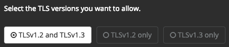
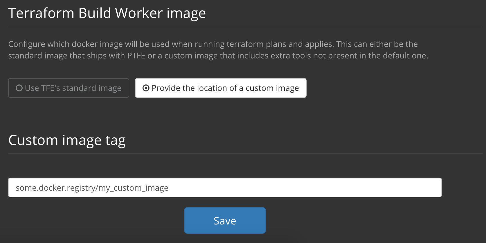

# Private Terraform Enterprise Installation (Installer)

## Delivery

This document outlines the procedure for using the Private Terraform Enterprise (PTFE)
installer to set up Terraform Enterprise on a customer-controlled machine.

~> **Note**: This document is only meant for those customers using Private
Terraform Enterprise via the Installer. Customers using the AMI can follow the
[instructions for the AMI-based install](./install-ami.html).

## Migrating from AMI

!> **Deprecation warning**: The AMI will no longer be actively developed as of 201808-1 and will be fully decommissioned on November 30, 2018.

If you are migrating an installation from the AMI to the installer, please
use the instuctions in the [migration guide](./migrate.html).

## Preflight

Before you begin, consult [Preflight](./preflight-installer.html) for pre-requisites. You'll need to prepare data files and a Linux instance.

## Proxy Usage

If your installation requires using a proxy server, you will be asked for the proxy server information when you first
run the installer via `ssh`. This proxy server will be used for all outbound HTTP and HTTPS connections.

Optionally, if you're running the installer script in an automated manner, you can pass a `http-proxy` flag to set
the address of the proxy. For example:

```
./install.sh http-proxy=http://internal.mycompany.com:8080
```

### Proxy Exclusions (NO\_PROXY)

If certain hostnames should not use the proxy and the instance should connect directly to them (for instance, for S3), then you can pass an additional option to provide a list of domains:

```
./install.sh additional-no-proxy=s3.amazonaws.com,internal-vcs.mycompany.com,example.com
````

Passing this option to the installation script is particularly useful if the hostnames that should not use the proxy include services that the instance needs to be able to reach during installation, such as S3. Alternately, if the only hosts you need to add are those that are not used during installation, such as a private VCS instance, you can provide these hosts after initial installation is complete, in the installer settings (available on port 8800 under `/console/settings`).

### Reconfiguring the Proxy

To change the proxy settings after installation, use the Console settings page, accessed from the dashboard on port 8800 under `/console/settings`.


On the Console Settings page, there is a section for HTTP Proxy:


This change updates the proxy settings for the PTFE application services. To update the proxy settings for the installer (for example, to handle configuration tests correctly), additional steps are necessary:

1. Locate the Replicated configuration files on the instance under either `/etc/sysconfig/` or `/etc/default`: `replicated` and `replicated-operator`.
1. Open the files for editing. On the line that includes `REPLICATED_OPTS`, add `-e HTTP_PROXY=<your proxy url> -e NO_PROXY=<list of no_proxy hosts>` to the existing command options. The list of `no_proxy` hosts is a comma-separated list with no spaces.
1. Restart the Replicated services following [the instructions for your distribution](https://help.replicated.com/docs/native/customer-installations/installing-via-script/#restarting-replicated).

## Trusting SSL/TLS Certificates

There are two primary areas for SSL configuration in the installer.

### TLS Key & Cert

The TLS Key & Cert field (found in the console settings after initial installation) should contain PTFE's own key and certificate, or key and certificate chain. A chain would be used in this field if the CA indicates an intermediate certificate is required as well.

### Certificate Authority (CA) Bundle

PTFE needs to be able to access all services that it integrates with, such as VCS providers or database servers.
Because it typically accesses them via SSL/TLS, it is critical that the certificates used by any service
that PTFE integrates with are trusted by PTFE.

This section is used to allow PTFE to connect to services that use SSL/TLS certificates issued by private CAs.
It allows multiple certificates to be specified as trusted, and should contain all certificates that PTFE
should trust when presented with them from itself or another application.

A collection of certificates for trusted issuers is known as a `Certificate Authority (CA) Bundle`.
All certificates in the certificate signing chain, meaning the root certificate and any intermediate certificates,
must be included here. These multiple certificates are listed one after another in text format.

~> **Note:** If PTFE is configured with a SSL key and certificate issued against a private CA,
   the certificate chain for that CA must be included here as well. This allows the instance
   to query itself.

Certificates must be formatted using PEM encoding, that is, as text. For example:

```
-----BEGIN CERTIFICATE-----
MIIFtTCCA52gAwIBAgIIYY3HhjsBggUwDQYJKoZIhvcNAQEFBQAwRDEWMBQGA1UE
AwwNQUNFRElDT00gUm9vdDEMMAoGA1UECwwDUEtJMQ8wDQYDVQQKDAZFRElDT00x
CzAJBgNVBAYTAkVTMB4XDTA4MDQxODE2MjQyMloXDTI4MDQxMzE2MjQyMlowRDEW
MBQGA1UEAwwNQUNFRElDT00gUm9vdDEMMAoGA1UECwwDUEtJMQ8wDQYDVQQKDAZF
....
-----END CERTIFICATE-----
-----BEGIN CERTIFICATE-----
MIIB5zCCAY6gAwIBAgIUNJADaMM+URJrPMdoIeeAs9/CEt4wCgYIKoZIzj0EAwIw
UjELMAkGA1UEBhMCVVMxCzAJBgNVBAgTAkNBMRYwFAYDVQQHEw1TYW4gRnJhbmNp
c2NvMR4wHAYDVQQDExVoYXNoaWNvcnAuZW5naW5lZXJpbmcwHhcNMTgwMjI4MDYx
....
-----END CERTIFICATE-----
```

The UI to upload these certificates looks like:


#### TLS Versions

As of version 201902-01, TLS versions 1.0 and 1.1 are no longer supported in Private Terraform Enterprise. Your options now include TLS v1.2 and TLS v1.3:



## Alternative Terraform worker image

TFE runs `terraform plan` and `terraform apply` operations in a disposable Docker containers. There are cases where runs may make frequent use of additional tools that are not available in the default Docker image. To allow use of these tools for any plan or apply, users can build their own image and configure TFE to use that instead. In order for this to happen the name of the alternative docker image must be set in the config by using the `Custom image tag` field as shown below:



### Requirements
 - The base image must be `ubuntu:xenial`.
 - The image must exist on the PTFE host. It can be added by running `docker pull` from a local registry or any other similar method.
 - CA certificates must be available when Terraform runs. During image creation, a file containing all necessary PEM encoded CA certificates must be placed in `/etc/ssl/certs/ca-certificates.crt`.
 - Terraform must not be installed on the image. TFE will take care of that at runtime.

 This is a sample `Dockerfile` you can use to start building your own image:

 ```
# This Dockerfile builds the image used for the worker containers.
FROM ubuntu:xenial

# Inject the ssl certificates
ADD ca-certificates.crt /etc/ssl/certs/ca-certificates.crt

# Install software used by TFE
RUN apt-get update && apt-get install -y --no-install-recommends \
    sudo unzip daemontools git-core ssh wget curl psmisc iproute2 openssh-client redis-tools netcat-openbsd
```

## Operational Mode Decision

Terraform Enterprise can store its state in a few different ways, and you'll
need to decide which works best for your installation. Each option has a
different approach to
[recovering from failures](./reliability-availability.html#recovery-from-failures-1).
The mode should be selected based on your organization's needs. See
[Preflight: Operational Mode Decision](./preflight-installer.html#operational-mode-decision)
for more details.

## Installation

The installer can run in two modes, Online or Airgapped. Each of these modes has a different way of executing the installer, but the result is the same.

~> **Note:** After running the installation script, the remainder of the installation is done through a browser using the installer dashboard on port 8800 of the TFE instance. To complete the installation, you must be able to connect to that port via HTTPS. The installer uses an internal CA to issue bootstrap certificates, so you will see a security warning when first connecting, and you'll need to proceed with the connection anyway.

### Run the Installer - Online

If your instance can access the Internet, use the Online install mode.

1. From a shell on your instance:
    * To execute the installer directly, run `curl https://install.terraform.io/ptfe/stable | sudo bash`
    * To inspect the script locally before running, run `curl https://install.terraform.io/ptfe/stable > install.sh` and, once you are satisfied with the script's content, execute it with `sudo bash install.sh`.
1. The installation will take a few minutes and you'll be presented with a message
    about how and where to access the rest of the setup via the web. This will be
    `https://<TFE HOSTNAME>:8800`.
    * You will see a security warning when first connecting. This is expected and you'll need
      to proceed with the connection anyway.

### Run the Installer - Airgapped

If the instance cannot reach the Internet, follow these steps to begin an Airgapped installation.

#### Prepare the Instance

1. Download the `.airgap` file using the information given to you in your setup email and place that file somewhere on the the instance.
    * If you use are using `wget` to download the file, be sure to use `wget --content-disposition "<url>"` so the downloaded file gets the correct extension.
    * The url generated for the .airgap file is only valid for a short time, so you may wish to download the file and upload it to your own artifacts repository.
1. [Download the installer bootstrapper](https://install.terraform.io/airgap/latest.tar.gz) and put it into its own directory on the instance (e.g. `/opt/tfe-installer/`)
1. Airgap installations require Docker to be pre-installed. Double-check that your instance has a supported version of Docker (see [Preflight: Software Requirements](./preflight-installer.html#software-requirements) for details).

#### Execute the Installer

From a shell on your instance, in the directory where you placed the `replicated.tar.gz` installer bootstrapper:

1. Run `tar xzf replicated.tar.gz`
1. Run `sudo ./install.sh airgap`
1. When asked, select the interface of the primary private network interface used to access the instance.
1. The software will take a few minutes and you'll be presented with a message about how and where to access the rest of the setup via the web. This will be `https://<TFE HOSTNAME>:8800`.
    * You will see a security warning when first connecting. This is expected and you'll need
      to proceed with the connection anyway.

### Continue Installation In Browser

1. Configure the hostname and the SSL certificate.
1. Upload the license file provided to you in your setup email.
1. Indicate whether you're doing an Online or Airgapped installation. Choose Online if
   you're not sure.
    * If you are doing an Airgapped install, provide the path on the the instance
      to the `.airgap` file that you downloaded using the initial instructions in
      your setup email.
1. Secure access to the installer dashboard. We recommend at least setting up the
   simple password authentication. If you're so inclined, LDAP authentication can also be
   configured.
1. The system will now perform a set of pre-flight checks on the instance and
   the configuration up to this point and indicate any failures. You can either fix the issues
   and re-run the checks, or ignore the warnings and proceed. If the system is running behind a proxy and is unable to connect to `releases.hashicorp.com:443`, it is likely safe to proceed; this check does not currently use the proxy. For any other issues, if you proceed despite the warnings, you are assuming the support responsibility.
1. Set an encryption password used to encrypt the sensitive information at rest. The default value is auto-generated,
   but we strongly suggest you create your own password. Be sure to retain the value, because you will need to use this
   password to restore access to the data in the event of a reinstall. See [Encryption Password](/docs/enterprise/private/encryption-password.html) for more information.
1. Configure the operational mode for this installation. See
   [Preflight: Operational Modes](./preflight-installer.html#operational-mode-decision) for information on what the different values are. Ensure that you've met the relevant preflight requirements for the mode you chose.
1. _Optional:_ Adjust the concurrent capacity of the instance. This should
   only be used if the hardware provides more resources than the baseline
   configuration and you wish to increase the work that the instance does
   concurrently. This setting should be adjusted with care as setting it too
   high can result in an very unresponsive instance.
1. _Optional:_ Provide the text version of a certificate (or certificates) that will be added to the trusted
   list for the product. This is used when services the product communicates with do not use
   globally trusted certificates but rather a private Certificate Authority (CA). This is typically
   used when Private Terraform Enterprise uses a private certificate (it must trust itself) or a
   VCS provider uses a private CA.
1. _Optional:_ Adjust the path used to store the vault files that are used to encrypt
   sensitive data. This is a path on the host system, which allows you
   to store these files outside of the product to enhance security. Additionally,
   you can configure the system not to store the vault files within any snapshots,
   giving you full custody of these files. These files will need to be provided before
   any snapshot restore process is performed, and should be placed into the path configured.
1. _Optional:_ Configure the product to use an externally managed Vault cluster.
   See [Externally Managed Vault Cluster](./vault.html) for details on how to configure this option.

### Finish Bootstrapping

Once configured, the software will finish downloading. When it’s ready, the UI
will indicate so and there will be an Open link to click to access the Terraform Enterprise UI.

## Configuration

After completing a new install you should head to the [configuration
page](./config.html) to continue setting up Terraform Enterprise.
