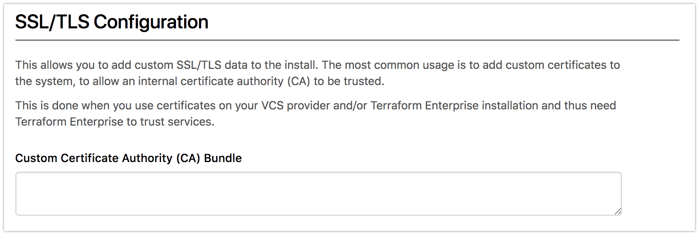

# Private Terraform Enterprise Installation (Installer)

## Delivery

This document outlines the procedure for using the Private Terraform Enterprise (PTFE)
installer to set up Terraform Enterprise on a customer-controlled machine.

~> **Note**: This document is only meant for those customers using Private
Terraform Enterprise via the Installer. Customers using the AMI can follow the
[instructions for the AMI-based install](./install-ami.html).

## Migrating from AMI

If you are migrating an installation from the AMI to the installer, please
use the instuctions in the [migration guide](./migrate.html).

## Preflight

Before you begin, you'll need to prepare data files and a Linux instance.

### Data Files

* TLS private key and certificate
  * The installer allows for using a self-signed certificate but HashiCorp does
    _not_ recommended this. Your VCS provider will likely reject that certificate
    when sending webhooks. If you do use the self-signed certificate, you must configure
    each webhook to ignore SSL errors within your VCS provider.
* License key (provided by HashiCorp)

~> **Note:** If you use your own certificate and it is issued by a private Certificate
   Authority, you must provide the certificate for that CA in the
   `Certificate Authority (CA) Bundle` section of the installation. This allows services
   running within PTFE to access each other properly.

### Linux Instance

Install the software on a Linux instance of your choosing.
You will start and manage this instance like any other server.

The Private Terraform Enterprise Installer currently supports the following
operating systems:

* Debian 7.7+
* Ubuntu 14.04 / 16.04
* Red Hat Enterprise Linux 7.2+
* CentOS 7+
* Amazon Linux 2016.03 / 2016.09 / 2017.03 / 2017.09
* Oracle Linux 7.2+

#### Hardware Requirements

These requirements provide the instance with enough resources to run the
Terraform Enterprise application as well as the Terraform plans and applies.

 * At least 40GB of disk space on the root volume
 * At least 8GB of system memory
 * At least 2 CPU cores

#### Software Requirements

~> RedHat Enterprise Linux (RHEL) has a specific set of requirements. Please see the [RHEL Install Guide](./rhel-install-guide.html) before continuing.

For Linux distributions other than RHEL, check Docker compatibility:

  * The instance should run a current version of Docker engine (1.7.1 or later, minimum 17.06.2-ce recommended). This also requires a 64-bit distribution with a minimum Linux Kernel version of 3.10.
    * In Online mode, the installer will install Docker automatically
    * In Airgapped mode, Docker should be installed before you begin
  * For _Redhat Enterprise_, _Oracle Linux_, and _SUSE Enterprise_, you **must** pre-install Docker as these distributions are [not officially supported by Docker Community Edition](https://docs.docker.com/engine/installation/#server).

~> **Note**: It is not recommended to run Docker under a 2.x kernel.

#### Network Requirements

1. Have the following ports available to the Linux instance:
  * **22** - to access the instance via SSH from your computer
  * **8800** - to access the Admin Console
  * **443** and **80** - to access the TFE app (both ports are needed; HTTP will redirect to HTTPS)
  * **9870-9880 (inclusive)** - for internal communication on the host and its subnet; not publicly accessible
1. If a firewall is configured on the instance, be sure that traffic can flow out of the `docker0` interface to the instance's primary address. For example, to do this with UFW run: `ufw allow in on docker0`. This rule can be added before the `docker0` interface exists, so it is best to do it now, before the Docker installation.
1. Get a domain name for the instance. Using an IP address to access the product is not supported as many systems use TLS and need to verify that the certificate is correct, which can only be done with a hostname at present.

### Proxy Usage

If your installation requires using a proxy server, you will be asked for the proxy server information when you first
run the installer via `ssh`. This proxy server will be used for all outbound HTTP and HTTPS connections.

Optionally, if you're running the installer script in an automated manner, you can pass a `http-proxy` flag to set the address of the proxy.
For example:

```
./install.sh http-proxy=http://internal.mycompany.com:8080
```

To exclude certain hosts from being accessed through the proxy (for instance, an internal VCS service), you will be
provided a place on the Settings page available on port 8800 under `/settings` to enter in these exclusions.

#### Reconfiguring the Proxy

To change the proxy settings after installation, use the Console settings page, accessed from the dashboard on port 8800 under `/console/settings`.


On the Console Settings page, there is a section for HTTP Proxy:


#### Trusting SSL/TLS Certificates

The installer has a section that allows multiple certificates to be specified as trusted.
A collection of certificates for trusted issuers are known as a `Certificate Authority (CA) Bundle` and are
used to allow PTFE to connect to services that use SSL/TLS certificates issued by private CAs.

All certificates in the certificate signing chain, meaning the root certificate and any intermediate certificates,
must be included here. These multiple certificates are listed one after another in text format.

Certificates must be formatted using PEM encoding, ie as text. For example:

```
-----BEGIN CERTIFICATE-----
MIIFtTCCA52gAwIBAgIIYY3HhjsBggUwDQYJKoZIhvcNAQEFBQAwRDEWMBQGA1UE
AwwNQUNFRElDT00gUm9vdDEMMAoGA1UECwwDUEtJMQ8wDQYDVQQKDAZFRElDT00x
CzAJBgNVBAYTAkVTMB4XDTA4MDQxODE2MjQyMloXDTI4MDQxMzE2MjQyMlowRDEW
MBQGA1UEAwwNQUNFRElDT00gUm9vdDEMMAoGA1UECwwDUEtJMQ8wDQYDVQQKDAZF
....
-----END CERTIFICATE-----
-----BEGIN CERTIFICATE-----
MIIB5zCCAY6gAwIBAgIUNJADaMM+URJrPMdoIeeAs9/CEt4wCgYIKoZIzj0EAwIw
UjELMAkGA1UEBhMCVVMxCzAJBgNVBAgTAkNBMRYwFAYDVQQHEw1TYW4gRnJhbmNp
c2NvMR4wHAYDVQQDExVoYXNoaWNvcnAuZW5naW5lZXJpbmcwHhcNMTgwMjI4MDYx
....
-----END CERTIFICATE-----
```

The UI to upload these certificates looks like:



~> **Note**: PTFE needs to be able to access all services that it integrates with, such as VCS providers,
   terraform providers, etc. Because it typically accesses them via SSL/TLS, it is critical that the
   certificates used by any service that is accessed is trusted by PTFE. This means properly configuring
   the `Certificate Authority (CA) Bundle` option so that PTFE can properly trust any certificates
   issued by private CAs.

~> **Note**: If PTFE is configured with a SSL key and certificate issued against a private CA,
   the certificate chain for that CA must be included here as well. This allows the instance
   to properly query itself.

### Operational Mode Decision

Terraform Enterprise can store its state in a few different ways and you'll
need to decide which works best for your installation. Each option has a
different approach to
[recovering from failures](./reliability-availability.html#recovery-from-failures-1)
and should be selected based on your organization's preferences. The operational mode is selected
at install time and cannot be changed once the install is running.

1. **Production - External Services** - This mode stores the majority of the
   stateful data used by the instance in an external PostgreSQL database as
   well as an external S3-compatible endpoint or Azure blob storage. There is still critical data
   stored on the instance that must be managed with snapshots. Be sure to
   checked the [PostgreSQL Requirements](#postgresql-requirements) for what
   needs to be present for Terraform Enterprise to work. This option is best
   for users with expertise managing PostgreSQL or users that have access
   to managed PostgreSQL offerings like [AWS RDS](https://aws.amazon.com/rds/).
1. **Production - Mounted Disk** - This mode stores data in a separate
   directory on the host, with the intention that the directory is
   configured to store its data on an external disk, such as EBS, iSCSI,
   etc. This option is best for users with experience mounting performant
   block storage.
1. **Demo** - This mode stores all data on the instance. The data can be
   backed up with the snapshot mechanism for restore later.


The decision you make will be entered during setup.

## Installation

The installer can run in two modes, Online or Airgapped. Each of these modes has a different way of executing the installer, but the result is the same.

### Run The Installer - Online

If your instance can access the internet, you should run the Online install mode.

1. From a shell on your instance:
  * To execute the installer directly, run `curl https://install.terraform.io/ptfe/stable | sudo bash`
	* To inspect the script locally before running, run `curl https://install.terraform.io/ptfe/stable > install.sh` and then once you are satisfied with the script's content, execute it with `sudo bash install.sh`
1. The software will take a few minutes and you'll be presented with a message
	 about how/where to access the rest of the setup via the web. This will be
   `https://[hostname or ip of your instance]:8800`
  * The Admin Console uses an internal CA to issue bootstrap certificates, so you will
		see a security warning when first connecting. This is expected and you'll need
    to proceed with the connection anyway.

### Run The Installer - Airgapped

If the instance can not reach the internet, then you can follow these steps to begin an Airgapped installation.

Preparing the instance:

1. Download the `.airgap` file using the information given to you in your setup email and place that file somewhere on the the instance.
  * If you use are using `wget` to download the file, be sure to use `wget --content-disposition "<url>"` so the downloaded file gets the correct extension.
  * The url generated for the .airgap file is only valid for a short time, so you may wish to download the file and upload it to your own artifacts repository.
1. [Download the installer bootstrapper](https://s3.amazonaws.com/replicated-airgap-work/replicated.tar.gz) and put it into its own directory on the instance (e.g. `/opt/tfe-installer/`)
1. Airgap installations require Docker to be pre-installed. Double check that your instance has a supported version of Docker (see [Software Requirements](#software-requirements) above for details).

Executing the installer:

From a shell on your instance, in the directory where you placed the `replicated.tar.gz` installer bootstrapper:

1. Run `tar xzf replicated.tar.gz`
1. Run `sudo ./install.sh airgap`
1. When asked, select the interface of your primary private network interface used to access the instance.
1. The software will take a few minutes and you'll be presented with a message about how/where to access the rest of the setup via the web. This will be https://[hostname or ip of your instance]:8800
  1. The web interface uses an internal CA to issues certificates, so you will
     see a security warning. This is expected and you'll need to proceed with
     the connection anyway.

### Continue Installation In Browser

1. Configure the hostname and the SSL certificate.
1. Upload your license file, provided to you in your setup email.
1. Indicate whether you're doing an Online or Airgapped installation. Choose Online if
   you're not sure.
	* If you are doing an Airgapped install, provide the path on the the instance
	  to the `.airgap` file that you downloaded using the initial instructions in
    your setup email.
1. Secure access to the Admin Console. We recommend at least setting up the
   simple password auth. If you're so inclined, LDAP authentication can also be
   configured for the Admin Console.
1. The system will now perform a set of pre-flight checks on the instance and
   configuration thus far and indicate any failures. You can either fix the issues
   and re-run the checks, or ignore the warnings and proceed. If the system is running behind a proxy and is unable to connect to `releases.hashicorp.com:443`, it is likely safe to proceed; this check does not currently use the proxy. For any other issues, if you proceed despite the warnings, you are assuming the support responsibility.
1. Configure the operational mode for this installation. See
   [Operational Modes](#operational-mode-decision) for information on what the different values
   are.
1. _Optional:_ Adjust the concurrent capacity of the instance. This should
   only be used if the hardware provides more resources than the baseline
   configuration and you wish to increase the work that the instance does
   concurrently. This setting should be adjusted with care as setting it too
   high can result in an very unresponsive instance.
1. _Optional:_ Provide the text version of a certificate (or certificates) that will be added to the trusted
   list for the product. This is used when services the product communicates with do not use
   globally trusted certificates but rather a private Certificate Authority (CA). This is typically
   used when Private Terraform Enterprise uses a private certificate (it must trust itself) or a
   VCS provider uses a private CA.
1. _Optional:_ Adjust the path used to store the vault files that are used to encrypt
   sensitive data. This is a path on the host system, which allows you
   to store these files outside of the product to enhance security. Additionally,
   you can configure the system not to store the vault files within any snapshots,
   giving you full custody of these files. These files will need to be provided before
   any snapshot restore process is performed, and should be placed into the path configured.
1. _Optional:_ Configure the product to use an externally managed Vault cluster.
   See [Externally Managed Vault Cluster](./vault.html) for details on how to configure this option.

#### PostgreSQL Requirements

When Terraform Enterprise uses an external PostgreSQL database, the
following must be present on it:

* PostgreSQL version 9.4 or greater
* User with full access to the schemas created and the ability to run "CREATE EXTENSION" on the database
* The following PostgreSQL schemas must be installed into the database: `rails`, `vault`, `registry`

To create schemas in PostgreSQL, the `CREATE SCHEMA` command is used. So to
create the above required schemas, the following snippet must be run on the
database:

```
CREATE SCHEMA rails;
CREATE SCHEMA vault;
CREATE SCHEMA registry;
```

When specifying which PostgreSQL database to use, the value specified must
be a valid Database URL, as [specified in the libpq documentation](https://www.postgresql.org/docs/9.3/static/libpq-connect.html#AEN39514).

Additionally, the URL must include the `sslmode` parameter indicating if SSL
should be used to connect to the database. There is no assumed SSL mode; the
parameter must be specified.

### Finish Bootstrapping

Once configured, the software will finish downloading. When it’s ready, the UI
will indicate so and there will be an Open link to click to access the Terraform Enterprise UI.

## Configuration

After completing a new install you should head to the [configuration
page](./config.html) to continue setting up Terraform Enterprise.
