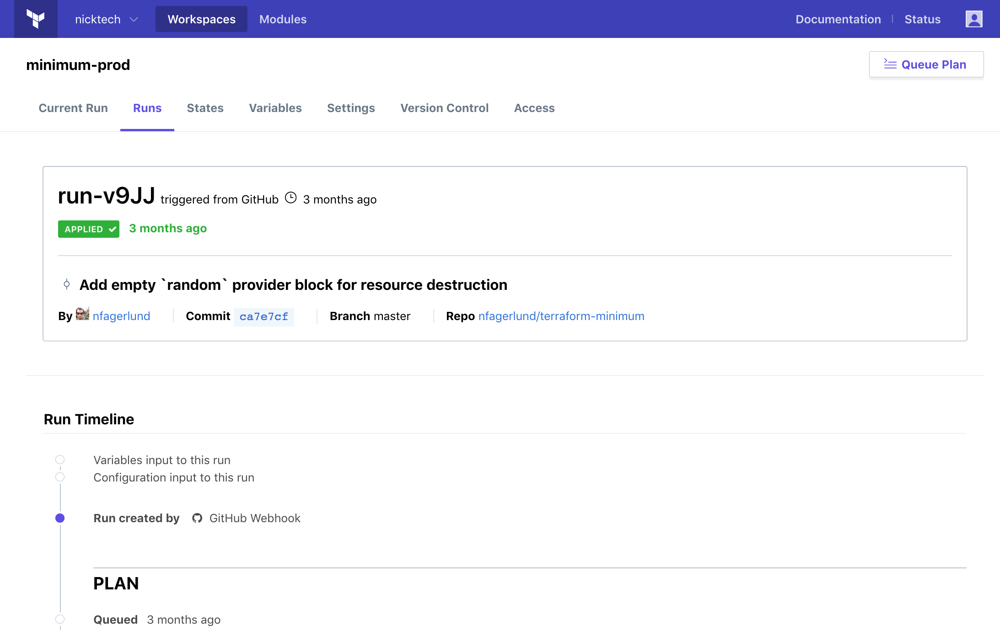

# About Terraform Runs in Terraform Enterprise

Terraform Enterprise (TFE) provides a central interface for running Terraform within a large collaborative organization. If you're accustomed to running Terraform from your workstation, the way TFE manages runs can be unfamiliar.

This page describes the basics of how runs work in TFE.

## Runs and Workspaces

TFE always performs Terraform runs in the context of a [workspace](./index.html). The workspace provides the state and variables for the run, and usually specifies where the configuration should come from.

Each workspace in TFE maintains its own queue of runs, and processes those runs in order.

Whenever a new run is initiated, it's added to the end of the queue. If there's already a run in progress, the new run won't start until the current one has completely finished — TFE won't even plan the run yet, because the current run might change what a future run would do. Runs that are waiting for other runs to finish are in a _pending_ state, and a workspace might have any number of pending runs.

When you initiate a run, TFE locks the run to the current Terraform code (usually associated with a specific VCS commit) and variable values. If you change variables or commit new code before the run finishes, it will only affect future runs, not ones that are already pending, planning, or awaiting apply.

## Starting Runs

TFE has three main workflows for managing runs, and your chosen workflow determines when and how Terraform runs occur. For detailed information, see:

- The [UI/VCS-driven run workflow](./ui.html), which is TFE's primary mode of operation.
- The [API-driven run workflow](./api.html), which is more flexible but requires you to create some tooling.
- The [CLI-driven run workflow](./cli.html), which uses Terraform's standard CLI tools to execute runs in TFE.

In more abstract terms, TFE runs can be initiated by VCS webhooks, the manual "Queue Plan" button on a workspace, the standard `terraform apply` command (with the remote backend configured), and [the Runs API](../api/run.html) (or any tool that uses that API).

## Plans and Applies

TFE enforces Terraform's division between _plan_ and _apply_ operations. It always plans first, saves the plan's output, and uses that output for the apply. In the default configuration, it waits for user approval before running an apply, but you can configure workspaces to [automatically apply](../workspaces/settings.html#auto-apply-and-manual-apply) successful plans. (Some plans can't be auto-applied, like destroy plans or plans queued by users without write permissions.)

### Speculative Plans

In addition to normal runs, TFE can also run _speculative plans,_ to test changes to a configuration during editing and code review.

Speculative plans are plan-only runs: they show a set of possible changes (and check them against Sentinel policies), but cannot apply those changes. They can begin at any time without waiting for other runs, since they don't affect real infrastructure. Speculative plans do not appear in a workspace's list of runs; viewing them requires a direct link, which is provided when the plan is initiated.

There are three ways to run speculative plans:

- In [VCS-backed workspaces](./ui.html), a pull request to the linked VCS branch (from another branch in the same repository) starts a speculative plan. Each workspace linked to the destination branch will perform a plan and post a link to it in the VCS provider's pull request interface.

    -> **Note:** To avoid executing malicious code or exposing sensitive information, TFE doesn't run speculative plans for pull requests that originate from other forks of a repository.
- With the [remote backend](/docs/backends/types/remote.html) configured, running `terraform plan` on the command line starts a speculative plan. The plan output streams to the terminal, and a link to the plan is also included.
- The runs API creates speculative plans whenever the specified configuration version is marked as speculative. See [the `configuration-versions` API](../api/configuration-versions.html#create-a-configuration-version) for more information.

## Run States

Each run passes through several stages of action (pending, plan, policy check, apply, and completion), and TFE shows the progress through those stages as run states. In some states, the run might require confirmation before continuing or ending; see [Interacting with Runs](#interacting-with-runs) below.

In the list of workspaces on TFE's main page, each workspace shows the state of the run it's currently processing. (Or, if no run is in progress, the state of the most recent completed run.)

For full details about the stages of a run, see [Run States and Stages][].

[Run States and Stages]: ./states.html

## Network Access to VCS and Infrastructure Providers

In order to perform Terraform runs, TFE needs network access to all of the resources being managed by Terraform.

If you are using the SaaS version of TFE, this means your VCS provider and any private infrastructure providers you manage with Terraform (including VMware vSphere, OpenStack, other private clouds, and more) _must be internet accessible._

Private installs of TFE must have network connectivity to any connected VCS providers or managed infrastructure providers.

## Navigating Runs

-> **API:** See [the Runs API](../api/run.html).

Each workspace has two ways to view and navigate runs:

- A "Runs" link, which goes to the full list of runs.
- A "Current Run" link, which goes to the most recent active run. (This might not be the most recently initiated run, since runs in the "pending" state remain inactive until the current run is completed.)


From the list of runs, you can click to view or interact with an individual run.

### The Run Page

An individual run page shows the progress and outcomes of each stage of the run.



Most importantly, it shows:

- The current status of the run.
- The code commit associated with the run.
- How the run was initiated, when, and which user initated it (if applicable).
- A timeline of events related to the run.
- The output from both the `terraform plan` and `terraform apply` commands, if applicable. You can hide or reveal these as needed; they default to visible if the command is currently running, and hidden if the command has finished.

## Interacting with Runs

-> **API:** See [the Runs API](../api/run.html).

In workspaces where you have write permissions, run pages include controls for interacting with the run at the bottom of the page. Depending on the state of the run, the following buttons might be available:

Button              | Available when:
--------------------|----------------
Add Comment         | Always.
Confirm & Apply     | A plan needs confirmation.
Override & Continue | A soft-mandatory policy failed (only available for owners team).
Discard Run         | A plan needs confirmation or a soft-mandatory policy failed.
Cancel Run          | A plan or apply is currently running.
Force Cancel Run    | A plan or apply was canceled, but something went wrong and TFE couldn't end the run gracefully (only available with workspace admin permissions).

If a plan needs confirmation (with [manual apply](../workspaces/settings.html#auto-apply-and-manual-apply) enabled) or a soft-mandatory policy failed, the run will remain paused until a user with appropriate permissions uses these buttons to continue or discard the run. For more details, see [Run States and Stages][].

### Canceling Runs

If a run is currently planning or applying (and you have write permissions to the workspace), you can cancel the run before it finishes, using the "Cancel Run" button on the run's page.

Canceling a run is roughly equivalent to hitting ctrl+c during a Terraform plan or apply on the CLI. The running Terraform process is sent an INT signal, which instructs Terraform to end its work and wrap up in the safest way possible. (This gives Terraform a chance to update state for any resources that have already been changed, among other things.)

In rare cases, a cancelled run can fail to end gracefully, and will continue to lock the workspace without accomplishing anything useful. These stuck runs can be **force-canceled,** which immediately terminates the running Terraform process and unlocks the workspace.

Since force-canceling can have dangerous side-effects (including loss of state and orphaned resources), it requires admin permissions on the workspace. Additionally, the "Force Cancel Run" button only appears after the normal cancel button has been used and a cool-off period has elapsed, to ensure TFE has a chance to terminate the run safely.

## Locking Workspaces (Preventing Runs)

-> **API:** See the [Lock a Workspace endpoint](../api/workspaces.html#lock-a-workspace).

If you need to temporarily stop runs from being queued, you can lock the workspace.

A lock prevents TFE from performing any plans or applies in the workspace. This includes automatic runs due to new commits in the VCS repository, manual runs queued via the UI, and runs created with the API or the TFE CLI tool. New runs remain in the "Pending" state until the workspace is unlocked.

You can find the lock button in [the workspace settings page](../workspaces/settings.html). Locking a workspace requires write or admin permissions.

~> **Important:** Locking a workspace prevents runs within TFE, but it **does not** prevent state from being updated. This means a user with write access can still modify the workspace's resources by running Terraform outside TFE with [the `atlas` remote backend](/docs/backends/types/terraform-enterprise.html). To prevent confusion and accidents, avoid using the `atlas` backend in normal workflows; to perform runs from the command line, see [TFE's CLI-driven workflow](./cli.html).

## Workers and Run Queuing

TFE performs Terraform runs in disposable Linux environments, using multiple concurrent worker processes. These workers take jobs from a global queue of runs that are ready for processing; this includes confirmed applies, and plans that have just become the current run on their workspace.

If the global queue has more runs than the workers can handle at once, some of them must wait until a worker becomes available. When the queue is backed up, TFE gives different priorities to different kinds of runs:

- Applies that will make changes to infrastructure have the highest priority.
- Normal plans have the next highest priority.
- Speculative plans have the lowest priority.

TFE can also delay some runs in order to make performance more consistent across organizations. If an organization requests a large number of runs at once, TFE queues some of them immediately, and delays the rest until some of the initial batch have finished; this allows every organization to continue performing runs even during periods of especially heavy load.

## Installing Terraform Providers

### Providers Distributed by HashiCorp

TFE runs `terraform init` before every plan or apply, which automatically downloads any [providers](/docs/configuration/providers.html) Terraform needs.

Private installs of TFE can automatically install providers as long as they can access releases.hashicorp.com. If that isn't feasible due to security requirements, you can manually install providers. Use [the `terraform-bundle` tool][bundle] to build a custom version of Terraform that includes the necessary providers, and configure your workspaces to use that bundled version.

[bundle]: https://github.com/hashicorp/terraform/tree/master/tools/terraform-bundle#installing-a-bundle-in-on-premises-terraform-enterprise

### Custom and Community Providers

-> **Note:** We are investigating how to improve custom provider installation, so this information might change in the near future.

Terraform only automatically installs plugins from [the main list of providers](/docs/providers/index.html); to use community providers or your own custom providers, you must install them yourself.

Currently, there are two ways to use custom provider plugins with TFE.

- Add the provider binary to the VCS repo (or manually-uploaded configuration version) for any workspace that uses it. Place the compiled `linux_amd64` version of the plugin at `terraform.d/plugins/linux_amd64/<PLUGIN NAME>` (as a relative path from the root of the working directory). The plugin name should follow the [naming scheme](https://www.terraform.io/docs/configuration/providers.html#plugin-names-and-versions). (Third-party plugins are often distributed with an appropriate filename already set in the distribution archive.)

    You can add plugins directly to a configuration repo, or you can add them as Git submodules and symlink the files into `terraform.d/plugins/linux_amd64/`. Submodules are a good choice when many workspaces use the same custom provider, since they keep your repos smaller. If using submodules, enable the ["Include submodules on clone" setting](../workspaces/settings.html#include-submodules-on-clone) on any affected workspace.

- **Private TFE only:** Use [the `terraform-bundle` tool][bundle] to add custom providers to a custom Terraform version. This keeps custom providers out of your configuration repos entirely, and is easier to update when many workspaces use the same provider.

## Terraform State in TFE

-> **API:** See the [State Versions API](../api/state-versions.html).

Each TFE workspace has its own separate state data. In order to read and write state for the correct workspace, TFE overrides any configured [backend](/docs/backends/index.html) when running Terraform.

You can view current and historical state data for a workspace from its "States" tab. Each state in the list indicates which run and which VCS commit (if applicable) it was associated with. You can click a state in the list for more details, including a diff against the previous state and a link to the raw state file.

### Cross-Workspace State Access

In your Terraform configurations, you can use a [`terraform_remote_state` data source](/docs/providers/terraform/d/remote_state.html) to access [outputs](/docs/configuration/outputs.html) from your other workspaces.

~> **Important:** A given workspace can only access state data from within the same organization. If you plan to use multiple TFE organizations, make sure to keep groups of workspaces that use each other's data together in the same organization.

To configure a data source for a TFE workspace, set `backend` to `atlas` and `config.name` to `<ORGANIZATION>/<WORKSPACE>`.

``` hcl
data "terraform_remote_state" "vpc" {
  backend = "atlas"
  config {
    name = "example_corp/vpc-prod"
  }
}

resource "aws_instance" "redis_server" {
  # ...
  subnet_id = "${data.terraform_remote_state.vpc.subnet_id}"
}
```

### Backend Details

TFE uses [the `atlas` backend](/docs/backends/types/terraform-enterprise.html) to exchange state data with the Terraform process during runs. The `atlas` backend requires an access token, provided via the `$ATLAS_TOKEN` environment variable. When you run Terraform from the command line, you can use a [user API token](../users-teams-organizations/users.html#api-tokens) with write permissions on the desired workspace.

When TFE performs a run, it doesn't use existing user credentials; instead it generates a unique per-run API token, and exports it to the Terraform worker's shell environment as `$ATLAS_TOKEN`. This per-run token can read and write state data for the workspace associated with the run, and can read state data from any other workspace in the same organization. It cannot make any other calls to the TFE API. Per-run tokens are not considered to be user, team, or organization tokens, and become invalid after the run is completed.

