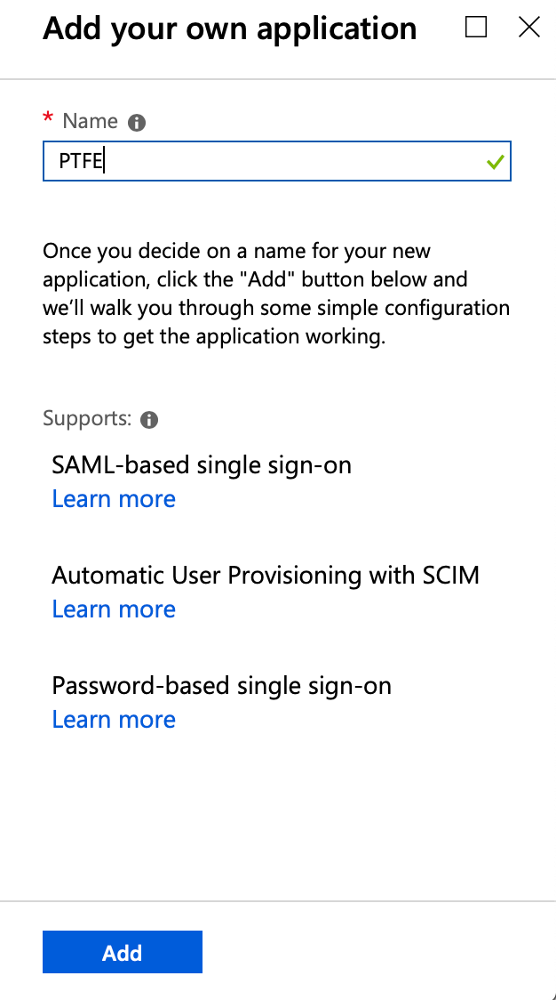
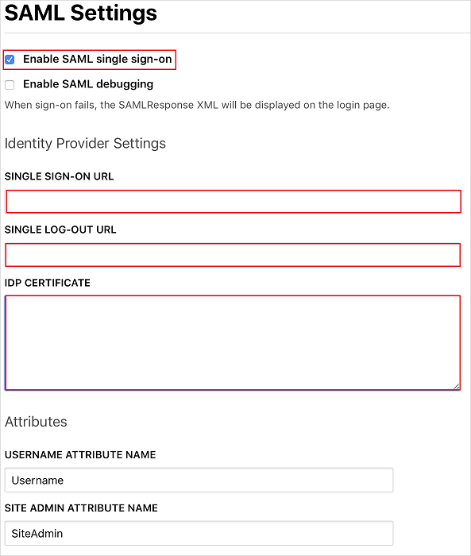

# AAD Configuration

Follow these steps to configure Azure Active Directory (AAD) as the identity provider (IdP) for Terraform Enterprise.

-> **Tip:** > We suggest you use the [documentation](https://docs.microsoft.com/en-us/azure/active-directory/saas-apps/terraform-enterprise-tutorial) Microsoft provides regarding setting up the TFE SSO gallery application.

~> **Note:** This guide assumes you have an appropriate licensing agreement for Azure Active Directory that supports non-gallery application single sign-on.

## Configure a New AAD Non-Gallery Application

1. In the Azure portal, navigate to **Azure Active Directory** > **Enterprise Applications** and select **Add an Application**.

    

2. Select **Non-gallery application**. Provide a name for the application and click **Add**.

    

3. AAD will automatically redirect to your new application settings. Navigate to **Single sign-on** and select **SAML**.

    

1. On the **Basic SAML Configuration** section, enter the values for the following fields:

    - In the **Identifier (Entity ID)** text box, type a URL using the following pattern:
    `https://<TFE HOSTNAME>/users/saml/metadata`

    - In the **Reply URL** text box, type a URL using the following pattern:
    `https://<TFE HOSTNAME>/users/saml/auth`

	- In the **Sign on URL** text box, type a URL using the following pattern:
    `https://<TFE HOSTNAME>/`

	~> **Note:** Update these values with the actual Identifier and Sign on URL. Contact [Terraform Enterprise Client support team](https://support.hashicorp.com) to get these values. You can also refer to the patterns shown in the **Basic SAML Configuration** section in the Azure portal.
	
    ~> **Note:** Update these values with the actual Identifier and Sign on URL. Contact [Terraform Enterprise Client support team](https://support.hashicorp.com) to get these values. You can also refer to the patterns shown in the **Basic SAML Configuration** section in the Azure portal.

    

1. Your Terraform Enterprise application expects the SAML assertions in a specific format, which requires you to add custom attribute mappings to your SAML token attributes configuration. The default value of **Unique User Identifier** is `user.userprincipalname` but Terraform Enterprise expects this to be mapped with the user's email address. For that, you can use `user.mail` attribute from the list or use the appropriate attribute value based on your organization configuration.

    

6. Still in the **User Attributes & Claims** page, under **Manage user claims**, configure a user claim to map the team a user belongs to:
    
     - **Name:** `MemberOf`. This is the default name for TFE's group [attribute](./attributes.html); you can change this attribute's name in [TFE's SAML settings](./configuration.html).
    
     - **Source attribute** (drop-down): `user.assignedroles`. Azure Active Directory will create custom roles that will be used to map users and groups to TFE teams.

    

1. On the **Set up single sign-on with SAML** page, in the **SAML Signing Certificate** section,  find **Certificate (Base64)** and select **Download** to download the certificate and save it on your computer.

    

8. Under the **Set up Terraform Enterprise** header, copy the **Login URL** and **Logout URL** that you will enter in your TFE configuration to link TFE to AAD.

    

9. Navigate to `https://<TFE_HOSTNAME>/app/admin/saml` and perform the following steps in the **SAML Settings** page:

    

    - Enable the **Enable SAML single sign-on** check box.
    - In the **Single Sign-On URL** textbox, paste the **Login URL** value which you copied from the Azure portal.
    - In the **Single Log-out URL** textbox, paste the **Login URL** value which you copied from the Azure portal.
    - Open the downloaded **Certificate** from the Azure portal into Notepad and paste the content into the **IDP CERTIFICATE** textbox. 

### Create an Azure AD test user

In this section, you'll create a test user in the Azure portal named B. Simon

1. From the left pane in the Azure portal, select **Azure Active Directory**, select **Users**, and then select **All users**.
1. Select **New user** at the top of the screen.
1. In the **User** properties, follow these steps:
   1. In the **Name** field, enter `B. Simon`.  
   1. In the **User name** field, enter the `B.Simon@companydomain.extension`, replacing `companydomain.extension` with your company's domain name. For example, `B.Simon@contoso.com`.
   1. Select the **Show password** check box, and then write down the value that's displayed in the **Password** box.
   1. Click **Create**.

### Assign the Azure AD test user

In this section, you'll enable B. Simon to use Azure single sign-on by granting access to Terraform Enterprise.

1. In the Azure portal, select **Enterprise Applications**, and then select **All applications**.
1. In the applications list, select **Terraform Enterprise**.
1. In the app's overview page, find the **Manage** section and select **Users and groups**.
1. Select **Add user**, then select **Users and groups** in the **Add Assignment** dialog.
1. In the **Users and groups** dialog, select **B. Simon** from the Users list, then click the **Select** button at the bottom of the screen.
1. If you are expecting a role to be assigned to the users, you can select it from the **Select a role** dropdown. If no role has been set up for this app, you see "Default Access" role selected.
1. In the **Add Assignment** dialog, click the **Assign** button.

## Configure Custom Roles for Team Membership Mapping

1. Create teams in TFE as outlined in [TFE Team Membership](./team-membership.html).

2. Return to the Azure Portal, navigate to the **App registrations** page, and search for the application you created for TFE in the **Enterprise applications** page. Select your app and in the left sidebar select **Manifest**.

    

3. In the manifest editor, locate the **appRoles** block. This is where you will add additional roles that map users and groups to teams in TFE.

    

4. The **appRoles** block may contain roles automatically generated by AAD. Leave the automatically generated role GUIDs with their default values.  New roles should be added after the system roles and must contain a unique GUID value for the ID value of the new role. You can use a tool such as [GUID Generator](https://www.guidgenerator.com) to create the GUIDs for these new roles. Click **Save** to add the roles.

    -> **Tip:** You can add as many roles as your organization needs, such as the `site-admins` role. Azure AD will send the value of these roles as the claim value in the SAML response.

    The following role configuration example creates a new role named **Dev**:

    ```json
    {
    "allowedMemberTypes": [
        "User"
    ],
    "displayName": "Dev",
    "id": "d1c2ade8-98f8-45fd-aa4a-6d06b947c66f",
    "isEnabled": true,
    "description": "Dev Team",
    "value": "Dev"
    }
    ```

    

5. Go back to **Enterprise applications**, and select the app you created for TFE. In the left sidebar, under the **Manage** heading, select **Users and Groups**. This is where you will enable access to TFE by adding either users or groups to your application. During the process of adding users or groups you will select a role to be assigned to the user or group. Select the role that matches the user or groups TFE team.

    

Once you have added users, the initial configuration is complete, and they can begin logging into TFE with their AAD username and password.


## Test SSO

In this section, you test your Azure AD single sign-on configuration with following options. 

- Click on **Test this application** in Azure portal. This will redirect to Terraform Enterprise Sign-on URL where you can initiate the login flow. 

- Go to Terraform Enterprise Sign-on URL directly and initiate the login flow from there.

- Go to Microsoft My Apps, then click the Terraform Enterprise tile. This will redirect to Terraform Enterprise Sign-on URL. For more information about the My Apps, see [Introduction to the My Apps](https://support.microsoft.com/account-billing/sign-in-and-start-apps-from-the-my-apps-portal-2f3b1bae-0e5a-4a86-a33e-876fbd2a4510).

## Next steps

Once you configure Terraform Enterprise, you can enforce session control, which protects exfiltration and infiltration of your organization’s sensitive data in real time. Session control extends from Conditional Access. Learn how to [enforce session control with Microsoft Cloud App Security](/cloud-app-security/proxy-deployment-any-app).