# ADFS Configuration

This guide explains how to configure Active Directory Federated Services (ADFS) in order to use it as an Identity Provider (IdP) for PTFE's SAML authentication feature. The screenshots below were taken on Windows Server 2016, and the UI may not look the same on previous Windows versions.

This document assumes that you have already installed and configured ADFS and that you are using PTFE version v201807-1 or later.

## Gather ADFS information

1. On the ADFS server, start the Server Manager.
  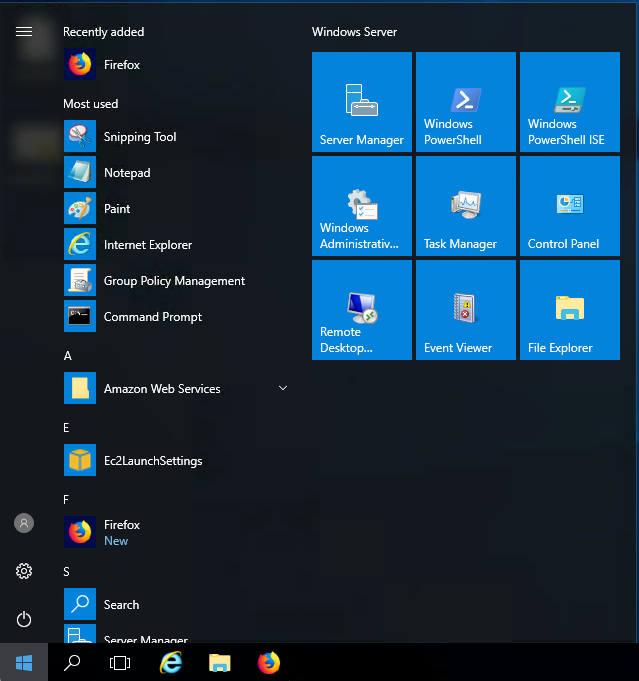
2. Click "Tools" -> "AD FS Management"
  .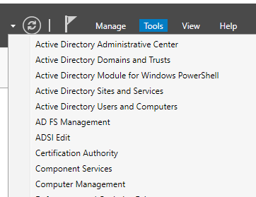
3. Expand the `Service` object and click "Endpoints".
  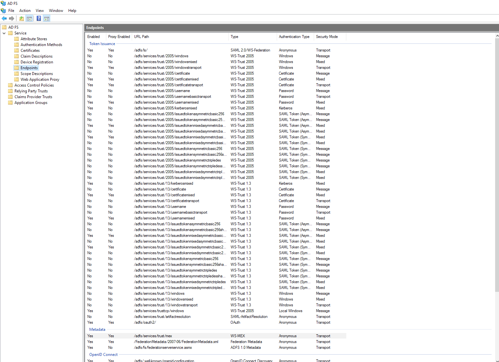
4. Make a note of the `URL Path` for Type `SAML 2.0/WS-Federation`. (If you are using the default settings, this will be `/adfs/ls/`.)
5. Switch from "Endpoints" to "Certificates" and choose the one under `Token-signing`.
  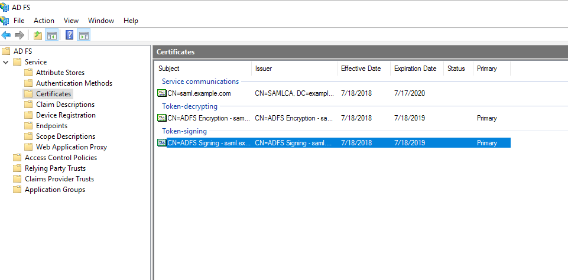
6. Right click "View Certificate".
  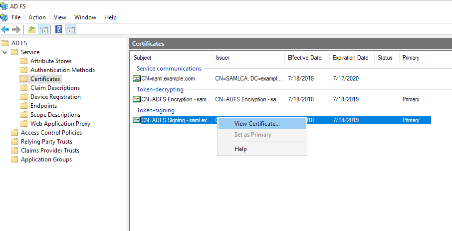
7. In the Certificate dialog, select the Details tab and click "Copy to File".
  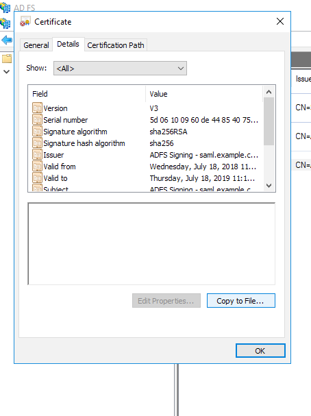
8. In the Certificate Export Wizard, click "Next", select "Base-64 encoded X.509 (.CER)" and click "Next" again.
  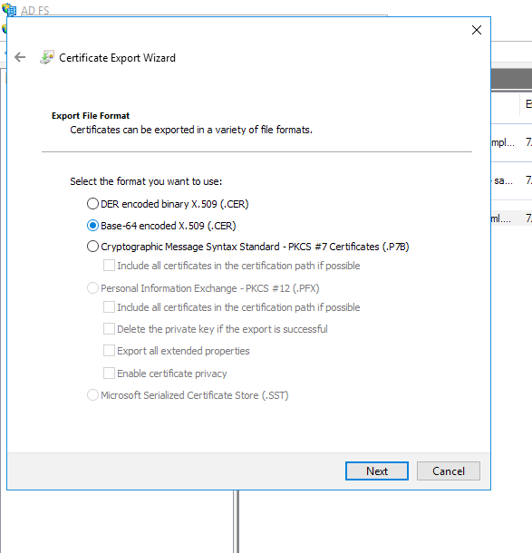
9. Pick a location to save the file and click "Next".
  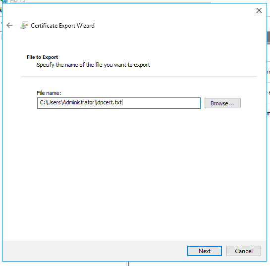
10. Review the settings and click "Finish".
  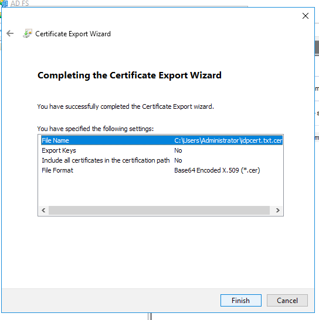

## Configure PTFE

1. Visit `https://<TFE HOSTNAME>/app/admin/saml`.
2. Set "Single Sign-on URL" to `https://<ADFS hostname>/<URL Path>`, using the path you noted above in step 4.
3. Set "Single Log-out URL" to `https://<ADFS hostname>/<URL Path>?wa=wsignout1.0`. (Note that this is the same path with an additional URL parameter.)
4. Paste the contents of the saved certificate in "IDP Certificate".
5. Scroll to the bottom of the screen and click "Save SAML Settings".

## Configure ADFS

### Configure the Relying Party (RP) Trust

1. On the ADFS server, start the Server Manager.
   
2. Click "Tools" -> "AD FS Management".
   
3. Right-click "Relying Party Trusts" and then click "Add Relying Party Trust".
   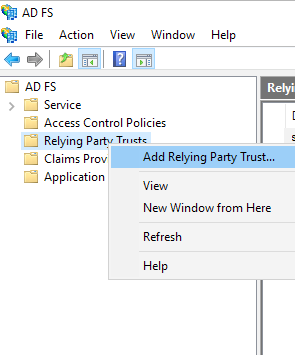
4. In the Add Relying Party Trust Wizard, select "Claims aware" and click "Start".
   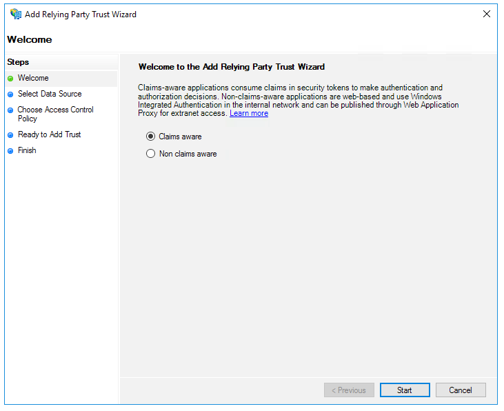
5. Next, select "Import data about the relying party published online or on a local network", and in the text box, enter `https://<TFE HOSTNAME>/users/saml/metadata`.
   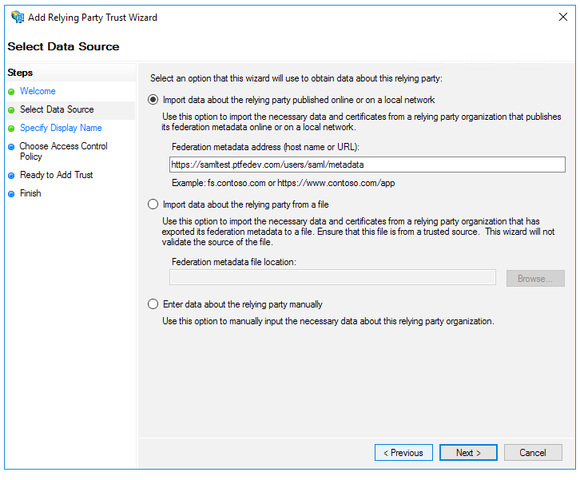
6. Click "Next", type a display name used to identify the RP trust, and click "Next" again.
   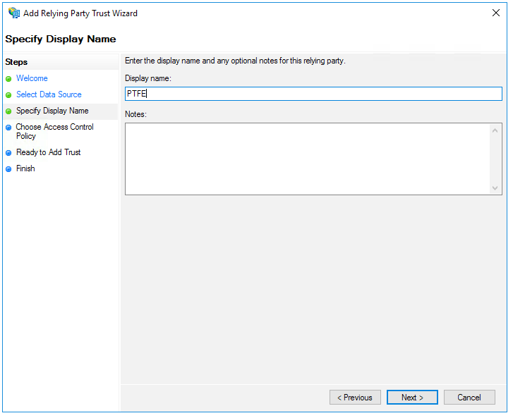
7. In the "Choose Access Control Policy" screen, choose one that matches your security policy, and click "Next".
   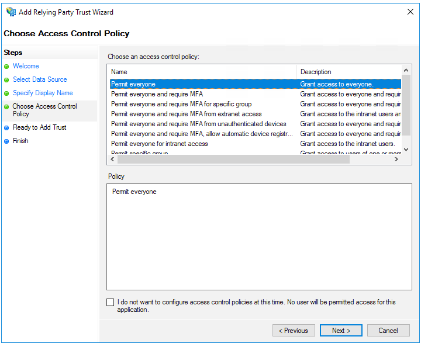
8. Review the settings and click "Next".
   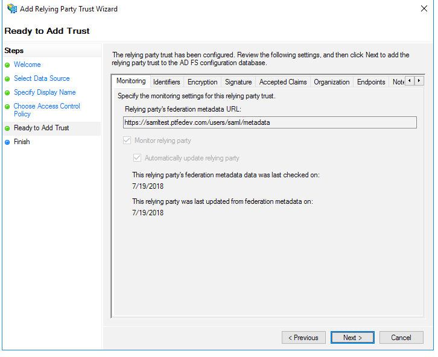
9. Finally, make sure "Configure claims issuance policy for this application" is checked and click "Close". This opens the Claim Issuance Policy editor for the RP trust just configured.
   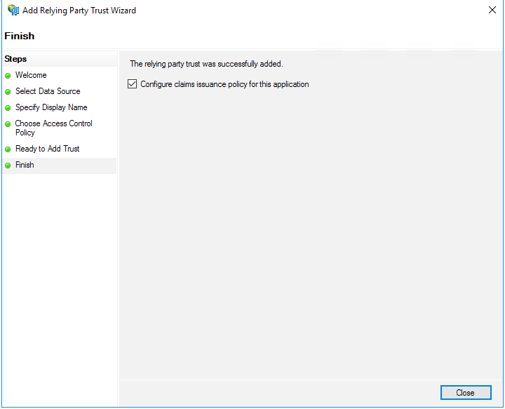

### Configure Claim Issuance

#### LDAP Attributes as Claims

1. Click "Add Rule", and then select "Send LDAP Attributes as Claims" from the `Claim rule template` dropdown. Click "Next".
2. Set a name used to identify the claim rule.
3. Set the attribute store to "Active Directory".
   - From the `LDAP Attribute` column, select "E-Mail Addresses".
   - From the `Outgoing Claim Type`, select "E-Mail Address".
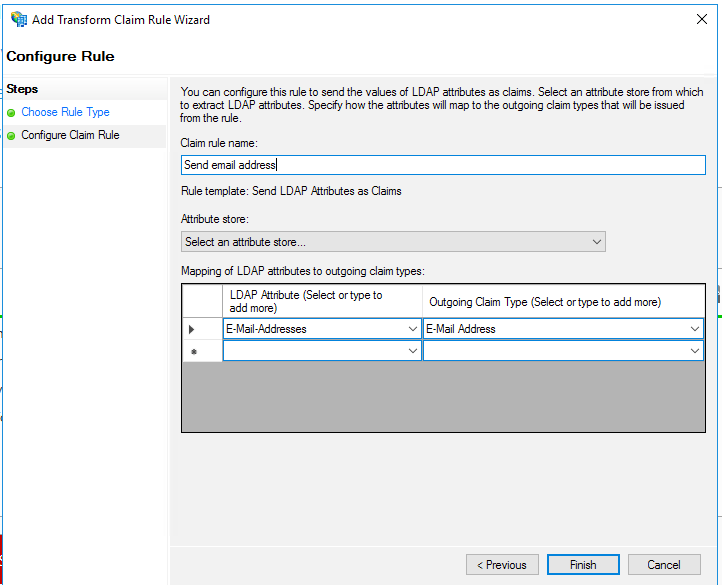

4. Click "Finish".

#### Transform Incoming Claims

4. Click "Add Rule", and then select "Transform an Incoming Claim" from the `Claim rule template` dropdown. Click "Next".
   
5. Set a name used to identify the claim rule.
  - Select "E-mail Address" as the `Incoming Claim Type`.
  - Select "Name ID" as the `Outgoing Claim Type`.
  - Select "Email" for `Outgoing Name ID Format`.
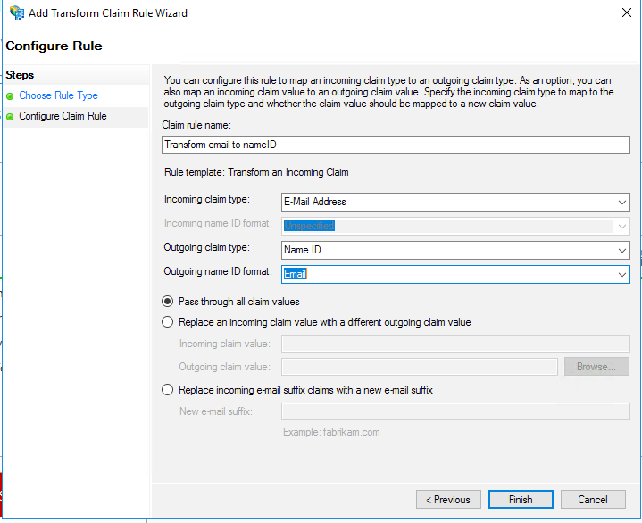

6. Click "Finish".

#### Send Group Membership as a Claim

7. Click "Add Rule", and then select "Send Group Membership as a Claim" from the `Claim rule template` dropdown. Click "Next".
8. Click "Browse" and locate the AD User group that contains all PTFE admins.
   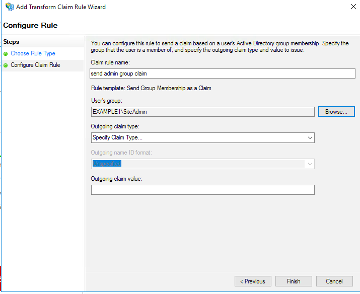
  - Set `Outgoing claim type` to `MemberOf`.
  - Set `Outgoing claim value` to `site-admins`.
      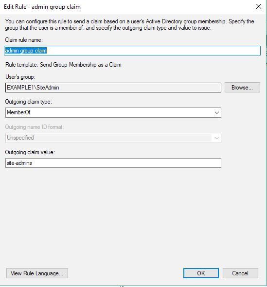
9. Click "Finish".

## Test configured SAML login

At this point SAML is configured. Follow [these instructions to log in](./login.html) to Terraform Enterprise.
