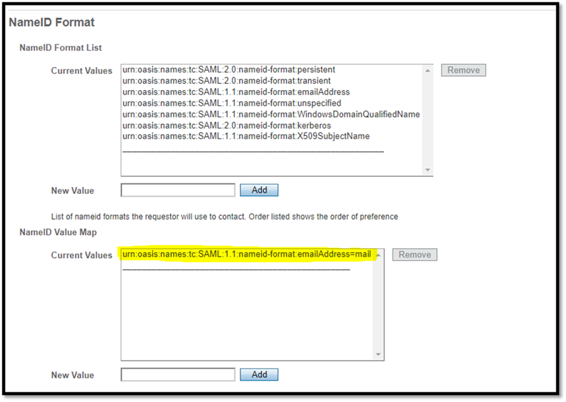
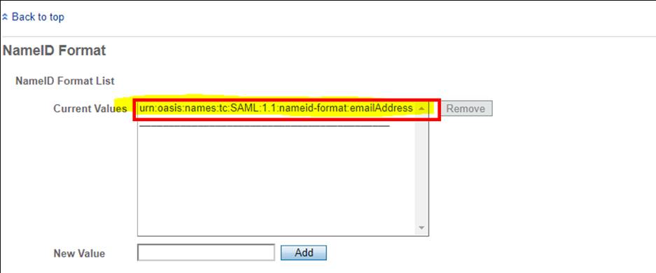
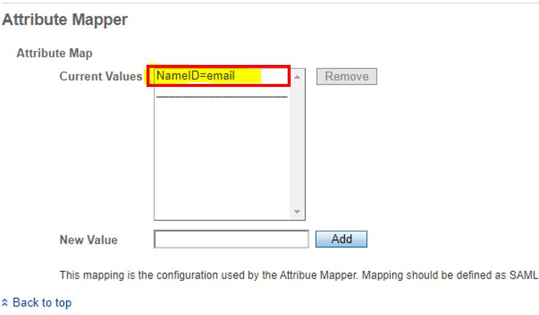

# ForgeRock Configuration

Follow these steps to configure ForgeRock as the identity provider (IdP) for Terraform Enterprise.

## Configure a new Remote Service Provider in ForgeRock

On the TFE console, paste the ForgeRock Access Manager hosted IDP metadata certificate in the proper pem encoded format.  Enter the IDP SSO and SLO URLs as well.


In the hosted IDP assertion content tab the highlighted entry must be on the top to be first in the order of precedence.



After a Remote SP is created in ForgeRock Access Manager with the provided TFE metadata.

The Assertion content tab of the Remote SP which was created should show as below.




And in the assertion processing tab of the remote SP




## Example SAML Request

```xml

<samlp:AuthnRequest xmlns:saml="urn:oasis:names:tc:SAML:2.0:assertion"
      xmlns:samlp="urn:oasis:names:tc:SAML:2.0:protocol"
      AssertionConsumerServiceURL="https://**TFE_DEPLOYMENT**/users/saml/auth"
      Destination="https://**ForgeRock_IDPSSO_Link_For_TFE"
      ID="_**Request_ID**"
      IssueInstant="2020-01-08T23:44:06Z"
      Version="2.0"
      >

    <saml:Issuer>https:// **TFE_DEPLOYMENT**/users/saml/metadata</saml:Issuer>
    <samlp:NameIDPolicy AllowCreate="true"
                        Format="urn:oasis:names:tc:SAML:1.1:nameid-format:emailAddress"
                        />
</samlp:AuthnRequest>
```

## Example SAMLResponse

```xml
<samlp:Response xmlns:samlp="urn:oasis:names:tc:SAML:2.0:protocol"
                ID="**Response_ID** "
                InResponseTo="_**Request_ID**"
                Version="2.0"
                IssueInstant="2a020-01-08T23:44:16Z"
                Destination="https:// **TFE_DEPLOYMENT**/users/saml/auth"
                >
    <saml:Issuer xmlns:saml="urn:oasis:names:tc:SAML:2.0:assertion">**Name_of_ForgeRock_Hosted_IDP** </saml:Issuer>
    <samlp:Status xmlns:samlp="urn:oasis:names:tc:SAML:2.0:protocol">
        <samlp:StatusCode xmlns:samlp="urn:oasis:names:tc:SAML:2.0:protocol"
                          Value="urn:oasis:names:tc:SAML:2.0:status:Success"
                          />
    </samlp:Status>

    <saml:Assertion xmlns:saml="urn:oasis:names:tc:SAML:2.0:assertion"
                    ID="**Assertion_ID**"
                    IssueInstant="2020-01-08T23:44:15Z"
                    Version="2.0"
                    >

        <saml:Issuer>**Name_of_ForgeRock_Hosted_IDP** </saml:Issuer>
        <ds:Signature xmlns:ds="http://www.w3.org/2000/09/xmldsig#">
            <ds:SignedInfo>
                <ds:CanonicalizationMethod Algorithm="http://www.w3.org/2001/10/xml-exc-c14n#" />
                <ds:SignatureMethod Algorithm="http://www.w3.org/2001/04/xmldsig-more#rsa-sha256" />
                <ds:Reference URI="**Reference_URI**">
                    <ds:Transforms>
                        <ds:Transform Algorithm="http://www.w3.org/2000/09/xmldsig#enveloped-signature" />
                        <ds:Transform Algorithm="http://www.w3.org/2001/10/xml-exc-c14n#" />
                    </ds:Transforms>
                    <ds:DigestMethod Algorithm="http://www.w3.org/2001/04/xmlenc#sha256" />
                    <ds:DigestValue>**Digest_Value**=</ds:DigestValue>
                </ds:Reference>
            </ds:SignedInfo>
            <ds:SignatureValue>
                000000000000000000000000000000000000000000000000000000000000000000000000000000000000000000000000000000000000000000000000000000000000000000000000000000000000000000000000000000000000000000000000000000000000000000000000000000000000000000000000000000000000000000000000000000000000000000000000000000000000000000000000000000000000000000000000000000==
            </ds:SignatureValue>
            <ds:KeyInfo>
                <ds:X509Data>
                    <ds:X509Certificate>
                        000000000000000000000000000000000000000000000000000000000000000000000000000000000000000000000000000000000000000000000000000000000000000000000000000000000000000000000000000000000000000000000000000000000000000000000000000000000000000000000000000000000000000000000000000000000000000000000000000000000000000000000000000000000000000000000000000000==
                    </ds:X509Certificate>
                </ds:X509Data>
            </ds:KeyInfo>
        </ds:Signature>
        <saml:Subject>

            <saml:NameID Format="urn:oasis:names:tc:SAML:1.1:nameid-format:emailAddress"
                         NameQualifier="**Name_of_ForgeRock_Hosted_IDP** "
                         SPNameQualifier="https:// **TFE_DEPLOYMENT**/users/saml/metadata"
                         >**user@email.com**</saml:NameID>

            <saml:SubjectConfirmation Method="urn:oasis:names:tc:SAML:2.0:cm:bearer">
                <saml:SubjectConfirmationData InResponseTo="_**SAML_Request_ID"
                                              NotOnOrAfter="2020-01-08T23:54:16Z"
                                              Recipient="https:// **TFE_DEPLOYMENT**/users/saml/auth"
                                              />
            </saml:SubjectConfirmation>
        </saml:Subject>

        <saml:Conditions NotBefore="2020-01-08T23:34:16Z"
                         NotOnOrAfter="2020-01-08T23:54:16Z"
                         >

            <saml:AudienceRestriction>
                <saml:Audience>https:// **TFE_DEPLOYMENT**/users/saml/metadata</saml:Audience>

            </saml:AudienceRestriction>

        </saml:Conditions>

        <saml:AuthnStatement AuthnInstant="2020-01-08T23:44:15Z"
                             SessionIndex="**Session_Index_ID**"
                             >

            <saml:AuthnContext>

                <saml:AuthnContextClassRef>urn:oasis:names:tc:SAML:2.0:ac:classes:PasswordProtectedTransport</saml:AuthnContextClassRef>
            </saml:AuthnContext>
        </saml:AuthnStatement>
    </saml:Assertion>
</samlp:Response>
```