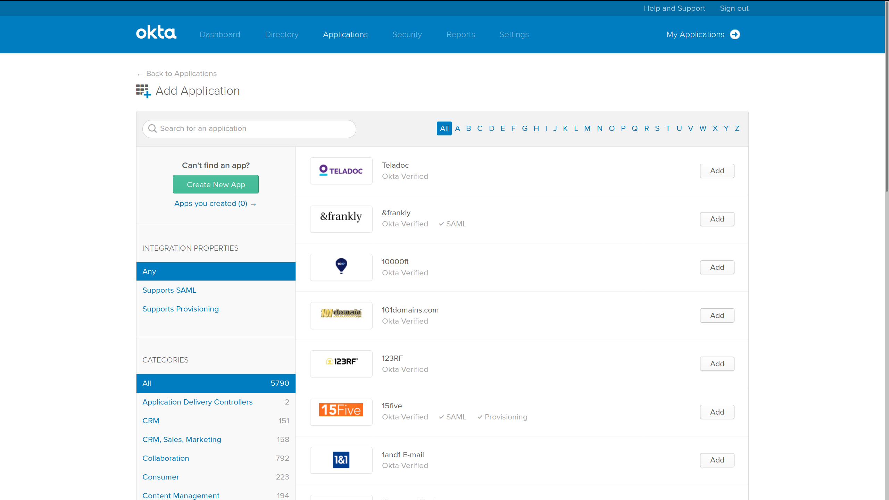
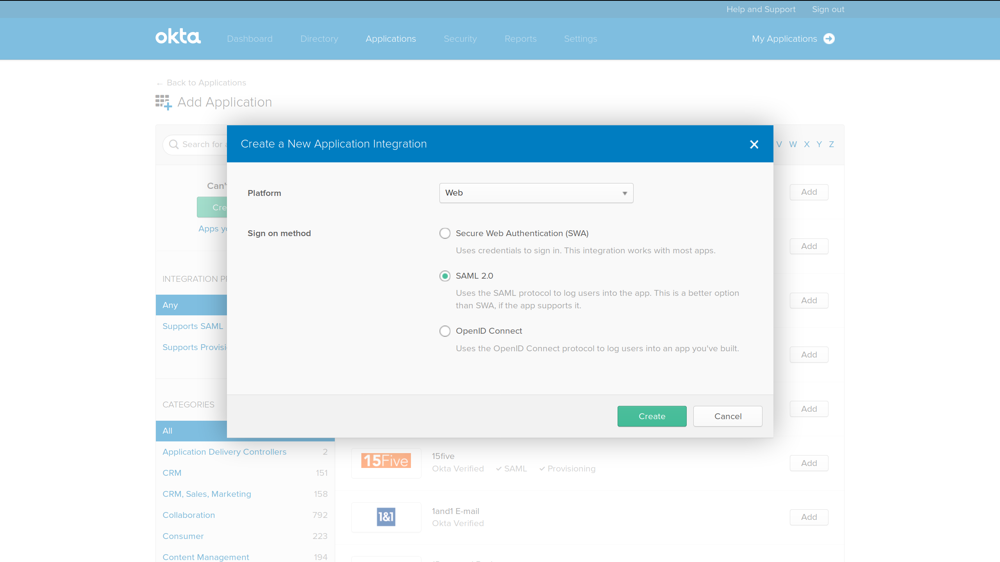
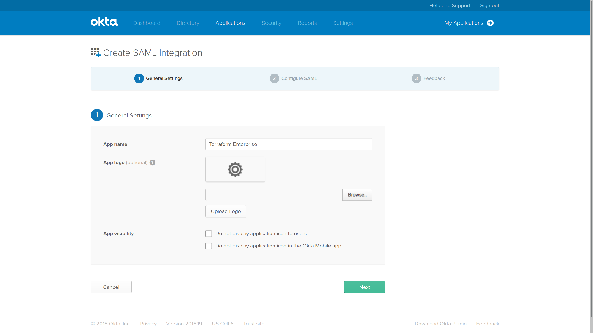
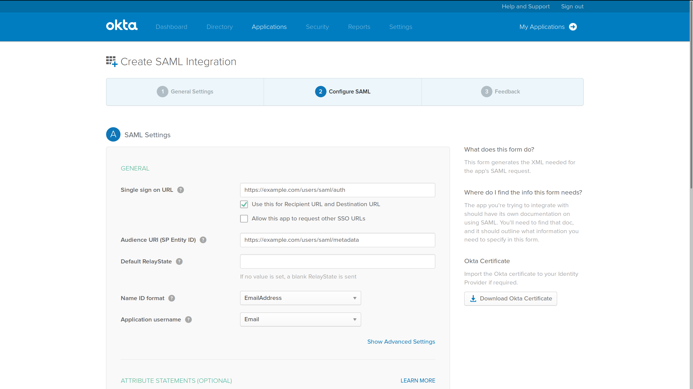
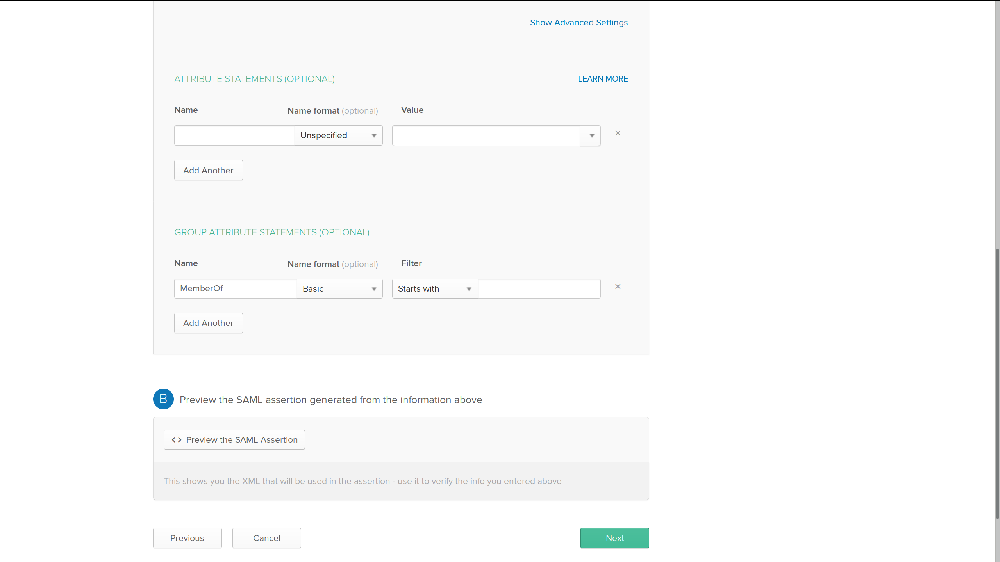

# Okta Configuration

Follow these steps to configure Okta as the identity provider (IdP) for Terraform Enterprise.

## Configure a New Okta SAML Application

1. In Okta's web interface, go to the "Applications" tab and click "Create New App".
    
2. Select "Web" as the platform and "SAML 2.0" as the sign on method, then click "Create".
    
3. In the "General Settings" page, enter an app name, then click "Next".
    
4. In the "Configure SAML" page, configure the following settings with the specified values:
    - **SSO (Single Sign-On) URL:** `https://<TFE HOSTNAME>/users/saml/auth` (listed as "ACS consumer (recipient) URL" in TFE's SAML settings).

        -> **Note:** The SSO URL is used by the identity provider software during authentication; it is different from the [Login URL][login_url], which users visit in order to sign in to Terraform Enterprise.
    - **Use the SSO URL for Recipient URL and Destination URL** (checkbox): enabled.
    - **Audience URI (SP Entity ID):** `https://<TFE HOSTNAME>/users/saml/metadata` (listed as "Metadata (audience) URL" in TFE's SAML settings).
    - **Name ID format** (drop-down): EmailAddress (the full name for this format in the SAML specification is `urn:oasis:names:tc:SAML:1.1:nameid-format:emailAddress`).
    - **Application username** (drop-down): Email

    ~> **Important:** TFE usernames must be at least 3 characters. If Email is not used as the application username, ensure that your Okta username or other method selected contains only usernames having at least 3 characters. For example, if Email Prefix is selected and the email is Jo@domain.com, the user will not be able to log in and will receive the message "ERROR: Validation failed: Username must have at least 3 characters".

      

5. Still in the "Configure SAML" page, configure a group attribute statement to report which teams a user belongs to. Under the "Group Attribute Statements (Optional)" header, configure the statement as follows:
    - **Name:** `MemberOf` (This is the default name for TFE's group [attribute][]; the name of this attribute can be changed in [TFE's SAML settings](./configuration.html) if necessary.)
    - **Name format** (drop-down): Basic
    - **Filter:** A filter type and filter value that will match all of the relevant groups that each user belongs to. The exact filter expression depends on how your Okta groups are configured, and which subset of groups you want to expose to TFE. Note that TFE ignores group names that do not correspond to existing TFE teams; see [Team Membership Mapping](./team-membership.html) for more details.

      
6. Still in the "Configure SAML" page, optionally configure a site admin permissions attribute statement. This statement determines which users can administer the entire Terraform Enterprise instance (see [Administering Terraform Enterprise](../admin/index.html) for more information about site admin permissions). Under the "Attribute Statements (Optional)" header, configure a statement as follows:
    - **Name:** `SiteAdmin` (This is the default name for TFE's site admin [attribute][]; the name of this attribute can be changed in [TFE's SAML settings](./configuration.html) if necessary.)
    - **Name Format** (drop-down): Basic
    - **Value:** An [Okta expression](https://developer.okta.com/reference/okta_expression_language/) that will evaluate to a boolean: `true` for every user who should have site admin permissions, but `false` for any users who should **not** have site admin permissions. The exact expression depends on the user properties you use to manage admin permissions.
7. Preview the SAML response and make sure it matches your expectations.
8. Finish configuring the SAML app in Okta, then copy the provided endpoint URLs and certificate to your Terraform Enterprise SAML settings at `https://<TFE_HOSTNAME>/app/admin/saml`. TFE requires a single sign-on URL, a single log-out URL, and a PEM (base64) encoded X.509 certificate.

[attribute]: ./attributes.html
[login_url]: ./login.html

## Example SAMLResponse

```xml
<?xml version="1.0" encoding="UTF-8"?>
<saml2p:Response xmlns:saml2p="urn:oasis:names:tc:SAML:2.0:protocol" Destination="https://example.com/users/saml/auth" ID="id1" InResponseTo="_a6d4052d-4dca-4816-b811-a81834681d40" IssueInstant="2018-05-30T15:27:58.831Z" Version="2.0" xmlns:xs="http://www.w3.org/2001/XMLSchema">
  <saml2:Issuer xmlns:saml2="urn:oasis:names:tc:SAML:2.0:assertion" Format="urn:oasis:names:tc:SAML:2.0:nameid-format:entity">http://www.okta.com/1</saml2:Issuer>
  <ds:Signature xmlns:ds="http://www.w3.org/2000/09/xmldsig#">
    <ds:SignedInfo>
      <ds:CanonicalizationMethod Algorithm="http://www.w3.org/2001/10/xml-exc-c14n#"/>
      <ds:SignatureMethod Algorithm="http://www.w3.org/2001/04/xmldsig-more#rsa-sha256"/>
      <ds:Reference URI="#id1">
        <ds:Transforms>
          <ds:Transform Algorithm="http://www.w3.org/2000/09/xmldsig#enveloped-signature"/>
          <ds:Transform Algorithm="http://www.w3.org/2001/10/xml-exc-c14n#">
            <ec:InclusiveNamespaces xmlns:ec="http://www.w3.org/2001/10/xml-exc-c14n#" PrefixList="xs"/>
          </ds:Transform>
        </ds:Transforms>
        <ds:DigestMethod Algorithm="http://www.w3.org/2001/04/xmlenc#sha256"/>
        <ds:DigestValue>000000000000000000000000000=</ds:DigestValue>
      </ds:Reference>
    </ds:SignedInfo>
    <ds:SignatureValue>000000000000000000000000000000000000000000000000000000000000000000000000000000000000000000000000000000000000000000000000000000000000000000000000000000000000000000000000000000000000000000000000000000000000000000000000000000000000000000000000000000000000000000000000000000000000000000000000000000000000000000000000000000000000000000000000000000==</ds:SignatureValue>
    <ds:KeyInfo>
      <ds:X509Data>
        <ds:X509Certificate>000000000000000000000000000000000000000000000000000000000000000000000000000000000000000000000000000000000000000000000000000000000000000000000000000000000000000000000000000000000000000000000000000000000000000000000000000000000000000000000000000000000000000000000000000000000000000000000000000000000000000000000000000000000000000000000000000000000000000000000000000000000000000000000000000000000000000000000000000000000000000000000000000000000000000000000000000000000000000000000000000000000000000000000000000000000000000000000000000000000000000000000000000000000000000000000000000000000000000000000000000000000000000000000000000000000000000000000000000000000000000000000000000000000000000000000000000000000000000000000000000000000000000000000000000000000000000000000000000000000000000000000000000000000000000000000000000000000000000000000000000000000000000000000000000000000000000000000000000000000000000000000000000000000000000000000000000000000000000000000000000000000000000000000000000000000000000000000000000000000000000000000000000000000000000000000000000000000000000000000000000000000000000000000000000000000000000000000000000000000000000000000000000000000000000000000000000000000000000000000000000000000000000000000000000000000000000000000000000000000000000000000000000000000000000000000000000000000000000000000000000000000000000000000000000000000000000000000000000000000000000000000000000000000000000000==</ds:X509Certificate>
      </ds:X509Data>
    </ds:KeyInfo>
  </ds:Signature>
  <saml2p:Status xmlns:saml2p="urn:oasis:names:tc:SAML:2.0:protocol">
    <saml2p:StatusCode Value="urn:oasis:names:tc:SAML:2.0:status:Success"/>
  </saml2p:Status>
  <saml2:Assertion xmlns:saml2="urn:oasis:names:tc:SAML:2.0:assertion" ID="id2" IssueInstant="2018-05-30T15:27:58.831Z" Version="2.0" xmlns:xs="http://www.w3.org/2001/XMLSchema">
    <saml2:Issuer Format="urn:oasis:names:tc:SAML:2.0:nameid-format:entity" xmlns:saml2="urn:oasis:names:tc:SAML:2.0:assertion">http://www.okta.com/1</saml2:Issuer>
    <ds:Signature xmlns:ds="http://www.w3.org/2000/09/xmldsig#">
      <ds:SignedInfo>
        <ds:CanonicalizationMethod Algorithm="http://www.w3.org/2001/10/xml-exc-c14n#"/>
        <ds:SignatureMethod Algorithm="http://www.w3.org/2001/04/xmldsig-more#rsa-sha256"/>
        <ds:Reference URI="#id2">
          <ds:Transforms>
            <ds:Transform Algorithm="http://www.w3.org/2000/09/xmldsig#enveloped-signature"/>
            <ds:Transform Algorithm="http://www.w3.org/2001/10/xml-exc-c14n#">
              <ec:InclusiveNamespaces xmlns:ec="http://www.w3.org/2001/10/xml-exc-c14n#" PrefixList="xs"/>
            </ds:Transform>
          </ds:Transforms>
          <ds:DigestMethod Algorithm="http://www.w3.org/2001/04/xmlenc#sha256"/>
          <ds:DigestValue>000000000000000000000000000=</ds:DigestValue>
        </ds:Reference>
      </ds:SignedInfo>
      <ds:SignatureValue>000000000000000000000000000000000000000000000000000000000000000000000000000000000000000000000000000000000000000000000000000000000000000000000000000000000000000000000000000000000000000000000000000000000000000000000000000000000000000000000000000000000000000000000000000000000000000000000000000000000000000000000000000000000000000000000000000000==</ds:SignatureValue>
      <ds:KeyInfo>
        <ds:X509Data>
          <ds:X509Certificate>000000000000000000000000000000000000000000000000000000000000000000000000000000000000000000000000000000000000000000000000000000000000000000000000000000000000000000000000000000000000000000000000000000000000000000000000000000000000000000000000000000000000000000000000000000000000000000000000000000000000000000000000000000000000000000000000000000000000000000000000000000000000000000000000000000000000000000000000000000000000000000000000000000000000000000000000000000000000000000000000000000000000000000000000000000000000000000000000000000000000000000000000000000000000000000000000000000000000000000000000000000000000000000000000000000000000000000000000000000000000000000000000000000000000000000000000000000000000000000000000000000000000000000000000000000000000000000000000000000000000000000000000000000000000000000000000000000000000000000000000000000000000000000000000000000000000000000000000000000000000000000000000000000000000000000000000000000000000000000000000000000000000000000000000000000000000000000000000000000000000000000000000000000000000000000000000000000000000000000000000000000000000000000000000000000000000000000000000000000000000000000000000000000000000000000000000000000000000000000000000000000000000000000000000000000000000000000000000000000000000000000000000000000000000000000000000000000000000000000000000000000000000000000000000000000000000000000000000000000000000000000000000000000000000000000==</ds:X509Certificate>
        </ds:X509Data>
      </ds:KeyInfo>
    </ds:Signature>
    <saml2:Subject xmlns:saml2="urn:oasis:names:tc:SAML:2.0:assertion">
      <saml2:NameID Format="urn:oasis:names:tc:SAML:1.1:nameid-format:emailAddress">user@example.com</saml2:NameID>
      <saml2:SubjectConfirmation Method="urn:oasis:names:tc:SAML:2.0:cm:bearer">
        <saml2:SubjectConfirmationData InResponseTo="_a6d4052d-4dca-4816-b811-a81834681d40" NotOnOrAfter="2018-05-30T15:32:58.831Z" Recipient="https://example.com/users/saml/auth"/>
      </saml2:SubjectConfirmation>
    </saml2:Subject>
    <saml2:Conditions NotBefore="2018-05-30T15:22:58.831Z" NotOnOrAfter="2018-05-30T15:32:58.831Z" xmlns:saml2="urn:oasis:names:tc:SAML:2.0:assertion">
      <saml2:AudienceRestriction>
        <saml2:Audience>https://example.com/users/saml/metadata</saml2:Audience>
      </saml2:AudienceRestriction>
    </saml2:Conditions>
    <saml2:AuthnStatement AuthnInstant="2018-05-30T15:11:50.514Z" SessionIndex="_a6d4052d-4dca-4816-b811-a81834681d40" xmlns:saml2="urn:oasis:names:tc:SAML:2.0:assertion">
      <saml2:AuthnContext>
        <saml2:AuthnContextClassRef>urn:oasis:names:tc:SAML:2.0:ac:classes:PasswordProtectedTransport</saml2:AuthnContextClassRef>
      </saml2:AuthnContext>
    </saml2:AuthnStatement>
    <saml2:AttributeStatement xmlns:saml2="urn:oasis:names:tc:SAML:2.0:assertion">
      <saml2:Attribute Name="Username" NameFormat="urn:oasis:names:tc:SAML:2.0:attrname-format:basic">
        <saml2:AttributeValue xmlns:xs="http://www.w3.org/2001/XMLSchema" xmlns:xsi="http://www.w3.org/2001/XMLSchema-instance" xsi:type="xs:string">new_username</saml2:AttributeValue>
      </saml2:Attribute>
      <saml2:Attribute Name="MemberOf" NameFormat="urn:oasis:names:tc:SAML:2.0:attrname-format:basic">
        <saml2:AttributeValue xmlns:xs="http://www.w3.org/2001/XMLSchema" xmlns:xsi="http://www.w3.org/2001/XMLSchema-instance" xsi:type="xs:string">devs</saml2:AttributeValue>
        <saml2:AttributeValue xmlns:xs="http://www.w3.org/2001/XMLSchema" xmlns:xsi="http://www.w3.org/2001/XMLSchema-instance" xsi:type="xs:string">reviewers</saml2:AttributeValue>
      </saml2:Attribute>
    </saml2:AttributeStatement>
  </saml2:Assertion>
</saml2p:Response>
```
