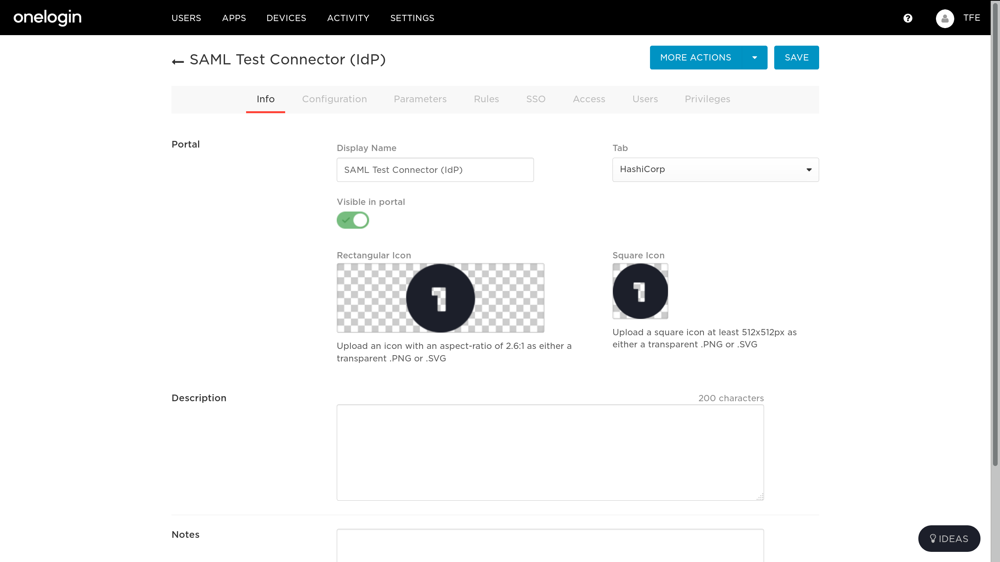
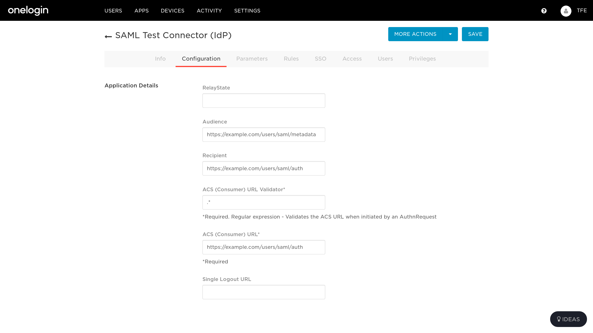
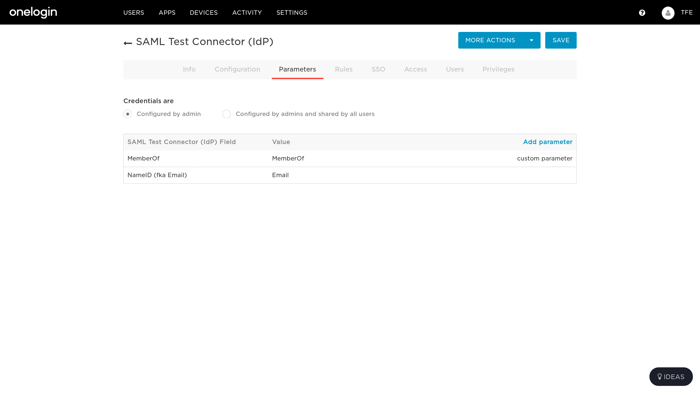
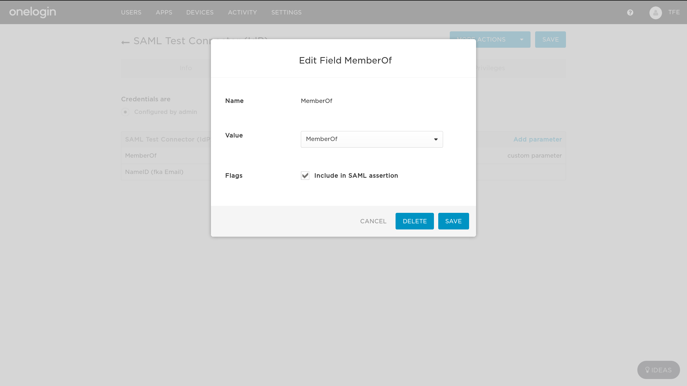
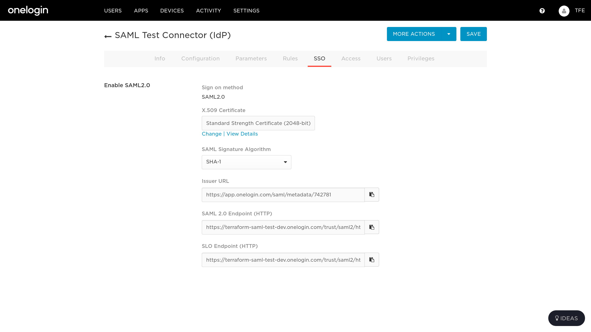
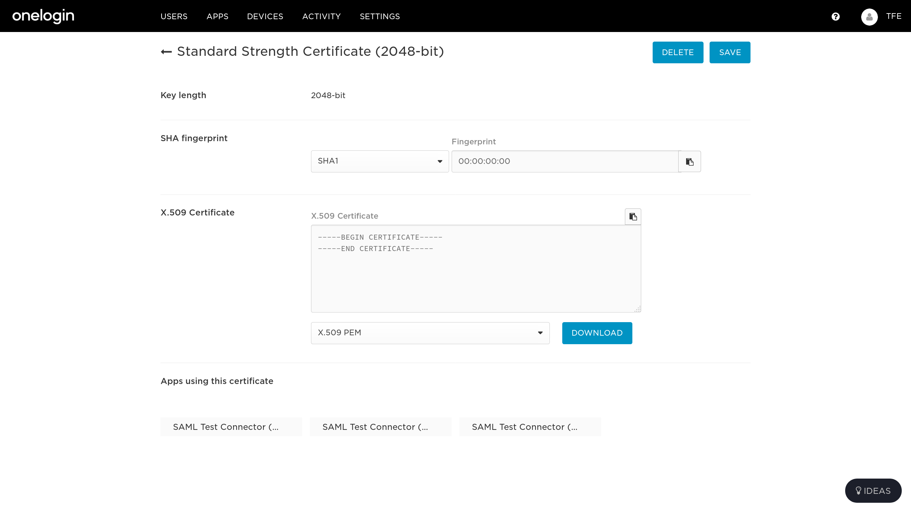
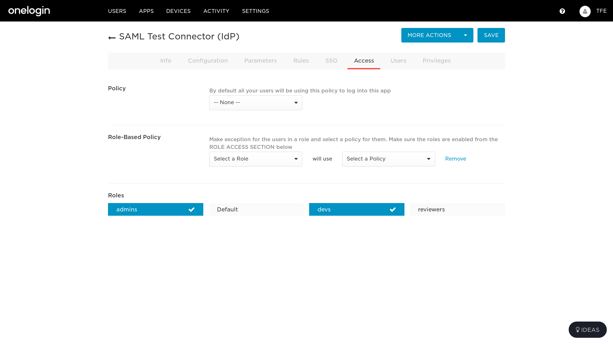
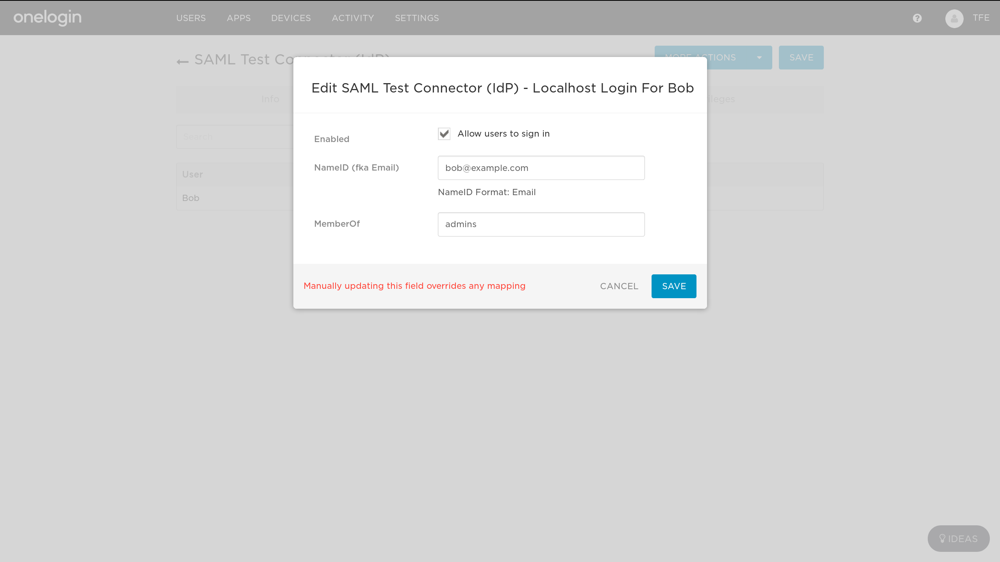
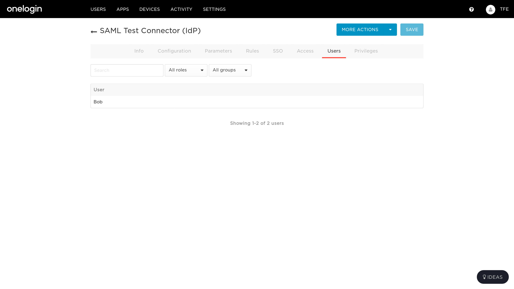
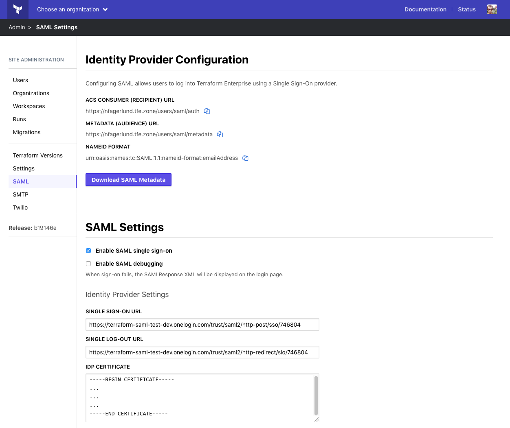

# OneLogin Configuration

Follow these steps to configure OneLogin as the identity provider (IdP) for Terraform Enterprise.

1. Add a OneLogin app by going to Apps > Add Apps then searching for "SAML Test Connector (IdP)".
2. Name the app.
  
3. Configure the service provider URLs. These are shown in your Terraform Enterprise SAML settings at `https://<YOUR_TERRAFORM_ENTERPRISE_DOMAIN>/admin/integrations/saml`.
  
4. Map the NameId and MemberOf parameters.
  
  
5. Copy the endpoint URLs and certificate to your Terraform Enterprise SAML settings `https://<YOUR_TERRAFORM_ENTERPRISE_DOMAIN>/admin/integrations/saml`.
  
  
6. Enable access for specific roles.
  
7. Add users and specify their roles.
  
  

## Terraform Enterprise SAML SSO settings

Verify the endpoint URLs, certificate, and attribute mappings are correct in the SAML SSO settings.

