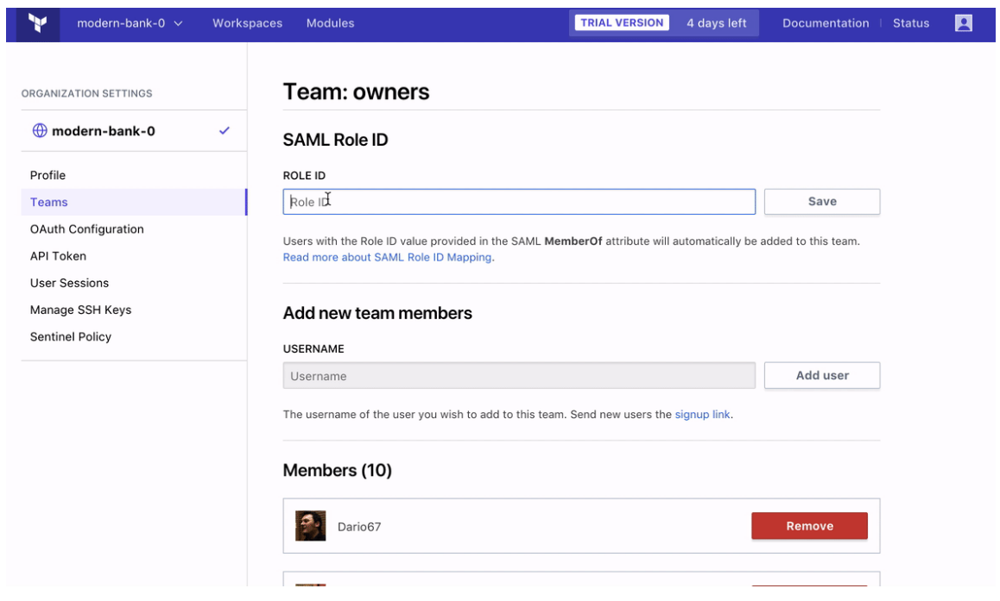

# Team Membership Mapping

Terraform Enterprise (TFE) can automatically add users to teams based on their SAML assertion, so you can manage team membership in your directory service.

## Configuring Team Membership Mapping

Team membership mapping is controlled with the "Team membership mapping enabled?" checkbox, in the SAML section of the TFE admin pages.

Once you enable it, you must specify the name of a SAML attribute in the [Team Attribute Name](./configuration.html) setting, and make sure the value of that atribute in the SAML assertion is a comma-separated list of team names.

Once team membership mapping is enabled, users logging in via SAML are automatically added to the teams included in their assertion, and automatically removed from any teams that _aren't_ included in their assertion. Note that this overrides any manually set team memberships; whenever the user logs in, their team membership is adjusted to match their SAML assertion.

Any team names that don't match existing teams are ignored; TFE will not automatically create new teams.

To disable team membership mapping, uncheck the "Team membership mapping enabled?" checkbox in the SAML admin page. With mapping disabled, TFE won't automatically manage team membership on login, and you can manually add users to teams via the organization settings page.

## Team Names

TFE expects the team names in the team membership SAML attribute to exactly match TFE's own team names. You cannot specify aliases for teams.

Note that team names are unique across an organization but not necessarily unique across a whole TFE instance. If a user is a member of multiple TFE organizations, their SAML assertion might add them to similarly-named teams. Keep this in mind when naming your teams.

## Managing Membership of the Owners Team

Since the "owners" team is especially important, TFE defaults to NOT managing its membership via SAML. Unless you specifically enable it, TFE won't automatically add or remove any owners, and you can manually manage membership via the teams page.

You can enable automatic membership in the owners team (on a per-organization basis) by explicitly specifying an alias (role ID) for it. On your organization settings page, click "Teams" and then click the owners team. If SAML is enabled, there will be a "SAML Role ID" field. Enter a legal team name as an ID and click "Save." The ID can be "owners," but it cannot conflict with any other team name.

Before enabling membership mapping for owners, double-check that your chosen role ID appears in the SAML assertion for users who should be owners. It's worth some extra effort to avoid accidentally removing people from the owners team.

## Site Admins

Site admins can log in to Terraform Enterprise directly. If they are disabled on the identity provider but still enabled in Terraform Enterprise and bypass SSO, they will still be able to log in.
