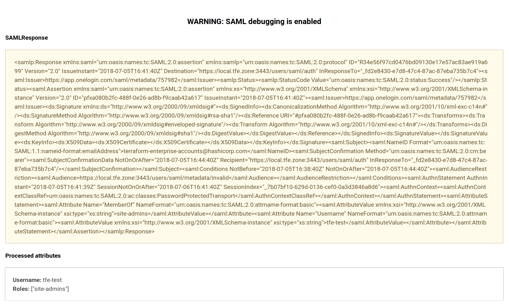

# Troubleshooting Guide

**Note**: Verify you are on release version 201807-2 or later, as that is the version that introduced the debugging functionality that is described in this guide. If you would like assistance with upgrading, please [contact support](/docs/enterprise/private/faq.html#support-for-private-terraform-enterprise).

## Disable SAML Single Sign-On

Before starting, disable SAML SSO by going to `https://<TFE HOSTNAME>/app/admin/saml` and unchecking the Enable SAML Single Sign-On checkbox. It's best to start from a clean setup.

## Create a non-SSO admin account for recovery

Before proceeding with troubleshooting, create a non-SSO admin account that can be used to log in if admin access gets revoked for other admins. The email address assigned to this user should not be one that will be used for SAML.

Open `https://<TFE HOSTNAME>/account/new` to create the account. Make sure to grant admin access to this user and verify they can log in at `https://<TFE HOSTNAME>/`.

## Enable SAML SSO and SAML debugging

### Enable SAML SSO

Enable SAML SSO by following the [configuration instructions](/docs/enterprise/saml/configuration.html).

### Enable SAML debugging

Enable SAML debugging by going to `https://<TFE HOSTNAME>/app/admin/saml`.

## Test sign-on

Try signing on by going to `https://<TFE HOSTNAME>/` and clicking the "Log in via SAML" button. Verify the page says `WARNING: SAML debugging is enabled`.

If login fails, the SAMLResponse XML document sent from the identity provider is shown. The XML document may contain the user's username, list of roles, and other attributes. Checking the format of the email address and username and whether the desired list of roles is included may assist with debugging.

If there is a configuration error, that is also shown on the login form.

Fix the configuration error and try to log in again.

## Common configuration errors

Most errors will be from misconfiguration and will be shown in the red box on the Terraform Enterprise login form.

**CONFIGURATION ERROR: `https://<TFE HOSTNAME>/metadata` is not a valid audience for this Response - Valid audiences: `https://<TFE HOSTNAME>/users/saml/metadata`** 
The audience URL was not configured correctly in the identity provider. 
**How to resolve:** Open the Terraform Enterprise admin settings for SAML SSO, copy the ACS Consumer URL, then paste it into the identity provider settings.

**CONFIGURATION ERROR: The response was received at `https://<TFE HOSTNAME>/auth` instead of `https://<TFE HOSTNAME>/users/saml/auth`** 
The recipient URL was not configured correctly in the identity provider. 
**How to resolve:** Open the Terraform Enterprise admin settings for SAML SSO, copy the Metadata URL, then paste it into the identity provider settings.

**ERROR: Validation failed: Email is invalid, Email is not a valid email address, Username has already been taken** 
NameID is invalid. It must be an email address. 
**How to resolve:** Open the identity provider settings and configure email address as the value for NameID.

**ERROR: Mail::AddressList can not parse |{onelogin:email}|: Only able to parse up to "{onelogin:email}"** 
The NameID that was received was blank. 
**How to resolve:** Open the identity provider settings and configure email address as the value for NameID.

**ERROR: nested asn1 error** 
The identity provider certificate is invalid or was not pasted correctly into Terraform Enterprise. 
**How to resolve:** Open the identity provider settings, copy the certificate, then paste it into the "IDP Certificate" field in Terraform Enterprise.

**ERROR: Issuer of assertion not found or multiple** 
Terrform Enterprise was unable to determine the issuer of the SAML response. 
**How to resolve:** The most common reason for this issue is that an F5 load balancer is not signing responses, resulting in the `<ds:Signature xmlns:ds="http://www.w3.org/2000/09/xmldsig#">` and related elements not being present. Follow the steps under **Configuring SAML SP Connectors** on [Using APM as a SAML IdP](https://support.f5.com/kb/en-us/products/big-ip_apm/manuals/product/apm-authentication-single-sign-on-12-1-0/29.html), particularly step 9c. If you are not using an F5 as part of your SAML setup, see below to contact support.

## Contacting support

If you're not able to resolve the error using the steps above, [reach out to support](/docs/enterprise/private/faq.html#support-for-private-terraform-enterprise). When contacting support, please provide:

  * A screenshot of "SAML Response" and "Processed attributes" shown on the login page after failed login
  * A screenshot of the error on the login page
  * The [SAMLResponse XML document](./identity-provider-configuration.html#example-samlresponse)
  * A [support bundle](/docs/enterprise/private/faq.html#diagnostics)
