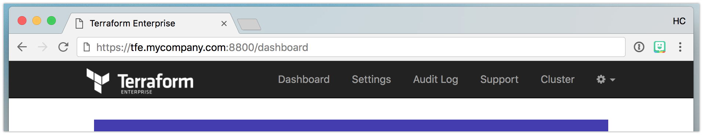

# Support for Terraform Enterprise

If some aspect of Terraform Enterprise is not working as
expected, please reach out to support for help.

## Email

You can engage HashiCorp support via the web portal at https://support.hashicorp.com or
by email at <support@hashicorp.com>. Please make sure
to use your organization email (not your personal email) when contacting us so
we can associate the support request with your organization and expedite our
response.

## Diagnostics

For most technical issues, HashiCorp support will ask you to include diagnostic
information in your support request. To ensure the required information is included,
Terraform Enterprise can automatically generate a support bundle including logs and configuration details.

### Downloading the Support Bundle

Diagnostic information is available via in the installer dashboard on port 8800 of your installation.

On the dashboard, click on the Support tab:

On the next page, click the _Download Support Bundle_ button which will download the support bundle directly to your web browser.

### Uploading the Support Bundle

Once you have downloaded the support bundle, please use a secure method to upload it to HashiCorp support.

#### Existing Customers

Attach the bundle to your support ticket. If possible, use the SendSafely integration available in the support portal at support.hashicorp.com, as it allows for large file uploads.

If you are unable to use the integration in the portal, please upload directly to `https://hashicorp.sendsafely.com/u/ptfe-support-bundles`.

#### Pre-Sales Customers

If you are in the pre-sales phase, please upload support bundle files directly to `https://hashicorp.sendsafely.com/u/ptfe-support-bundles`.

### About the Bundle

The support bundle contains logging and telemetry data from various components
in Terraform Enterprise. It may also include log data from Terraform builds you have executed on your Terraform Enterprise installation.
