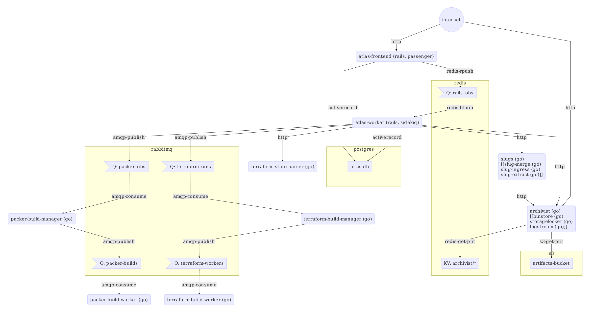

# Terraform Enterprise Architecture

This page describes aspects of the architecture of Terraform Enterprise.

-> **Note:** This page was written for a prior implementation of Terraform Enterprise, and may be outdated. We plan to review our architecture documentation in the near future.

## Services

These are the services used to run Terraform Enterprise. Each service contains a description of what actions it performs, a policy for restarts, impact of failing or degraded performance, and the service's dependencies.

- [`atlas-frontend` and `atlas-worker`](https://github.com/hashicorp/terraform-enterprise-modules/blob/master/docs/services/atlas.md)
- [`archivist`, `binstore`, `storagelocker`, and `logstream`](https://github.com/hashicorp/terraform-enterprise-modules/blob/master/docs/services/archivist.md)
- [`terraform-build-manager`, and `terraform-build-worker`](https://github.com/hashicorp/terraform-enterprise-modules/blob/master/docs/services/build-pipeline.md)
- [`slug-extract`, `slug-ingress`, `slug-merge`](https://github.com/hashicorp/terraform-enterprise-modules/blob/master/docs/services/slugs.md)

## Data Flow Diagram

The following diagram shows the way data flows through the various services and data stores in Terraform Enterprise.

(Note: The services in double square brackets are soon to be replaced by the service that precedes them.)

