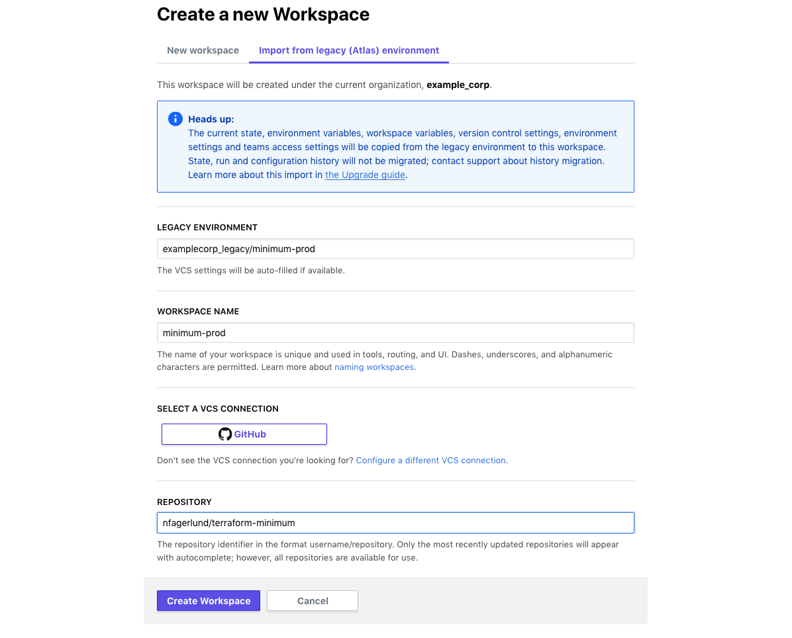
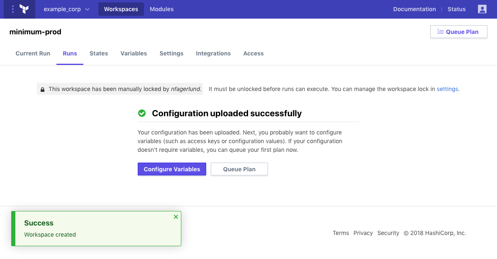

# Upgrading From Terraform Enterprise (Legacy)

If you used the legacy version of Terraform Enterprise (TFE), you probably have some older environments that aren't available in the new version. You can transfer control of that infrastructure to the new Terraform Enterprise without re-provisioning those resources.

Follow these steps to migrate your old TFE environments to new TFE workspaces.

-> **API:** See the [Create a Workspace endpoint](../api/workspaces.html#create-a-workspace); the `data.attributes.migration-environment` property enables migration from legacy environments. For end-to-end instructions for migrating many legacy environments, see [Batch Migration](./batch.html).

## Step 1: Create a New Organization

You can't use the current version of TFE with a legacy organization because the internals are too different. If you don't already have an organization in the new TFE, do the following:

1. [Create an organization](../getting-started/access.html#creating-an-organization).
2. [Configure version control access](../vcs/index.html). Use the same VCS account(s) that you used in your legacy TFE organization, so that the new organization can access the same repositories.

### Note: Naming Your Organizations

Organization names are globally unique, so your old and new organizations must have different names.

If you want to re-use your existing organization's name, you can rename your legacy organization (go to your account settings, choose your legacy organization from the sidebar, and change the Username field) before creating your new organization. However, this can cause problems if you plan to continue Terraform runs in your legacy organization for a while.

## Step 2: Verify Your Permissions

To migrate legacy environments to new workspaces, you must be a member of the owners team in both the new organization and the legacy organization. Make sure that your currently logged-in TFE user belongs to both owners teams.

## Step 3: Migrate Environments to the New Organization

Follow these steps for each legacy environment you want to migrate to your new organization.

### Step 3.a: Ensure the Legacy Environment is Ready

Navigate to your legacy TFE environment and ensure your environment is in a stable state before migrating. In particular:

- Make sure that no runs are currently in progress, and that the most recent plan has been applied.
- Make sure that the environment is either unlocked, or locked by your currently logged-in user account.
- Check with your colleagues and make sure no one needs to make changes to this infrastructure while you are migrating.

If you start migrating with a run in progress or with the workspace locked by a different user, the migration will fail.

### Step 3.b: Create a New Workspace Using the "Import" Tab

Navigate to your new TFE organization, make sure you're on the [main workspaces list](../workspaces/index.html), and click the "+ New Workspace" button.

On the new workspace page, there are two tabs beneath the "Create a new Workspace" header. Click the one labeled "Import from legacy (Atlas) environment".

This import tab has fewer settings than the [new workspace tab](../workspaces/creating.html), since it migrates most settings from the legacy environment. Fill the fields as follows:

- In the "Legacy Environment" field, enter the environment to migrate, in the form `<LEGACY ORGANIZATION>/<ENVIRONMENT NAME>`.
- In the "Workspace Name" field, enter the new name of the workspace, which should usually be the same as the old environment name.
- Choose the same VCS provider and repository as the old environment, or choose "None" if you plan to push configurations [via the API](../run/api.html) or [with the optional TFE CLI tool](../run/cli.html).

After filling the fields, click the "Create Workspace" button.

After a brief delay the migration should finish, with a "Configuration uploaded successfully" message.

If the migration fails, the error message should explain the problem; most commonly, migration fails when a different user has locked the legacy environment, and you must unlock it to proceed. If you encounter an error you can't recover from, please contact HashiCorp support.

### Step 3.c: Inspect the New Workspace's Settings

The migration should result in a new workspace with the same data and settings as the legacy environment. Compare the two to ensure everything is as expected. In particular, note that:

- TFE updates your new organization's teams and team membership to match the legacy environment. If necessary, it will create new teams and/or add users to existing teams. Carefully verify your team settings before continuing.
- Environment variables and Terraform variables are copied to the new workspace, including sensitive values. However, the new TFE does not support personal organization variables; if you used personal variables, you might need to add additional variables to the workspace.
- VCS repo settings (like working directory) should match those from the legacy environment.

-> **Note:** TFE immediately imports the settings and current state, and asynchronously imports historical states and runs. If you don't see your previous runs after migrating a workspace, this is normal; they will appear later.

### Step 3.d: Set `ATLAS_TOKEN` (Optional)

~> **Important:** This step is **only** for configurations that access state from a legacy TFE environment using a `terraform_remote_state` data source. If this environment doesn't do that, skip to the next step.

TFE usually makes it easy to share state data between workspaces by automatically handling authentication. However, this only works _within_ a single organization, and your legacy environments are in a separate organization from your new workspaces. If your Terraform configuration accesses remote state from a legacy TFE environment, you must manually provide credentials until all of the relevant environments are migrated to the new TFE.

To do this, create a new environment variable in the new workspace called `ATLAS_TOKEN` and enter a valid TFE user API token as its value. Mark the variable as sensitive to protect the token.

The user account that owns this token must be a member of both the new and legacy organizations, and must have the following permissions:

- **Read** access to any legacy environments that the configuration needs to read state from.
- **Write** access to the new workspace where the configuration will run.

If you use this workaround during your migration process, you must do two additional steps after migrating all of your legacy environments:

1. Edit this workspace's configuration so it reads state data from the new workspaces that replaced your legacy environments.
2. At the same time, delete `ATLAS_TOKEN` from this workspace's variables.

Make a note of any workspaces that access remote state as you migrate them, and update them soon after you finish migrating. Leaving a value for `ATLAS_TOKEN` over the long term can make your workspaces unnecessarily fragile.

### Step 3.e: Queue Plan and Check Results

After verifying the settings and variables, queue a plan in the new workspace.

If everything matches the legacy environment, **the plan should complete with no changes** (or the expected changes if the VCS repository has new commits). If the plan would result in changes, inspect it carefully to find what has changed and update variables or settings if necessary.

At this point, your new workspace is ready for normal operation. The legacy environment is locked and will perform no more runs unless someone in your organization unlocks it.

## Step 4: Delete Legacy Environments (Optional)

When you have no more need for your legacy environments, you can delete them. This is optional; if left in place, they will be automatically deleted when the administrators of your TFE instance end support for legacy environments.

Before deleting, make sure the legacy environment is no longer needed. In particular, be aware of the following:

- If any other Terraform configurations read the legacy state data with a `terraform_remote_state` data source, update them to reference the new workspace instead.

    If you delete an environment before updating dependent configurations, it can cause run failures in other workspaces.
- If you want to preserve state history and run history from the legacy environment, wait until the history migration has finished before deleting.

    History migration is a silent background process, and TFE does not display its status to normal users. However, site admins can view migration status in TFE's admin pages. To find out whether migration has finished, wait several days after migrating your final legacy environment, then contact the administrators of your TFE instance. For the SaaS version of TFE, email HashiCorp support; for private installs, contact your organization's admins.

    If you are an administrator of your private TFE instance, you can view the current status of all history migrations [on the Migrations page of the site admin section](../private/admin/resources.html#migration-of-workspace-history-from-legacy-environments).

