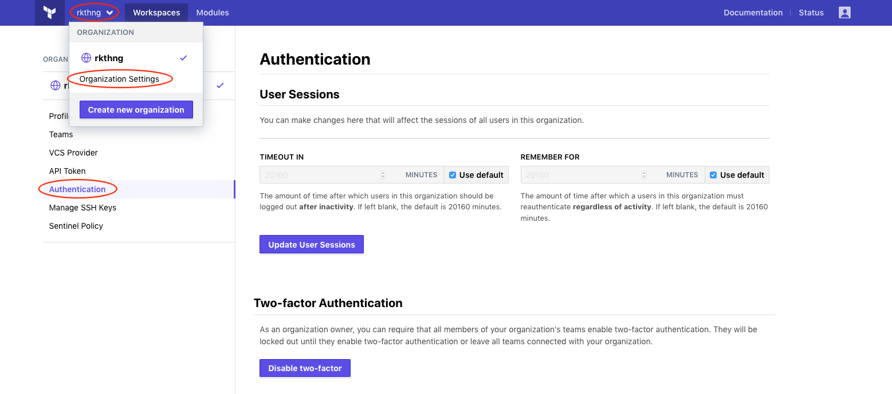
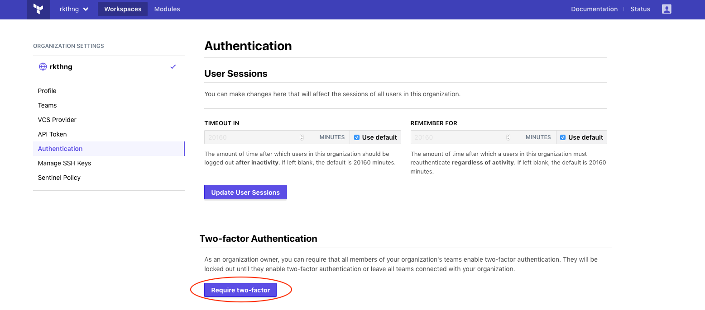

# Two-factor Authentication

User accounts can be additionally protected with Two-factor authentication, and an organization owner can make this a requirement for all users.

## Setting up Two-factor authentication

To reach your user settings page, click the user icon in the upper right corner and choose "User Settings" from the menu.

Once on this page you can set-up authentication with either a TOTP-compliant Application and/or an SMS-enabled phone number.

After successful set-up you will also have the ability to view backup codes, as well as disable two-factor authentication.

## Logging in with Two-factor authentication

After two-factor authentication has been successfully set-up you will need to enter the code from your TOTP-compliant application or from an SMS sent to your approved SMS-enabled phone number on login.

If necessary you can also use a backup code by clicking "Use a recovery code". Please remember that each backup code can only be used to log in once.

## Requiring Two-factor authentication for all users

If you are an organization owner you can require all users within your organization have two-factor authentication. 

To reach your organization settings page, click the name of your organization in the upper left corner and choose "Organization Settings" from the menu. On this page click "Authentication" on the left navigation menu. 

Click the button "Require two-factor" . Please remember that all organization owners must have two-factor authentication on before this can be set.

