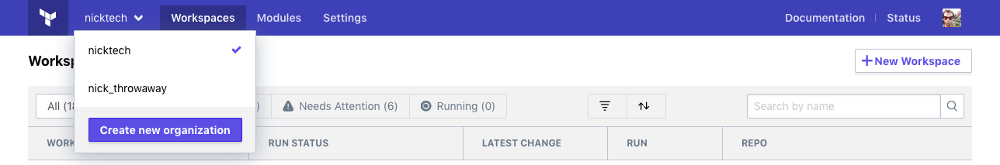
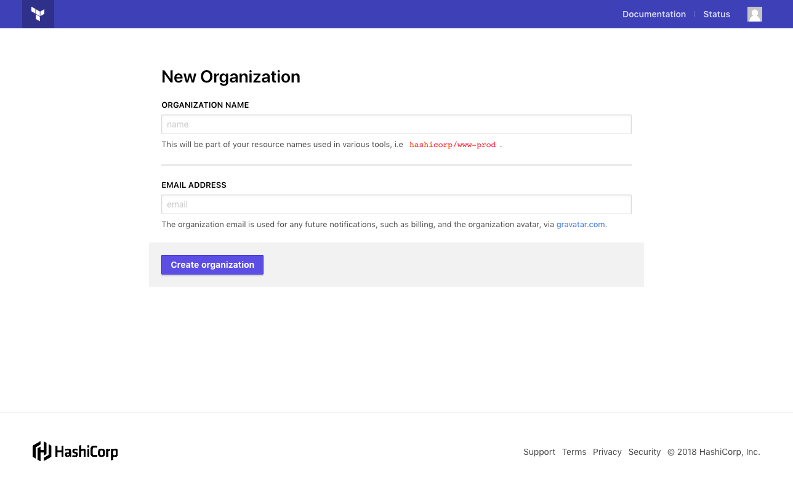
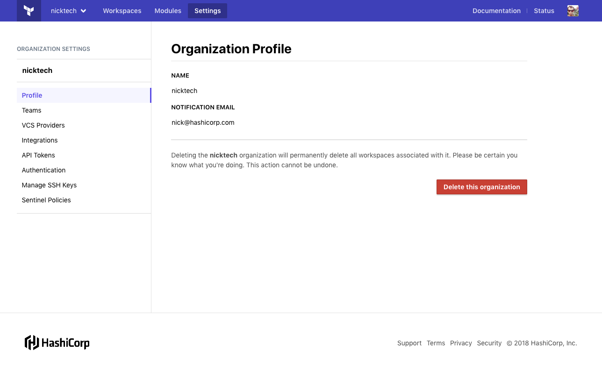

[teams]: ./teams.html
[users]: ./users.html

# Organizations

Organizations are a shared space for [teams][] to collaborate on workspaces in Terraform Enterprise (TFE).

## Selecting Organizations

On most pages within TFE, the top navigation bar displays the name of the selected organization. Clicking the name reveals the organization switcher menu, which lists all of the organizations you belong to. You can switch to another organization by clicking its name, or you can create a new organization with the "Create new organization" button.

## Adding Users to Organizations

Organization membership is automatic, and is determined by team membership. To add a user to an organization, add them to one or more of that organization's teams. See [Teams][] for more information.

You can only add existing user accounts to teams. If a colleague has not created their TFE account yet, send them the sign-up link (`https://app.terraform.io/account/new` for SaaS, `https://<TFE HOSTNAME>/account/new` for private installs) and ask them to send you their username.

## Creating Organizations

Users can create new TFE organizations by clicking the "Create new organization" button in the organization switcher menu. The new organization page also displays automatically when the currently logged-in user does not belong to any organizations, as when first logging in as a new user.

To create a new organization, provide a unique name and a primary contact email address. Organization names can include numbers, letters, underscores (`_`), and hyphens (`-`).

Once you have created an organization, you can add other [users][] by adding them to one or more [teams][].

-> **Note:** On the SaaS version of TFE, any user can create a new organization. On private installs of TFE, the administrators can restrict this ability, so that only site admins can create organizations. See [Administration: General Settings](../private/admin/general.html#organization-creation) for more details.

## Organization Settings

-> **API:** See the [Organizations API](../api/organizations.html).

You can view and manage an organization's settings by clicking the "Settings" link in the top navigation bar.

Only [organization owners](./teams.html#the-owners-team) can manage an organization's settings. However, other users can use this section to view the organization's contact email, view the membership of any teams they belong to, and view the organization's authentication policy.

Most of the organization settings are documented near the specific workflows they enable. What follows is a brief summary with links to more relevant sections of the documentation.

### Profile / Delete

The profile page shows the organization's name and contact email, but does not allow you to change them.

The profile page is also where you can **delete your organization.**

### Teams

The teams page allows organization owners to manage the organization's teams, including creating and deleting teams, managing membership, and generating team API tokens.

Users who aren't organization owners can view the list of teams they belong to and the membership of those teams. They can't edit teams or view any teams they don't belong to.

See [Teams][] for more information.

### VCS Provider

The VCS provider page is used for setting up VCS access for TFE. See [Connecting VCS Providers](../vcs/index.html) for more information.

### API Tokens

Organizations can have a special service account API token that is not associated with a specific user or team. See [Service Accounts](./service-accounts.html) for more information.

### Authentication

The authentication page allows owners to determine when users must reauthenticate. It also allows owners to require [two-factor authentication](./2fa.html) for all members of the organization.

### Manage SSH Keys

The SSH keys page manages any keys necessary for cloning Git-based module sources during Terraform runs. It does not manage keys used for accessing a connected VCS provider. See [SSH Keys for Cloning Modules](../workspaces/ssh-keys.html) for more information.

### Sentinel Policies

Sentinel is an embedded policy-as-code framework that allows you to enforce rules about Terraform runs within an organization. See [Sentinel](../sentinel/index.html) for more information.

## Inactive Organizations

TFE is a paid product offered to organizations on a subscription basis; for more information about billing, please speak to a HashiCorp sales representative. TFE is also available as a free trial to organizations evaluating its features.

When a free trial has expired, or when paid billing has been canceled, an organization becomes inactive. Inactive organizations display a banner reading "TRIAL EXPIRED — Upgrade Required" in the top navigation bar:

Members of an inactive organization can still log into TFE, view data about past runs, manage team memberships, and manage access permissions on workspaces. However, inactive organizations cannot initiate new [Terraform runs](../run/index.html).

