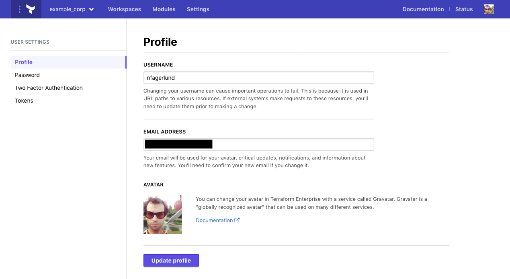
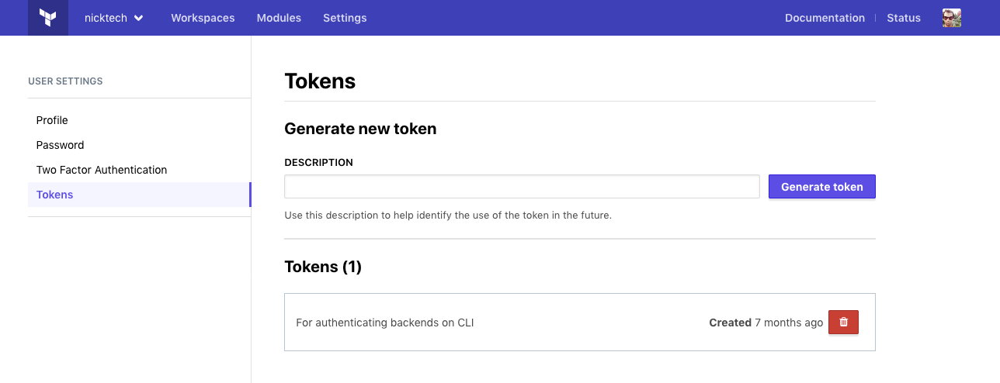

# Users

Users are individual members of an organization. Users must first [create an account](https://atlas.hashicorp.com/account/new) in Terraform Enterprise before
they can be added to an organization.

## Team and Organization Membership

Once a user has an account, an organization owner can add them to the
organization by adding them to any of the organization's teams.

To add a user to a team, navigate to the "Teams" section in your organization
settings. Create a team if it does not already exist or add the user to an
existing team.

## User Settings

To reach your user settings page, click the user icon in the upper right corner and choose "User Settings" from the menu.

Once on this page, you can change your password and generate or revoke API tokens.

### Password Management

Users manage their own passwords. To change your password, click the "Security" tab of the user settings page. You'll need to confirm your current password, and type your new password twice.

Password management isn't available if your organization uses [SAML single sign on](../saml/index.html).

### API Tokens

Users can create any number of API tokens, and can revoke existing tokens at any time. API tokens are necessary for:

- Authenticating with the [Terraform Enterprise API](../api/index.html).
- Authenticating with the [Terraform `atlas` backend](/docs/backends/types/terraform-enterprise.html).

Terraform Enterprise has three kinds of API tokens: User, team, and organization. For more information about team and organization tokens, see [Service Accounts](./service-accounts.html).

Protect your tokens carefully, because they can do anything your user account can. For example, if you belong to a team with write access to a workspace, your API token can edit variables in that workspace. See [Permissions](./permissions.html) for details about workspace permissions.

To manage API tokens, click the "Tokens" tab of the user settings page.

- To create a new token, enter a comment to identify it and click the "Generate token" button.

    A token is only displayed once, at the time of creation; if you lose it, you will need to revoke the old token and create a new one. Make sure your description includes enough information so you know which token to revoke later.
- To revoke a token, click the "🗑" (trash can) icon button next to the token's description. That token will no longer be able to authenticate as your user account.

