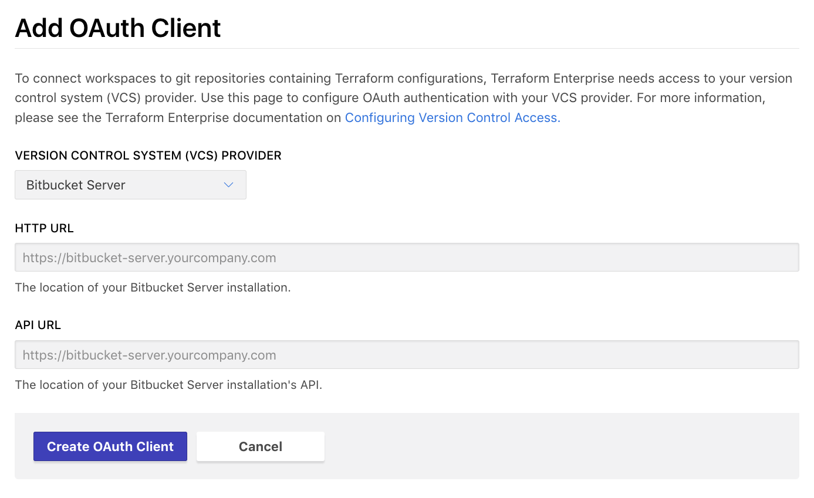
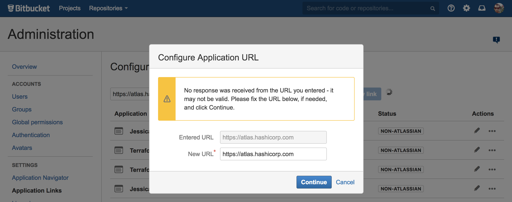
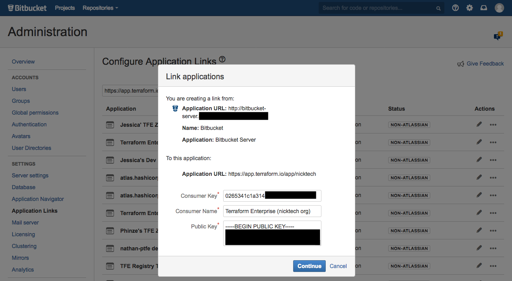
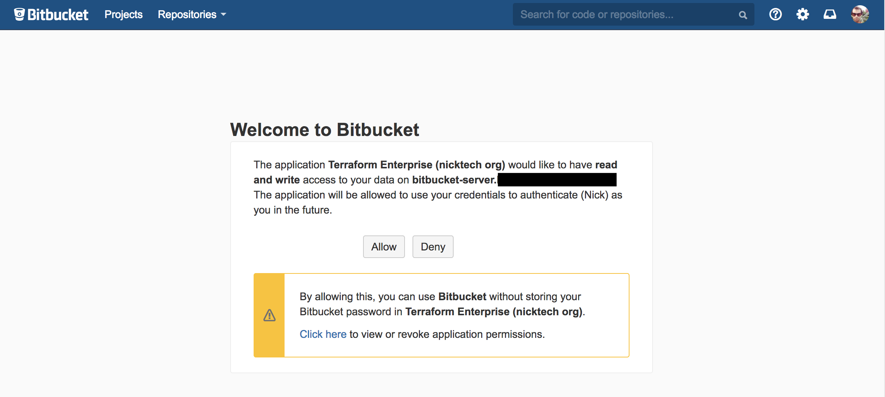
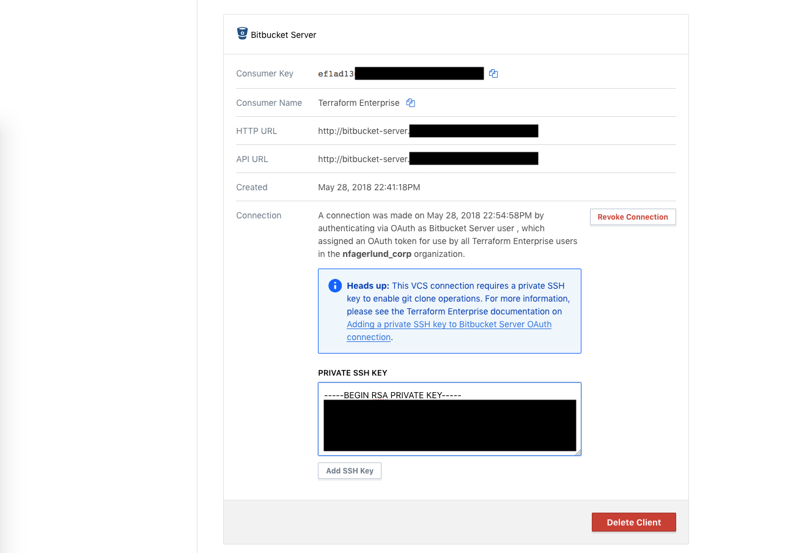

# Configuring Bitbucket Server Access

These instructions are for using Bitbucket Server for Terraform Enterprise (TFE)'s VCS features. Bitbucket Server is the on-premise version of Bitbucket; [Bitbucket Cloud has separate instructions,](./bitbucket-cloud.html) as do the [other supported VCS providers.](./index.html)

Note that Bitbucket Server requires both OAuth authentication and an SSH key. The instructions below include SSH key configuration.

-> **Version note:** TFE supports Bitbucket Server versions 4.9.1 and newer. HashiCorp does not test older versions of Bitbucket Server with TFE, and they might not work as expected. Also note that, although we do not deliberately remove support for versions that have reached end of life (per the [Atlassian Support End of Life Policy](https://confluence.atlassian.com/support/atlassian-support-end-of-life-policy-201851003.html)), our ability to resolve customer issues with end of life versions might be limited.

~> **Important:** TFE needs to contact your Bitbucket Server instance during setup and during normal operation. For the SaaS version of TFE, this means Bitbucket Server must be internet-accessible; for private installs of TFE, you must have network connectivity between your TFE and Bitbucket Server instances over HTTP or HTTPS and SSH. Bitbucket Server repository clone operations are performed over SSH on the port the Bitbucket Server instance uses.

-> **Note:** Alternately, you can skip the OAuth configuration process and authenticate with a personal access token. This requires using TFE's API. For details, see [the OAuth Clients API page](../api/oauth-clients.html).

## Step 1: On Bitbucket Server, Ensure the Webhooks Plugin is Installed

TFE uses webhooks to get new configurations. To support this, Bitbucket Server needs Atlassian's webhooks plugin.

1. Open your Bitbucket server instance in your browser and log in as an admin user.
2. Go to the "Manage add-ons" page. You can click the gear icon in the upper right corner and then use the "Manage add-ons" link in the sidebar, or go directly to `https://<BITBUCKET INSTANCE HOSTNAME>/plugins/servlet/upm`.
3. Look for an add-on named "Bitbucket Server Web Post Hooks Plugin," and make sure it is installed and enabled. The plugin is disabled by default. Clicking `Enabled` will toggle the plugin on.
4. If the plugin isn't present, click "Find new add-ons" in the sidebar navigation. Search for the plugin by name and install it.

    Make sure to install the correct plugin. TFE is designed to work with the [Bitbucket Server Web Post Hooks Plugin published by Atlassian Labs.](https://marketplace.atlassian.com/plugins/com.atlassian.stash.plugin.stash-web-post-receive-hooks-plugin/server/overview)

    

5. Visit the repository's settings, click on `Hooks` and check that the plugin is *enabled* there as well.

There is an option to configure a `webhook URL` on the plugin. Leave this optional field blank. Terraform Enterprise will dynamically update the `webhook URL` after the VCS connection is established.

Leave the page open in a browser tab, and remain logged in as an admin user.

## Step 2: On TFE, Add a VCS Provider

1. Open TFE in your browser and navigate to the "VCS Provider" settings for your organization. Click the "Add VCS Provider" button.

    If you just created your organization, you might already be on this page. Otherwise:

    1. Click the upper-left organization menu, making sure it currently shows your organization.
    1. Click the "Settings" link at the top of the page (or within the &#9776; menu)
    1. On the next page, click "VCS Provider" in the left sidebar.
    1. Click the "Add VCS Provider" button.

2. The next page has a drop-down and several text fields. Select "Bitbucket Server" from the drop-down. Several text fields will vanish, leaving only two. Enter the URL of your Bitbucket Server instance in both fields. The API URL should be the same as the main URL.

    ~> **Note:** If Bitbucket Server isn't accessible on the standard ports (for example, if it's using its default ports of 7990 or 8443 and is not behind a reverse proxy), make sure to specify the port in the URL. If you omit the port in the URL, TFE uses the standard port for the protocol (80 for HTTP, 443 for HTTPS).

    

3. Click "Create VCS Provider." This will take you back to the VCS Provider page, which now includes your new Bitbucket Server client.

4. Leave this page open in a browser tab. In the next step, you will copy and paste the unique **Consumer Key** and **Public Key.**

    

## Step 3: On Bitbucket Server, Create a New Application Link

1. While logged in as an admin user, go to Bitbucket Server's "Application Links" administration page. You can use the sidebar navigation in the admin pages, or go directly to `https://<BITBUCKET INSTANCE HOSTNAME>/plugins/servlet/applinks/listApplicationLinks`.

    This page has a text field for creating a new application link, followed by a list of existing application links.

    

2. Enter TFE's URL in the text field (`https://app.terraform.io`, or the hostname of your private TFE instance) and click the "Create new link" button.

    ~> **Note:** If you're connecting multiple TFE organizations to the same Bitbucket Server instance, you can only use TFE's main URL once. For subsequent organizations, you can enter the organization URL instead. Organization URLs look like `https://app.terraform.io/app/<ORG NAME>` or `https://<TFE HOSTNAME>/app/<ORG NAME>` — it's the page TFE's "Workspaces" button takes you to.

3. In the "Configure application URL" dialog, confirm that you wish to use the URL exactly as you entered it. If you used TFE's main URL, click "Continue;" if you used an organization URL, click the "Use this URL" checkbox and then click "Continue."

    
    

4. In the "Link applications" dialog, fill out the form fields as follows:

    Field                           | Value
    --------------------------------|------------------------------------
    Application Name (text)         | Terraform Enterprise (`<ORG NAME>`)
    Application Type (drop-down)    | Generic Application
    Create incoming link (checkbox) | ✔️ (enabled)

    Leave all the other fields blank, and click "Continue."

    

5. This takes you to another dialog, also titled "Link applications," with three text fields. In the "Consumer Key" and "Public Key" fields, copy and paste the values from step 2. In the "Consumer Name" field, enter "Terraform Enterprise (`<ORG NAME>`)." Click "Continue."

    

## Step 4: On Workstation: Create an SSH Key for TFE

On a secure workstation, create an SSH keypair that TFE can use to connect to Bitbucket Server. The exact command depends on your OS, but is usually something like `ssh-keygen -t rsa -f "/Users/<NAME>/.ssh/service_tfe" -C "service_terraform_enterprise"`. This creates a `service_tfe` file with the private key, and a `service_tfe.pub` file with the public key.

This SSH key **must have an empty passphrase.** TFE cannot use SSH keys that require a passphrase.

### Important Notes

- Do not use your personal SSH key to connect TFE and Bitbucket Server; generate a new one or use an existing key reserved for service access.
- In the following steps, you must provide TFE with the private key. Although TFE does not display the text of the key to users after it is entered, it retains it and will use it for authenticating to Bitbucket Server.
- **Protect this private key carefully.** It can push code to the repositories you use to manage your infrastructure. Take note of your organization's policies for protecting important credentials and be sure to follow them.

## Step 5: On Bitbucket Server, Switch Users and Add an SSH Key

1. If you are still logged in to Bitbucket Server as an administrator, log out now.
2. Log in as whichever account you want TFE to act as. For most organizations this should be a dedicated service user, but a personal account will also work.

    ~> **Important:** The account you use for connecting TFE **must have admin access** to any shared repositories of Terraform configurations, since creating webhooks requires admin permissions.

3. Go to the "SSH keys" page. You can click the profile icon in the upper right corner, choose "Manage account," then click "SSH keys" in the sidebar navigation, or you can go directly to `https://<BITBUCKET INSTANCE HOSTNAME>/plugins/servlet/ssh/account/keys`.

    

4. Click the "Add key" button. Paste the text of the **SSH public key** you created in step 4 (from the `.pub` file) into the text field, then click the "Add key" button to confirm.

## Step 6: On TFE, Request Access and Add an SSH Private Key

1. Go back to your TFE browser tab and click the "Connect organization `<NAME>`" button on the VCS Provider page.

    

    This takes you to a page on your Bitbucket Server instance, asking if you want to authorize TFE. Double-check that you're logged in as the user account TFE will be using, and not as a Bitbucket administrator.

    

2. Click the "Allow" button. This returns you to TFE's VCS Provider page, where the Bitbucket Server client's information has been updated.

    If this results in a 500 error, it usually means TFE was unable to reach your Bitbucket Server instance.

3. Click the "Add a private SSH key" link. A large text field will appear. Paste the text of the **SSH private key** you created in step 4, and click the "Add SSH Key" button.

    

## Finished

At this point, Bitbucket Server access for TFE is fully configured, and you can create Terraform workspaces based on your organization's shared repositories.

