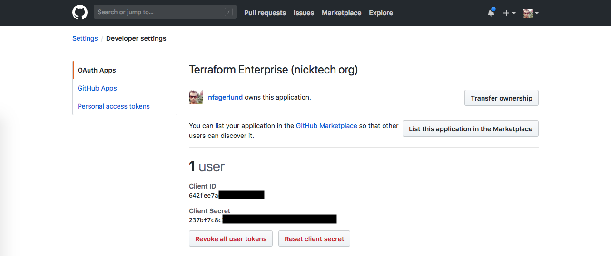
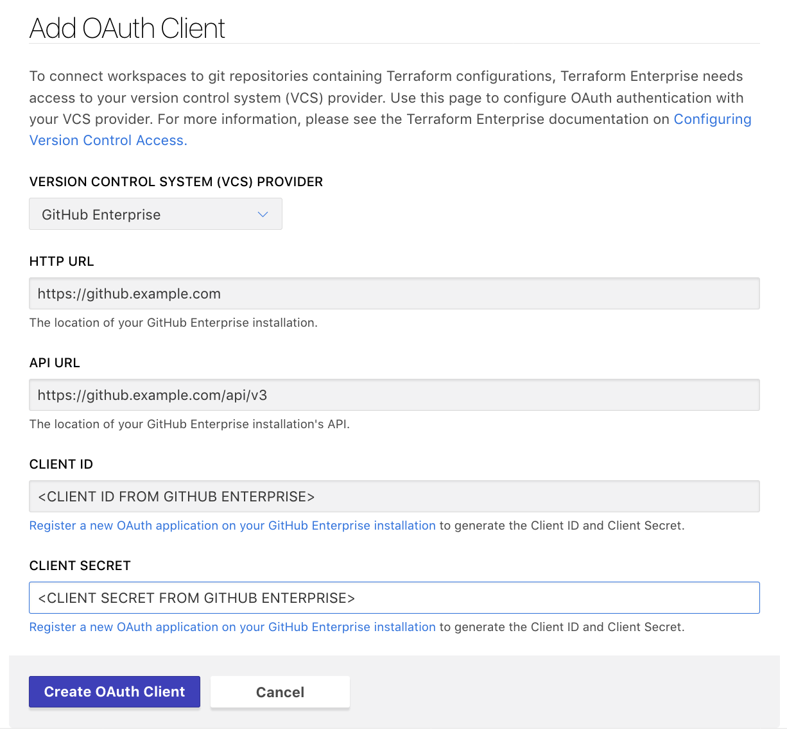
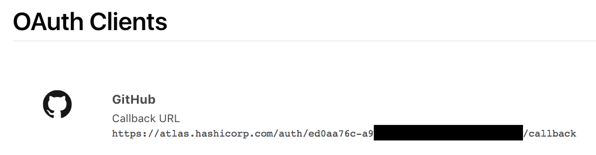

# Configuring GitHub Enterprise Access

These instructions are for using an on-premise installation of GitHub Enterprise for TFE's VCS features. [GitHub.com has separate instructions,](./github-enterprise.html) as do the [other supported VCS providers.](./index.html)

Connecting TFE to your VCS involves five steps:

On your VCS | On TFE
--|--
Register your TFE organization as a new app. Get ID and key. | &nbsp;
&nbsp; | Tell TFE how to reach VCS, and provide ID and key. Get callback URL.
Provide callback URL. | &nbsp;
&nbsp; | Request VCS access.
Approve access request. | &nbsp;

The rest of this page explains the GitHub Enterprise versions of these steps.

~> **Important:** TFE needs to contact your GitHub Enterprise instance during setup and during normal operation. For the SaaS version of TFE, this means GitHub Enterprise must be internet-accessible; for private installs of TFE, you must have network connectivity between your TFE and GitHub Enterprise instances.

-> **Note:** Alternately, you can skip the OAuth configuration process and authenticate with a personal access token. This requires using TFE's API. For details, see [the OAuth Clients API page](../api/oauth-clients.html).

## Step 1: On GitHub, Create a New OAuth Application

1. Open your GitHub Enterprise instance in your browser and log in as whichever account you want TFE to act as. For most organizations this should be a dedicated service user, but a personal account will also work.

    ~> **Important:** The account you use for connecting TFE **must have admin access** to any shared repositories of Terraform configurations, since creating webhooks requires admin permissions.

2. Navigate to GitHub's Register a New OAuth Application page.

    This page is located at `https://<GITHUB INSTANCE HOSTNAME>/settings/applications/new`. You can also reach it through GitHub's menus:
    - In the upper right corner, click your profile picture and choose "Settings."
    - In the navigation sidebar, click "OAuth Apps" (under the "Developer settings" section).
    - In the upper right corner, click the "Register a new application" button.

3. This page has a form with four text fields.

    

    Fill them in as follows:

    Field name                 | Value
    ---------------------------|--------------------------------------------------
    Application Name           | Terraform Enterprise (`<YOUR ORGANIZATION NAME>`)
    Homepage URL               | `https://app.terraform.io` (or the URL of your private TFE install)
    Application Description    | Any description of your choice.
    Authorization callback URL | `https://example.com/replace-this-later` (or any placeholder; the correct URI doesn't exist until the next step.)

4. Click the "Register application" button, which creates the application and takes you to its page.

5. Leave this page open in a browser tab. In the next step, you will copy and paste the unique **Client ID** and **Client Secret.**

    

## Step 2: On TFE, Add a VCS Provider

1. Open TFE in your browser and navigate to the "VCS Provider" settings for your organization. Click the "Add VCS Provider" button.

    If you just created your organization, you might already be on this page. Otherwise:

    1. Click the upper-left organization menu, making sure it currently shows your organization.
    1. Click the "Organization Settings" link, right below the name of your organization.
    1. On the next page, click "VCS Provider" in the left sidebar.
    1. Click the "Add VCS Provider" button.

2. The next page has a drop-down and four text fields. Select "GitHub Enterprise" from the drop-down, and fill in all four text fields as follows:

    Field         | Value
    --------------|--------------------------------------------
    HTTP URL      | `https://<GITHUB INSTANCE HOSTNAME>`
    API URL       | `https://<GITHUB INSTANCE HOSTNAME>/api/v4`
    Client ID     | (paste value from previous step)
    Client Secret | (paste value from previous step)

    

3. Click "Create VCS Provider." This will take you back to the VCS Provider page, which now includes your new GitHub Enterprise client.

4. Locate the new client's "Callback URL," and copy it to your clipboard; you'll paste it in the next step. Leave this page open in a browser tab.

    

## Step 3: On GitHub, Update the Callback URL

1. Go back to your GitHub browser tab. (If you accidentally closed it, you can reach your OAuth app page through the menus: use the upper right menu > Settings > Developer settings > OAuth Apps > "Terraform Enterprise (`<YOUR ORG NAME>`)".)

2. In the "Authorization Callback URL" field, near the bottom of the page, paste the callback URL from TFE's OAuth Configuration page, replacing the "example.com" placeholder you entered earlier.

3. Click the "Update application" button. A banner saying the update succeeded should appear at the top of the page.

## Step 4: On TFE, Request Access

1. Go back to your TFE browser tab and click the "Connect organization `<NAME>`" button on the VCS Provider page.

    

    This takes you to a page on github.com, asking whether you want to authorize the app.

2. The authorization page lists any GitHub organizations this account belongs to. If there is a "Request" button next to the organization that owns your Terraform code repositories, click it now. Note that you need to do this even if you are only connecting workspaces to private forks of repositories in those organizations since those forks are subject to the organization's access restrictions.  See [About OAuth App access restrictions](https://help.github.com/articles/about-oauth-app-access-restrictions).

    

3. Click the green "Authorize `<GITHUB USER>`" button at the bottom of the authorization page. GitHub might request your password to confirm the operation.

    This returns you to TFE's OAuth Configuration page. If it results in a 500 error, it usually means TFE was unable to reach your GitHub Enterprise instance.

## Step 5: Contact Your GitHub Organization Admins

If your organization uses OAuth app access restrictions, you had to click a "Request" button when authorizing TFE, which sent an automated email to the administrators of your GitHub organization. An administrator must approve the request before TFE can access your organization's shared repositories.

If you're a GitHub administrator, check your email now and respond to the request; otherwise, contact whoever is responsible for GitHub accounts in your organization, and wait for confirmation that they've approved your request.

## Finished

At this point, GitHub access for TFE is fully configured, and you can create Terraform workspaces based on your organization's shared GitHub Enterprise repositories.
