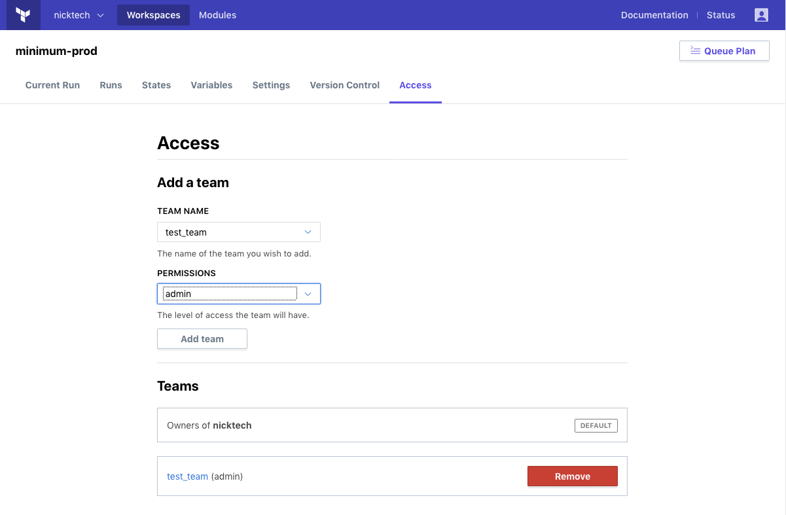

# Managing Access to Workspaces

Terraform Enterprise (TFE) workspaces can only be accessed by users with the correct permissions. You can manage permissions for a workspace on a per-team basis.

Workspace access should be managed by [organization owners](../users-teams-organizations/teams.html#the-owners-team). (Users with [admin privileges](../users-teams-organizations/permissions.html) on a workspace can make minor adjustments to its permissions, but only owners can manage permissions for any team in the organization.)

## Background

TFE manages workspace permissions with teams, and uses three levels of permissions (read, write, and admin).

For more information see:

- [Users, Teams and Organizations](../users-teams-organizations/index.html)
- [Permissions](../users-teams-organizations/permissions.html)

## Managing Workspace Access Permissions

-> **API:** See the [Team Access APIs](../api/team-access.html).  
**Terraform:** See the `tfe` provider's [`tfe_team_access` resource](/docs/providers/tfe/r/team_access.html).

When a workspace is created, the only team able to access it is the owners team, with full admin permissions. The owners team can never be removed from a workspace.

To manage other teams' access, go to the workspace's page and click the "Access" tab.

This page has a pair of drop-downs for adding new teams, and a list of teams that already have access.

To add a team, select it from the first dropdown and choose which permissions it should have (read, write, or admin) with the second dropdown, then click the "Add team" button.

To remove a team's permissions on the workspace, click the "Remove" button next to that team's entry in the teams list.

To change a team's permissions on the workspace, you must first remove the team, then re-add it.

