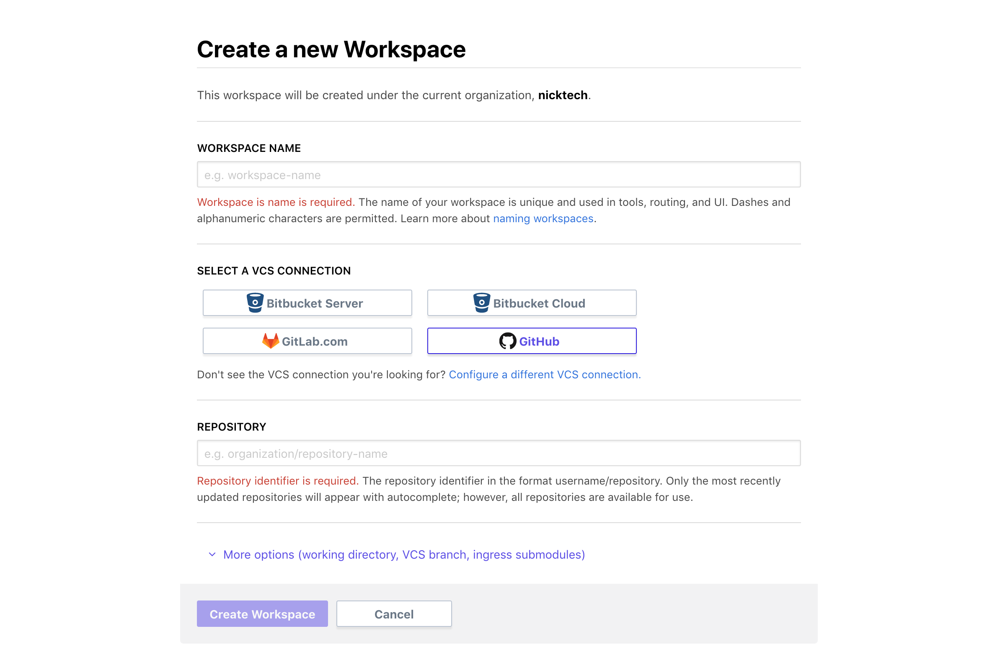
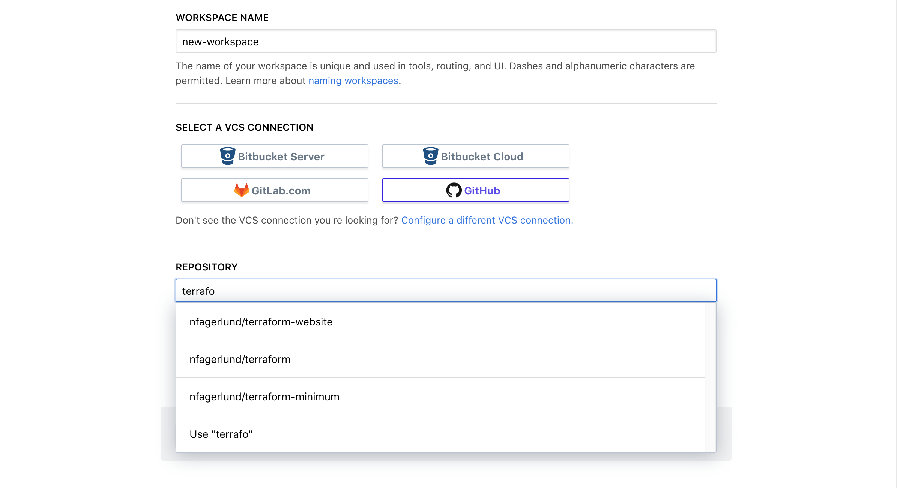

# Creating Workspaces

~> **Note:** Only members of the "owners" team can create new workspaces.

-> **API:** You can also create and manage workspaces with the [workspaces API](../api/workspaces.html).

Create new workspaces with the "+ New Workspace" button, which appears on the list of workspaces. If you're not already viewing the workspace list, you can get there with the "Workspaces" button in the top navigation bar.

You must fill out several fields to configure your new workspace:

- **Workspace name** (required) — A name for the workspace; can include letters, numbers, underscores, and hyphens. [See more advice about workspace names here](./naming.html).
- **VCS connection** (required; list of buttons) — If you've configured multiple [VCS integrations](../vcs/index.html), you must select which one to use in this workspace by clicking the appropriate button. If you only have one VCS provider, it's automatically selected.
- **Repository** (required) — The VCS repository that contains the Terraform configuration this workspace should use. For most VCS providers, repository names use a format like `<ORGANIZATION>/<REPO NAME>` or `<PROJECT KEY>/<REPO NAME>`.

    This field supports autocomplete by searching your list of most recently used repositories. If you need to specify a repo that isn't included in the autocomplete list, you can enter the full name manually.

    When creating a workspace in TFE's UI, you **must** specify a VCS repository for the configuration. If you need a Terraform workflow that doesn't rely on VCS integration, you'll need to skip the UI and create workspaces via the API. For more info, see the [API-driven run workflow](./run-api.html).

    ~> **Important:** Once a workspace is created, its VCS repository cannot be changed.

There are also several optional fields, which you can reveal by clicking the "More options" link:

- **Terraform working directory** — The directory where Terraform will execute, specified as a relative path from the root of the repo. This is useful when working with VCS repos that contain multiple Terraform configurations.
- **VCS branch** — Which branch of the repository to use. If left blank, TFE will use the repository's default branch.
- **Include submodules on clone** (checkbox) — Whether to recursively clone all of the repository's submodules when fetching a configuration.

## After Creating a Workspace

When you create a new workspace, a few things happen:

- TFE _doesn't_ immediately queue a plan for the workspace. Instead, it presents a dialog with shortcut links to either queue a plan or edit variables.
- TFE automatically registers a webhook with your VCS service. The next time new commits appear in the selected branch of that repo, TFE will automatically queue a Terraform plan for the workspace.

Most of the time, you'll want do do some of the following after creating a workspace:

- [Edit variables](./variables.html)
- [Edit workspace settings](./settings.html)
- [Work with runs](./run-basics.html)
