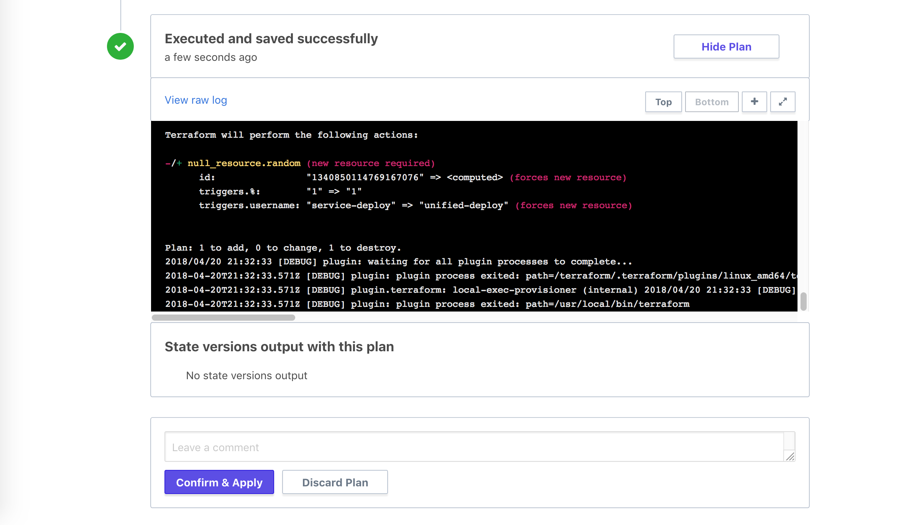

# The UI- and VCS-driven Run Workflow

Terraform Enterprise (TFE) has two workflows for managing Terraform runs.

- The simpler workflow, described below, is driven by TFE's UI and by integration with a supported VCS provider.
- [The more complex workflow](./run-api.html) is driven entirely by TFE's API, and lets you replace the UI and supported VCS providers with almost any kind of custom tooling.

## Summary

In the UI and VCS workflow, every workspace is associated with a specific branch of a VCS repo of Terraform configurations. TFE registers webhooks with your VCS provider when you create a workspace, then automatically queues a Terraform run whenever new commits are merged to the workspace's branch.

The Terraform code for a run always comes from version control, and is always associated with a specific commit.

## Starting Runs

Most of the time, you start a run automatically by committing changes to version control.

If the code in version control hasn't changed but you've modified some variables in TFE, you can also manually queue a plan from the UI. Each workspace has a "Queue Plan" button, and the form for editing variables also includes a "Save & Plan" button.

Manually queueing a plan requires write or admin access.

If the workspace has a plan that is still in the [Plan stage](./run-basics.html#2-the-plan-stage) when a new plan is queued, you can either wait for it to complete, or visit the "Current Run" page and click "Run this plan now". Be aware that this will terminate the current plan and unlock the workspace, which can lead to anomalies in behavior, but can be useful if the plans are long-running and the current plan is known not to have all the desired changes.

## Confirming or Discarding Plans

By default, run plans require confirmation before TFE will apply them. Users with write access on a workspace can visit the page for a run that has finished planning and click the "Confirm & Apply" or "Discard Plan" button to finish or cancel a run.

Users can also leave comments if there's something unusual involved in a run.

Note that once the Plan stage is completed, until you apply or discard a plan, TFE can't start another run in that workspace.

### Auto apply

If you would rather automatically apply plans that don't have errors, you can enable auto apply on the workspace's settings tab.
