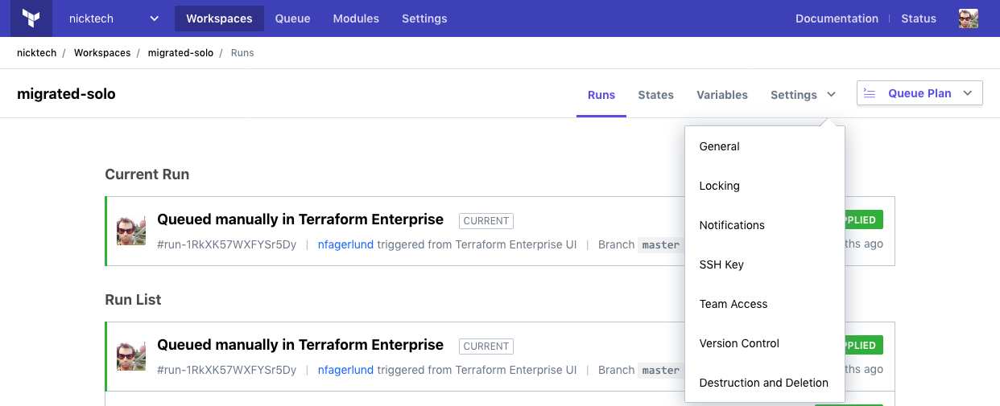

# Workspace Settings

-> **API:** See the [Update a Workspace endpoint](../api/workspaces.html#update-a-workspace) (`PATCH /organizations/:organization_name/workspaces/:name`).

Terraform Enterprise (TFE) workspaces can be reconfigured after creation.

Workspace settings are separated into several pages, which are listed in the drop-down "Settings" menu in each workspace's header. The following groups of settings are available:

- "General", for basic configuration.
- "Locking", for temporarily preventing new plans and applies.
- "Notifications", for configuring run notifications.
- "SSH Key", for configurations that use Git-based module sources.
- "Team Access," for managing workspace permissions.
- "Version Control", for managing the workspace's VCS integration.
- "Destruction and Deletion", for removing a workspace and the infrastructure it manages.

Changing settings requires [admin privileges](../users-teams-organizations/permissions.html) on the affected workspace.

## General

The "General Settings" page configures a workspace's name, plus some details about how Terraform runs behave.

After changing any of these settings, you must click the "Save settings" button at the bottom of the page.

### ID

Every workspace has a unique ID that cannot be changed. Workspace IDs are sometimes necessary when working with [TFE's API](../api/index.html).

Click the icon beside the ID to copy it to the clipboard.

### Name

The display name of the workspace.

~> **Important:** Since some API calls refer to a workspace by its name, changing the name can sometimes break existing integrations.

### Auto Apply and Manual Apply

Whether or not TFE should automatically apply a successful Terraform plan. If you choose manual apply, an operator must confirm a successful plan and choose to apply it.

Auto-apply has a few exceptions:

- [Destroy plans](#destruction-and-deletion) must always be manually applied.
- Plans queued by users with [plan permissions](../users-teams-organizations/permissions.html#plan) must be approved by a user with write or admin permissions.

### Terraform Version

Which version of Terraform to use for all operations in the workspace. The default value is whichever release was current when the workspace was created.

You can choose "latest" to automatically update a workspace to new versions, or you can choose a specific version.

-> **API:** You can specify a Terraform version when [creating a workspace](../api/workspaces.html#create-a-workspace) via the API.

### Terraform Working Directory

The directory where Terraform will execute, specified as a relative path from the root of the configuration directory. This is useful when working with VCS repos that contain multiple Terraform configurations. Defaults to the root of the configuration directory.

-> **Note:** If you specify a working directory, TFE will still queue a plan for changes to the repository outside that working directory. This is because local modules are often outside the working directory, and changes to those modules should result in a new run. If you have a repo that manages multiple infrastructure components with different lifecycles and are experiencing too many runs, we recommend splitting the components out into independent repos. See [Repository Structure](./repo-structure.html) for more detailed explanations.

## Locking

~> **Important:** Unlike other settings, locks can also be managed by users with write privileges.

If you need to prevent Terraform runs for any reason, you can lock a workspace. This prevents users with write access from manually queueing runs, prevents automatic runs due to changes to the backing VCS repo, and prevents the creation of runs via the API. To enable runs again, a user must unlock the workspace.

Locking a workspace also restricts state uploads. In order to upload state, the workspace must be locked by the user who is uploading state.

~> **Important:** [The `atlas` backend][atlas-backend] ignores this restriction, and allows users with write access to modify state when the workspace is locked. To prevent confusion and accidents, avoid using the `atlas` backend in normal workflows and use the `remote` backend instead; see [TFE's CLI-driven workflow](../run/cli.html) for details.

[atlas-backend]: /docs/backends/types/terraform-enterprise.html

Users with write access can lock and unlock a workspace, but can't unlock a workspace which was locked by another user. Users with admin privileges can force unlock a workspace even if another user has locked it.

Locks are managed with a single "Lock/Unlock/Force unlock `<WORKSPACE NAME>`" button. TFE asks for confirmation when unlocking.

## Notifications

The "Notifications" page allows TFE to send webhooks to external services whenever specific run events occur in a workspace.

See [Run Notifications](./notifications.html) for detailed information about configuring notifications.

## SSH Key

If a workspace's configuration uses [Git-based module sources](/docs/modules/sources.html) to reference Terraform modules in private Git repositories, Terraform needs an SSH key to clone those repositories. The "SSH Key" page lets you choose which key it should use.

See [Using SSH Keys for Cloning Modules](./ssh-keys.html) for detailed information about this page.

## Team Access

The "Team Access" page configures which teams can perform which actions on a workspace.

See [Managing Access to Workspaces](./access.html) for detailed information.

## Version Control

The "Version Control" page configures the VCS repository (if any) that contains the workspace's Terraform configuration.

After changing any of these settings, you must click the "Update VCS settings" button at the bottom of the page.

### VCS Connection and Repository

You can use the "Select a VCS connection" buttons and "Repository" field to change which VCS repository the workspace gets configurations from. See also:

- [Creating Workspaces](./creating.html) for more details about selecting a VCS repository.
- [Connecting VCS Providers to Terraform Enterprise](../vcs/index.html) for more details about configuring VCS integrations.

-> **API:** If you need to change VCS connections for many workspaces at once, consider automating the changes with the [Update a Workspace endpoint](../api/workspaces.html#update-a-workspace). This is most common when moving a VCS server, or when a vendor deprecates an older API version.

### VCS Branch

Which branch of the repository to use. If left blank, TFE will use the repository's default branch.

### Include submodules on clone

Whether to recursively clone all of the repository's Git submodules when fetching a configuration.

-> **Note:** The [SSH key for cloning Git submodules](../vcs/index.html#ssh-keys) is set in the VCS provider settings for the organization, and is not related to the workspace's SSH key for Terraform modules.

## Destruction and Deletion

This page includes two buttons:

- "Queue destroy Plan"
- "Delete from Terraform Enterprise"

In almost all cases, you should perform both actions in that order when destroying a workspace.

Queueing a destroy plan destroys the infrastructure managed by a workspace. If you don't do this, the infrastructure resources will continue to exist but will become unmanaged; you'll need to go into your infrastructure providers to delete the resources manually.

Before queueing a destroy plan, you must go to the workspace's [variables page](./variables.html) and set an environment variable with a name of `CONFIRM_DESTROY` and a value of `1`.
