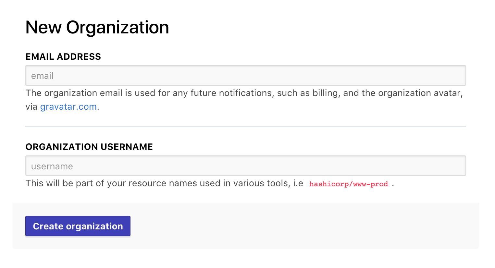

# Accessing Terraform Enterprise v2

TFE v2 is in beta, and you can't currently use it with your existing TFE data and configurations. To start testing TFE v2, you must:

- Make sure you have a TFE account.
- Manually navigate to TFE v2.
- Create a new organization specifically for working with TFE v2.

## Creating a TFE Account

If you don't already have a TFE account, you must create one. You can use the same user account to access TFE v1 and the TFE v2 beta.

TODO: I don't remember how I created an account, and I can't find the links for it when I open atlas in a private browser.

## Getting Accepted into the TFE v2 Beta

TODO: Do you need to get whitelisted to use v2? If so, we need to write down the acceptance process.

## Navigating to TFE v2

To access TFE v2, you must manually navigate to the following URL:

<https://atlas.hashicorp.com/v2>

At a later date, we will add a discoverable link in the TFE navigation menu. For now, we're using this manual step to help manage the rate of beta testing and avoid confusing v1 users.

## Creating an Organization

After you've navigated to TFE v2, you will be prompted to create a new organization. TFE v2 **cannot** currently import settings and workspaces from an existing TFE v1 organization.

To create your v2 organization, enter a name (distinct from your v1 organization(s)) and an admin email address at the prompt.

TODO: Can't remember whether there's a different first-run experience we should point out here.

For more information about organizations, see [the TFE docs about users, teams, and organizations.](TODO)

## Next Steps

After you have a TFE v2 organization, you can start [configuring version control access, users, and teams.](./TODO)

