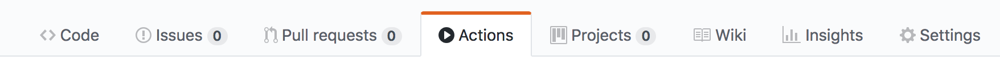
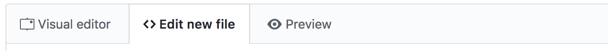
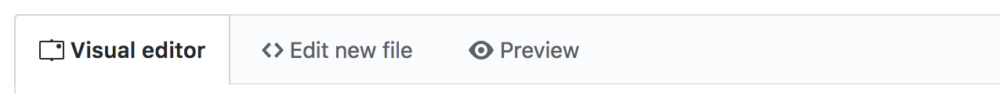
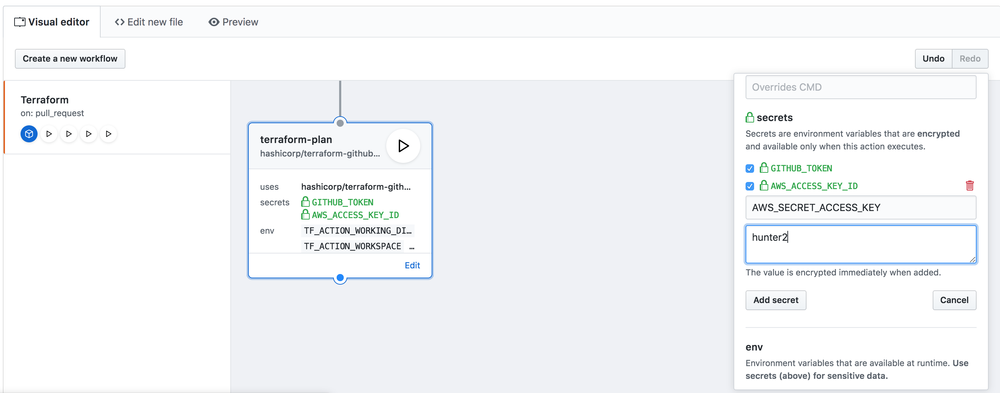

# Getting Started

GitHub Actions allow you to trigger commands in reaction to GitHub events.
Terraform's GitHub Actions are designed to run on new and updated pull requests to help you review
and validate Terraform changes.

## Recommended Workflow

The easiest way to get started is to copy our recommended workflow, which runs all of
Terraform's GitHub Actions on new and updated pull requests.

-> **Note:** If you'd like to write your own custom workflow using our Actions, check out the [Actions Reference](../actions).

1. Open up your repository in GitHub and click on the **Actions** tab.

    

1. Click the **Create a new workflow** button.

    

1. Click the **\<\> Edit new file** tab.

    

1. Replace the default workflow with the following:

    ```hcl
    workflow "Terraform" {
      resolves = "terraform-plan"
      on = "pull_request"
    }

    action "filter-to-pr-open-synced" {
      uses = "docker://superbbears/filter:0.2.0"
      args = ["action", "opened|synchronize"]
    }

    action "terraform-fmt" {
      uses = "hashicorp/terraform-github-actions/fmt@v0.1"
      needs = "filter-to-pr-open-synced"
      secrets = ["GITHUB_TOKEN"]
      env = {
        TF_ACTION_WORKING_DIR = "."
      }
    }

    action "terraform-init" {
      uses = "hashicorp/terraform-github-actions/init@v0.1"
      needs = "terraform-fmt"
      secrets = ["GITHUB_TOKEN"]
      env = {
        TF_ACTION_WORKING_DIR = "."
      }
    }

    action "terraform-validate" {
      uses = "hashicorp/terraform-github-actions/validate@v0.1"
      needs = "terraform-init"
      secrets = ["GITHUB_TOKEN"]
      env = {
        TF_ACTION_WORKING_DIR = "."
      }
    }

    action "terraform-plan" {
      uses = "hashicorp/terraform-github-actions/plan@v0.1"
      needs = "terraform-validate"
      secrets = ["GITHUB_TOKEN"]
      env = {
        TF_ACTION_WORKING_DIR = "."
        # If you're using Terraform workspaces, set this to the workspace name.
        TF_ACTION_WORKSPACE = "default"
      }
    }
    ```

1. **Directories** — If your Terraform configuration is not in the root
    of your repo, replace all instances of:

    ```hcl
    TF_ACTION_WORKING_DIR = "."
    ```

    ...with your directory, relative to the root of the repo. For example:

    ```hcl
    TF_ACTION_WORKING_DIR = "./terraform"
    ```

    If you have multiple directories of Terraform code, see [Directories](../directories).

1. **Workspaces** — If your Terraform runs in a different
    [Terraform workspace](/docs/state/workspaces.html) than `default`,
    change the `TF_ACTION_WORKSPACE` environment variable in the `terraform-plan` action.

    ```hcl
    TF_ACTION_WORKSPACE = "your-workspace"
    ```

    If you have multiple workspaces, see [Workspaces](../workspaces).

1. **Credentials** — If you're using a Terraform provider that requires
    credentials to run `terraform plan` (like AWS or Google Cloud Platform)
    then you need to add those credentials as secrets to the `terraform-plan` action.
    Secrets can only be added from the **Visual Editor,** so switch to that tab.

    

    Scroll down to the `terraform-plan` action and click **Edit**.
    This will open the action editor on the right side, where you'll be able
    to add your secrets as environment variables, like `AWS_ACCESS_KEY_ID` and `AWS_SECRET_ACCESS_KEY`.
    See your [provider documentation](https://www.terraform.io/docs/providers/)
    for the specific environment variables your provider needs.

    

    !> **⚠️ WARNING ⚠️** These secrets could be exposed if the plan action is run on a
    malicious Terraform file. To avoid this, we recommend you do not use the plan action
    on public repos or repos where untrusted users can submit pull requests.
1. Click **Start commit** to commit the Workflow.
1. On your next pull request, you should see the Actions running.
