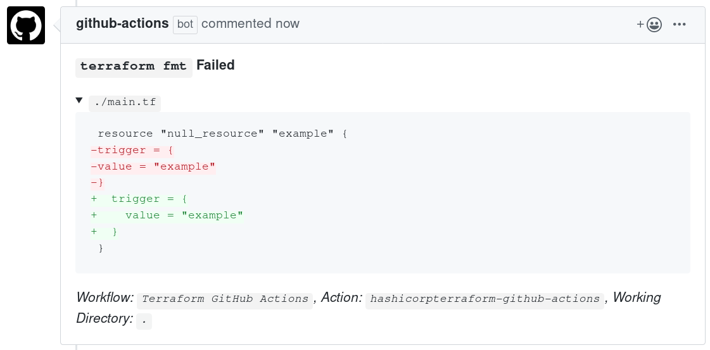
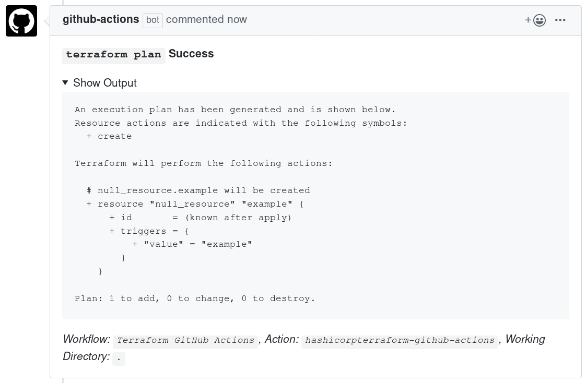

# Terraform GitHub Actions

This is the documentation for Terraform GitHub Actions.

[GitHub Actions](https://developer.github.com/actions) allow you to run commands in response to GitHub events such as pushing a new commit. Terraform GitHub Actions are designed to execute Terraform commands to help you review and validate Terraform changes. When Terraform GitHub Actions are executed on a pull request, a comment may be posted on the pull request conversation detailing the outcome of the GitHub Actions step.

If you are new to Terraform GitHub Actions, begin with the [Getting Started](./getting-started.html) guide.

Here are screenshots showing some of the information Terraform GitHub Actions will post to a pull request.

## Terraform Format

## Terraform Validate

## Terraform Plan

